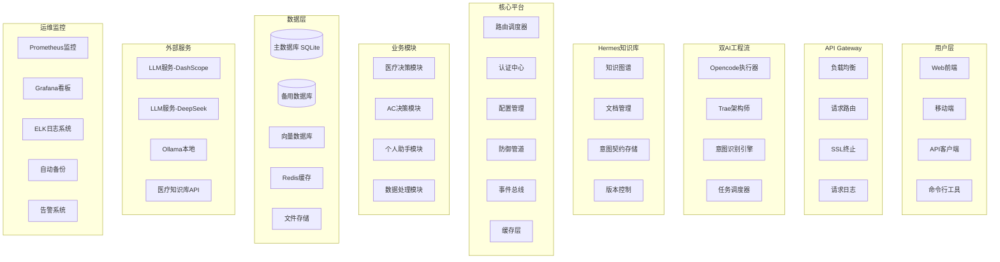

# 🏗️ AC Platform 完整架构设计（高颗粒度）

## 一、系统架构全景图



---

## 二、核心平台详细设计

### 2.1 路由调度器

| 字段 | 类型 | 说明 | 示例 |
|------|------|------|------|
| route_id | str | 路由唯一标识 | `med_drug_search` |
| path | str | API路径 | `/api/v1/medical/drugs` |
| methods | list | HTTP方法 | `["GET", "POST"]` |
| module | str | 所属模块 | `medical` |
| handler | str | 处理函数路径 | `src.modules.medical.api:search_drugs` |
| auth_required | bool | 是否需要认证 | `true` |
| rate_limit | int | 速率限制(次/分钟) | `60` |
| timeout | int | 超时时间(秒) | `30` |

### 2.2 认证中心

| 角色 | 权限范围 | 描述 |
|------|----------|------|
| super_admin | 全部权限 | 系统管理员 |
| admin | 管理权限 | 项目管理员 |
| developer | 开发权限 | 开发人员 |
| user | 用户权限 | 普通用户 |
| guest | 只读权限 | 访客 |

### 2.3 防御管道

| 规则类型 | 配置项 | 默认值 | 说明 |
|----------|--------|--------|------|
| 速率限制 | requests_per_minute | 60 | 每分钟请求数 |
| 输入限制 | max_payload_size | 1MB | 请求体最大大小 |
| 内容过滤 | block_keywords | [] | 屏蔽关键词列表 |
| SQL防护 | enabled | true | 是否启用SQL注入防护 |
| XSS防护 | enabled | true | 是否启用XSS防护 |

---

## 三、核心配置结构

```python
class Settings(BaseModel):
    # 运行模式
    AC_CORE_MODE: bool = True
    DEBUG: bool = False
    ENVIRONMENT: str = "production"

    # 安全配置
    API_KEY: Optional[str] = None
    SECRET_KEY: str = "default-secret-key"

    # 数据库配置
    DATABASE_URL: str = "sqlite:///./ac_platform.db"

    # LLM配置
    OLLAMA_HOST: str = "http://localhost:11434"
    DASHSCOPE_API_KEY: Optional[str] = None
    DEEPSEEK_API_KEY: Optional[str] = None

    # 防御配置
    RATE_LIMIT_ENABLED: bool = True
    RATE_LIMIT_REQUESTS: int = 60
```

---

## 四、意图契约数据结构

```python
class IntentContract(BaseModel):
    task_id: str           # TASK-YYYYMMDD-XXX
    title: str             # 任务标题
    description: str       # 详细描述
    complexity: str         # low/medium/high
    priority: str          # high/medium/low
    author: str
    assignee: Optional[str] = None
    status: str            # pending/in_progress/review/completed
    requirements: List[str]
    acceptance_criteria: List[AcceptanceCriteria]
    deliverables: List[Deliverable]
```

---

## 五、数据库表结构

| 表名 | 说明 |
|------|------|
| users | 用户表 |
| api_keys | API Key表 |
| roles | 角色表 |
| med_drugs | 药物数据库 |
| med_drug_interactions | 药物交互表 |
| med_patients | 患者表 |
| med_records | 病历表 |
| tasks | 任务表 |
| intent_contracts | 意图契约表 |

---

*来源: {USER_HOME}\TRAE\Hermes\架构设计\AC Platform完整架构设计_高颗粒度.md*
*文档版本: v1.0 | 创建时间: 2026-05-11*
