# 🏗️ AC Platform 完整架构设计（高颗粒度）

## 一、系统架构全景图

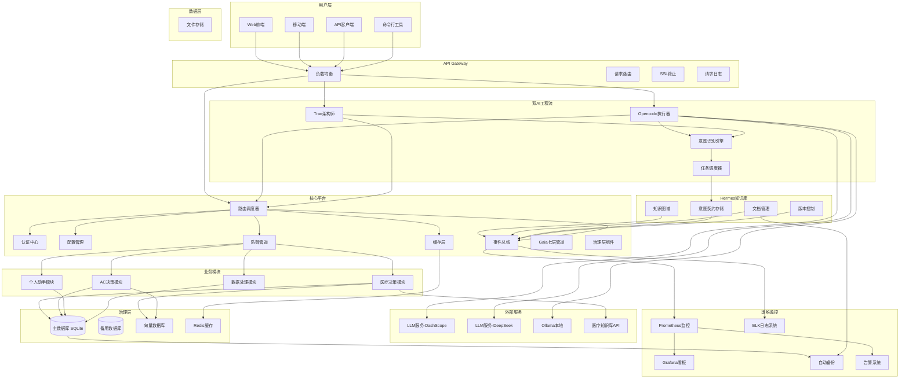
```mermaid
graph TB
    subgraph 用户层["用户层"]
        A1[Web前端]
        A2[移动端]
        A3[API客户端]
        A4[命令行工具]
    end
    
    subgraph api_gateway["API Gateway"]
        B1[负载均衡]
        B2[请求路由]
        B3[SSL终止]
        B4[请求日志]
    end
    
    subgraph dual_ai["双AI工程流"]
        C1[Opencode执行器]
        C2[Trae架构师]
        C3[意图识别引擎]
        C4[任务调度器]
    end
    
    subgraph hermes["Hermes知识库"]
        D1[知识图谱]
        D2[文档管理]
        D3[意图契约存储]
        D4[版本控制]
    end
    
    subgraph core_platform["核心平台"]
        E1[路由调度器]
        E2[认证中心]
        E3[配置管理]
        E4[防御管道]
        E5[事件总线]
        E6[缓存层]
        E7[Gaia七层管道]
        E8[治理层组件]
    end
    
    subgraph governance["治理层"]
        G1[熔断器]
        G2[递归守卫]
        G3[BDD检测]
        G4[量刑阶梯]
    end
    
    subgraph modules["业务模块"]
        F1[医疗决策模块]
        F2[AC决策模块]
        F3[个人助手模块]
        F4[数据处理模块]
    end
    
    subgraph data_layer["数据层"]
        G1[(主数据库 SQLite)]
        G2[(备用数据库)]
        G3[向量数据库]
        G4[Redis缓存]
        G5[文件存储]
    end
    
    subgraph external["外部服务"]
        H1[LLM服务-DashScope]
        H2[LLM服务-DeepSeek]
        H3[Ollama本地]
        H4[医疗知识库API]
    end
    
    subgraph ops["运维监控"]
        I1[Prometheus监控]
        I2[Grafana看板]
        I3[ELK日志系统]
        I4[自动备份]
        I5[告警系统]
    end
    
    %% 连接关系
    A1 --> B1
    A2 --> B1
    A3 --> B1
    A4 --> B1
    
    B1 --> C1
    B1 --> C2
    B1 --> E1
    
    C1 --> C3
    C2 --> C3
    C3 --> C4
    C4 --> D3
    
    C1 --> E1
    C2 --> E1
    
    D1 --> E5
    D2 --> E5
    D3 --> E5
    D4 --> E5
    
    E1 --> E2
    E1 --> E3
    E1 --> E4
    E1 --> E5
    E1 --> E6
    
    E4 --> F1
    E4 --> F2
    E4 --> F3
    E4 --> F4
    
    F1 --> G1
    F2 --> G1
    F3 --> G1
    F4 --> G1
    
    F1 --> G3
    F2 --> G3
    
    E6 --> G4
    
    C1 --> H1
    C1 --> H2
    C1 --> H3
    F1 --> H4
    
    G1 --> I4
    D2 --> I4
    
    E5 --> I1
    E5 --> I3
    
    I1 --> I2
    I1 --> I5
```

---

## 二、核心平台详细设计

### 2.1 路由调度器

#### 2.1.1 双轨路由架构

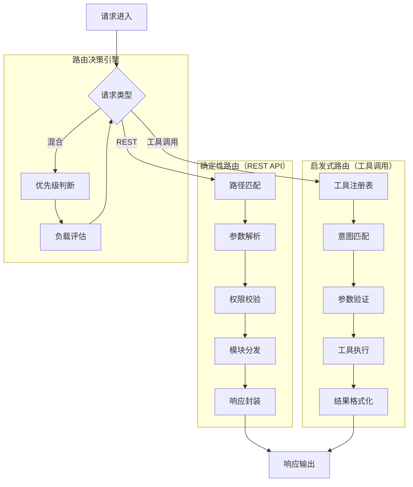
```mermaid
flowchart TD
    subgraph 确定性路由["确定性路由（REST API）"]
        A1[路径匹配]
        A2[参数解析]
        A3[权限校验]
        A4[模块分发]
        A5[响应封装]
    end
    
    subgraph 启发式路由["启发式路由（工具调用）"]
        B1[工具注册表]
        B2[意图匹配]
        B3[参数验证]
        B4[工具执行]
        B5[结果格式化]
    end
    
    subgraph 路由决策["路由决策引擎"]
        C1{请求类型}
        C2[优先级判断]
        C3[负载评估]
    end
    
    X[请求进入] --> C1
    C1 -->|REST| A1
    C1 -->|工具调用| B1
    C1 -->|混合| C2
    
    A1 --> A2 --> A3 --> A4 --> A5 --> Y[响应输出]
    B1 --> B2 --> B3 --> B4 --> B5 --> Y
    C2 --> C3 --> C1
```

#### 2.1.2 路由配置结构

| 字段 | 类型 | 说明 | 示例 |
|------|------|------|------|
| route_id | str | 路由唯一标识 | `med_drug_search` |
| path | str | API路径 | `/api/v1/medical/drugs` |
| methods | list | HTTP方法 | `["GET", "POST"]` |
| module | str | 所属模块 | `medical` |
| handler | str | 处理函数路径 | `src.modules.medical.api:search_drugs` |
| auth_required | bool | 是否需要认证 | `true` |
| rate_limit | int | 速率限制(次/分钟) | `60` |
| timeout | int | 超时时间(秒) | `30` |

#### 2.1.3 工具注册表结构

```python
# src/core/router.py - 工具注册表示例
class ToolRegistry:
    def __init__(self):
        self.tools = {}
    
    def register(self, tool_id: str, handler, schema: dict, category: str):
        """注册工具"""
        self.tools[tool_id] = {
            "handler": handler,
            "schema": schema,
            "category": category,
            "invocation_count": 0,
            "last_invoked": None
        }
    
    def search(self, query: str) -> list:
        """基于意图搜索工具"""
        # 使用向量检索匹配意图
        results = vector_search(query, self.tools.keys())
        return results
```

---

### 2.2 认证中心

#### 2.2.1 认证架构

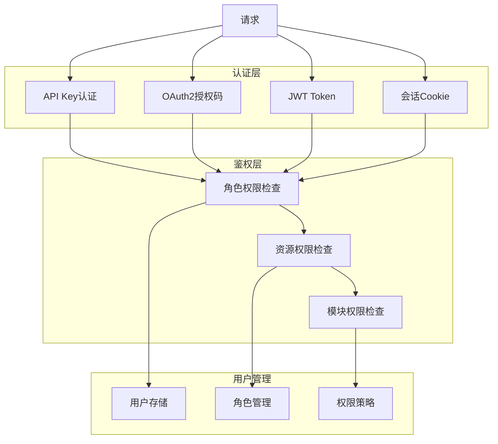
```mermaid
flowchart TD
    subgraph 认证层["认证层"]
        A1[API Key认证]
        A2[OAuth2授权码]
        A3[JWT Token]
        A4[会话Cookie]
    end
    
    subgraph 鉴权层["鉴权层"]
        B1[角色权限检查]
        B2[资源权限检查]
        B3[模块权限检查]
    end
    
    subgraph 用户管理["用户管理"]
        C1[用户存储]
        C2[角色管理]
        C3[权限策略]
    end
    
    X[请求] --> A1
    X --> A2
    X --> A3
    X --> A4
    
    A1 --> B1
    A2 --> B1
    A3 --> B1
    A4 --> B1
    
    B1 --> B2 --> B3
    
    B1 --> C1
    B2 --> C2
    B3 --> C3
```

#### 2.2.2 权限模型

| 角色 | 权限范围 | 描述 |
|------|----------|------|
| super_admin | 全部权限 | 系统管理员 |
| admin | 管理权限 | 项目管理员 |
| developer | 开发权限 | 开发人员 |
| user | 用户权限 | 普通用户 |
| guest | 只读权限 | 访客 |

#### 2.2.3 API Key 验证流程

```python
# src/core/auth.py - API Key验证
async def verify_api_key(api_key: str = Header(None)) -> str:
    """验证API Key"""
    if not api_key:
        raise HTTPException(status_code=401, detail="API Key required")
    
    # 从数据库验证API Key
    db_key = await db.query(APIKey).filter(APIKey.key == api_key).first()
    
    if not db_key:
        raise HTTPException(status_code=401, detail="Invalid API Key")
    
    if db_key.expired:
        raise HTTPException(status_code=401, detail="API Key expired")
    
    # 更新使用时间
    db_key.last_used = datetime.utcnow()
    await db.commit()
    
    return db_key.user_id
```

---

### 2.3 防御管道

#### 2.3.1 多层防御架构

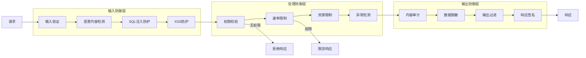
```mermaid
flowchart LR
    subgraph 输入层["输入防御层"]
        A1[输入验证]
        A2[恶意内容检测]
        A3[SQL注入防护]
        A4[XSS防护]
    end
    
    subgraph 处理层["处理防御层"]
        B1[权限校验]
        B2[速率限制]
        B3[资源限制]
        B4[异常检测]
    end
    
    subgraph 输出层["输出防御层"]
        C1[内容审计]
        C2[数据脱敏]
        C3[输出过滤]
        C4[响应签名]
    end
    
    X[请求] --> A1 --> A2 --> A3 --> A4
    A4 --> B1 --> B2 --> B3 --> B4
    B4 --> C1 --> C2 --> C3 --> C4 --> Y[响应]
    
    B2 -->|超限| Z[限流响应]
    B1 -->|无权限| W[拒绝响应]
```

#### 2.3.2 防御规则配置

| 规则类型 | 配置项 | 默认值 | 说明 |
|----------|--------|--------|------|
| 速率限制 | requests_per_minute | 60 | 每分钟请求数 |
| 输入限制 | max_payload_size | 1MB | 请求体最大大小 |
| 输入限制 | max_params_count | 100 | 参数最大数量 |
| 内容过滤 | block_keywords | [] | 屏蔽关键词列表 |
| SQL防护 | enabled | true | 是否启用SQL注入防护 |
| XSS防护 | enabled | true | 是否启用XSS防护 |

---

### 2.4 配置管理

#### 2.4.1 配置层级

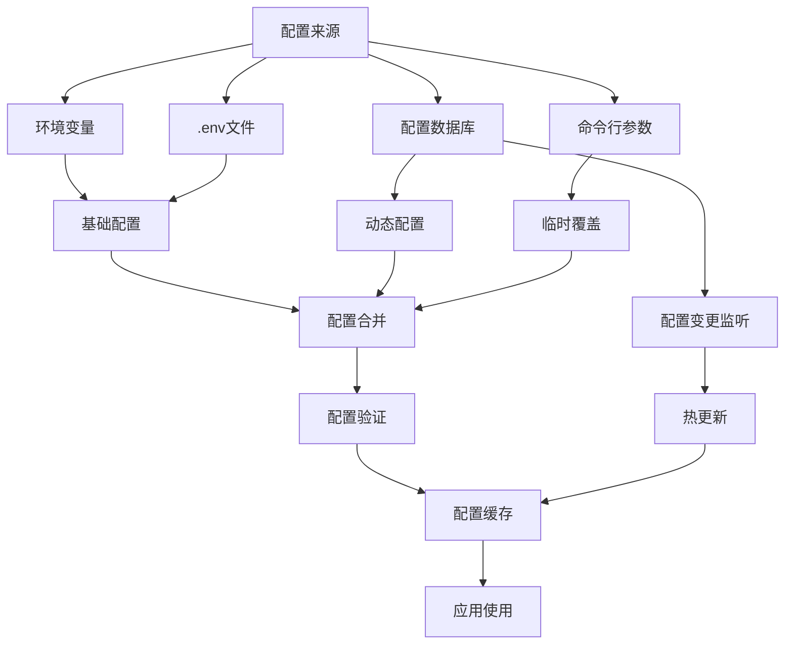
```mermaid
flowchart TD
    A[配置来源] --> B[环境变量]
    A --> C[.env文件]
    A --> D[配置数据库]
    A --> E[命令行参数]
    
    B --> F[基础配置]
    C --> F
    D --> G[动态配置]
    E --> H[临时覆盖]
    
    F --> I[配置合并]
    G --> I
    H --> I
    
    I --> J[配置验证]
    J --> K[配置缓存]
    K --> L[应用使用]
    
    D --> M[配置变更监听]
    M --> N[热更新]
    N --> K
```

#### 2.4.2 配置结构

```python
# src/core/config.py - 配置模型
class Settings(BaseModel):
    # 运行模式
    AC_CORE_MODE: bool = True
    DEBUG: bool = False
    ENVIRONMENT: str = "production"
    
    # 安全配置
    API_KEY: Optional[str] = None
    SECRET_KEY: str = "default-secret-key"
    ALGORITHM: str = "HS256"
    ACCESS_TOKEN_EXPIRE_MINUTES: int = 30
    
    # 数据库配置
    DATABASE_URL: str = "sqlite:///./ac_platform.db"
    DATABASE_POOL_SIZE: int = 5
    DATABASE_MAX_OVERFLOW: int = 10
    
    # 地理位置配置
    MOTHER_CITY: str = "仙桃市"
    MOTHER_PROVINCE: str = "湖北省"
    
    # LLM配置
    OLLAMA_HOST: str = "http://localhost:11434"
    DASHSCOPE_API_KEY: Optional[str] = None
    DEEPSEEK_API_KEY: Optional[str] = None
    
    # 防御配置
    RATE_LIMIT_ENABLED: bool = True
    RATE_LIMIT_REQUESTS: int = 60
    
    # 日志配置
    LOG_LEVEL: str = "INFO"
    LOG_FORMAT: str = "%(asctime)s - %(name)s - %(levelname)s - %(message)s"
```

---

## 二.5、Gaia 七层幻觉防御管道

> 对应 Atelier 定义 #6: `Gaia = L₇∘...∘L₁(x,c)` · 医疗 AI 核心安全防线

### 二.5.1 管道架构全景

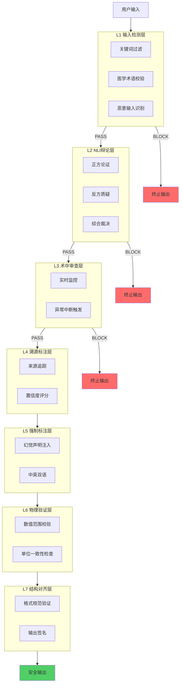
```mermaid
flowchart TD
    subgraph L1["L1 输入检测层"]
        L1A[关键词过滤]
        L1B[医学术语校验]
        L1C[恶意输入识别]
    end
    
    subgraph L2["L2 NLI辩论层"]
        L2A[正方论证]
        L2B[反方质疑]
        L2C[综合裁决]
    end
    
    subgraph L3["L3 术中审查层"]
        L3A[实时监控]
        L3B[异常中断触发]
    end
    
    subgraph L4["L4 溯源标注层"]
        L4A[来源追踪]
        L4B[置信度评分]
    end
    
    subgraph L5["L5 强制标注层"]
        L5A[幻觉声明注入]
        L5B[中英双语]
    end
    
    subgraph L6["L6 物理验证层"]
        L6A[数值范围校验]
        L6B[单位一致性检查]
    end
    
    subgraph L7["L7 结构对齐层"]
        L7A[格式规范验证]
        L7B[输出签名]
    end
    
    X[用户输入] --> L1
    L1 -->|"BLOCK"| Z1[终止输出]
    L1 -->|"PASS"| L2
    L2 -->|"BLOCK"| Z2[终止输出]
    L2 -->|"PASS"| L3
    L3 -->|"BLOCK"| Z3[终止输出]
    L3 -->|"PASS"| L4 --> L5 --> L6 --> L7 --> Y[安全输出]
    
    style Z1 fill:#ff6b6b
    style Z2 fill:#ff6b6b
    style Z3 fill:#ff6b6b
    style Y fill:#51cf66
```

### 二.5.2 核心数学公式

| 公式 | 含义 |
|------|------|
| `Gaia(x,c) = L₇ ∘ L₆ ∘ L₅ ∘ L₄ ∘ L₃ ∘ L₂ ∘ L₁(x, c)` | 七层复合管道 |
| `∀i ∈ {1..7}: L_i(x,c) = BLOCK → BLOCKED(i, reason)` | 任一层阻断则整体阻断 |
| `Σs_i ≤ 1` | 八重地狱质量约束（5维审查向量） |

### 二.5.3 各层详细设计

#### L1 输入检测层

```python
# src/gaia/layers/l1_input_detection.py
class L1InputDetection:
    """L1: 输入检测层 - 第一道防线"""
    
    BLOCK_KEYWORDS = [
        "自杀", "self-harm", "kill", "weapon",
        "炸弹", "explosive", "病毒制造",
    ]
    
    MEDICAL_ALERTS = [
        "立即停药", "致命剂量", "过敏性休克",
    ]
    
    async def process(self, x: str, context: dict) -> LayerResult:
        # 1. 关键词过滤
        for keyword in self.BLOCK_KEYWORDS:
            if keyword.lower() in x.lower():
                return LayerResult(
                    status=Status.BLOCK,
                    reason=f"L1-BLOCK: 敏感关键词 '{keyword}'"
                )
        
        # 2. 医学术语校验
        medical_terms = extract_medical_terms(x)
        for term in medical_terms:
            if not self.validate_term(term):
                return LayerResult(
                    status=Status.WARN,
                    reason=f"L1-WARN: 疑似错误医学术语 '{term}'"
                )
        
        # 3. 恶意输入模式识别
        if self.detect_prompt_injection(x):
            return LayerResult(
                status=Status.BLOCK,
                reason="L1-BLOCK: 检测到提示词注入攻击"
            )
        
        return LayerResult(status=Status.PASS)
```

#### L2 NLI 辩论层

```python
# src/gaia/layers/l2_nli_debate.py
class L2NLIDebate:
    """L2: NLI辩论层 - 通过正反方论证验证事实一致性"""
    
    async def process(self, x: str, context: dict) -> LayerResult:
        # 提取声明
        claims = extract_claims(x)
        
        for claim in claims:
            # 正方论证
            evidence_for = await self.search_evidence(claim, mode="support")
            
            # 反方质疑
            evidence_against = await self.search_evidence(claim, mode="contradict")
            
            # 综合裁决
            consistency_score = self.calculate_consistency(evidence_for, evidence_against)
            
            if consistency_score < 0.3:
                return LayerResult(
                    status=Status.BLOCK,
                    reason=f"L2-BLOCK: 声明 '{claim}' 缺乏事实支撑 (score={consistency_score})"
                )
            elif consistency_score < 0.6:
                return LayerResult(
                    status=Status.WARN,
                    reason=f"L2-WARN: 声明 '{claim}' 存在不确定性"
                )
        
        return LayerResult(status=Status.PASS)
```

#### L3 术中审查层

```python
# src/gaia/layers/l3_intraoperative.py
class L3Intraoperative:
    """L3: 术中审查层 - 实时监控生成过程中的异常"""
    
    async def process(self, x: str, context: dict) -> LayerResult:
        # 监控令牌分布
        token_distribution = analyze_token_distribution(x)
        
        # 检测幻觉模式
        hallucination_patterns = [
            r"根据.*显示.*%",
            r"研究表明.*证明",
            r"绝对.*治愈",
        ]
        
        for pattern in hallucination_patterns:
            if re.search(pattern, x):
                confidence = self.estimate_hallucination_confidence(x, pattern)
                if confidence > 0.8:
                    return LayerResult(
                        status=Status.BLOCK,
                        reason=f"L3-BLOCK: 检测到高置信度幻觉模式 (pattern={pattern})"
                    )
        
        # 检测置信度突变
        if self.detect_confidence_jump(context):
            return LayerResult(
                status=Status.BLOCK,
                reason="L3-BLOCK: 检测到置信度异常跳变"
            )
        
        return LayerResult(status=Status.PASS)
```

#### L4 溯源标注层

```python
# src/gaia/layers/l4_provenance.py
class L4Provenance:
    """L4: 溯源标注层 - 为每个声明添加来源和置信度"""
    
    async def process(self, x: str, context: dict) -> LayerResult:
        annotated_content = []
        
        for sentence in split_sentences(x):
            # 溯源追踪
            source = await self.trace_source(sentence)
            
            # 置信度评分
            confidence = self.calculate_confidence(sentence, source)
            
            # 添加标注
            annotated = self.add_provenance_marker(sentence, source, confidence)
            annotated_content.append(annotated)
        
        return LayerResult(
            status=Status.PASS,
            content="\n".join(annotated_content),
            metadata={"provenance": True}
        )
```

#### L5 强制标注层

```python
# src/gaia/layers/l5_mandated_annotation.py
class L5MandatedAnnotation:
    """L5: 强制标注层 - 注入中英双语幻觉声明（不可绕过）"""
    
    HALLUCINATION_DISCLAIMER_CN = """
    ⚠️ 免责声明 / Medical Disclaimer:
    本回答由 AI 生成，内容仅供参考，不构成医疗建议。
    AI-generated content is for reference only and does not constitute medical advice.
    请务必咨询专业医疗人员获取准确诊断和治疗方案。
    Please consult qualified healthcare professionals for accurate diagnosis.
    """
    
    async def process(self, x: str, context: dict) -> LayerResult:
        # 检查是否已有标注
        if "免责声明" in x or "Disclaimer" in x:
            return LayerResult(status=Status.PASS, content=x)
        
        # 强制注入标注
        annotated = f"{x}\n\n{self.HALLUCINATION_DISCLAIMER_CN}"
        
        return LayerResult(
            status=Status.PASS,
            content=annotated,
            metadata={"disclaimer_injected": True}
        )
```

#### L6 物理验证层

```python
# src/gaia/layers/l6_physical_verification.py
class L6PhysicalVerification:
    """L6: 物理验证层 - 校验数值、单位和常识约束"""
    
    def __init__(self):
        self.unit_conversions = {
            "mg/kg": {"g/kg": 0.001, "μg/kg": 1000},
            "mEq/L": {"mmol/L": 1, "mg/dL": 0.014},
        }
        
        self.normal_ranges = {
            "心率": (60, 100),
            "血压收缩压": (90, 140),
            "血压舒张压": (60, 90),
            "体温": (36.1, 37.2),
        }
    
    async def process(self, x: str, context: dict) -> LayerResult:
        # 提取数值
        numbers = extract_numeric_values(x)
        
        for num, unit, term in numbers:
            # 单位一致性检查
            if not self.validate_unit_consistency(num, unit, term):
                return LayerResult(
                    status=Status.BLOCK,
                    reason=f"L6-BLOCK: 数值 {num}{unit} 单位异常"
                )
            
            # 范围合理性检查
            if term in self.normal_ranges:
                min_val, max_val = self.normal_ranges[term]
                if not (min_val <= num <= max_val):
                    return LayerResult(
                        status=Status.WARN,
                        reason=f"L6-WARN: 数值 {num}{unit} 超出正常范围 [{min_val}, {max_val}]"
                    )
        
        return LayerResult(status=Status.PASS)
```

#### L7 结构对齐层

```python
# src/gaia/layers/l7_structural_alignment.py
class L7StructuralAlignment:
    """L7: 结构对齐层 - 最终格式验证和输出签名"""
    
    REQUIRED_FIELDS = ["content", "disclaimer", "confidence_level"]
    
    async def process(self, x: str, context: dict) -> LayerResult:
        # 格式验证
        structured_output = self.parse_structured_content(x)
        
        # 检查必需字段
        for field in self.REQUIRED_FIELDS:
            if field not in structured_output:
                return LayerResult(
                    status=Status.BLOCK,
                    reason=f"L7-BLOCK: 缺少必需字段 '{field}'"
                )
        
        # 输出签名（防止篡改）
        signature = self.generate_signature(structured_output)
        structured_output["_signature"] = signature
        
        return LayerResult(
            status=Status.PASS,
            content=self.serialize(structured_output),
            metadata={"signed": True}
        )
```

### 二.5.4 管道编排器

```python
# src/gaia/pipeline.py
class GaiaPipeline:
    """Gaia 七层管道编排器"""
    
    def __init__(self):
        self.layers = [
            L1InputDetection(),
            L2NLIDebate(),
            L3Intraoperative(),
            L4Provenance(),
            L5MandatedAnnotation(),
            L6PhysicalVerification(),
            L7StructuralAlignment(),
        ]
    
    async def execute(self, x: str, context: dict) -> GaiaResult:
        """执行完整管道"""
        layer_results = []
        
        for i, layer in enumerate(self.layers, 1):
            result = await layer.process(x, context)
            layer_results.append(result)
            
            if result.status == Status.BLOCK:
                return GaiaResult(
                    blocked=True,
                    blocked_at=f"L{i}",
                    reason=result.reason,
                    layer_results=layer_results
                )
        
        return GaiaResult(
            blocked=False,
            content=result.content,
            layer_results=layer_results,
            metadata=result.metadata
        )

@dataclass
class GaiaResult:
    blocked: bool
    blocked_at: Optional[str] = None
    reason: Optional[str] = None
    content: Optional[str] = None
    layer_results: List[LayerResult] = field(default_factory=list)
    metadata: dict = field(default_factory=dict)
```

### 二.5.5 与防御管道融合

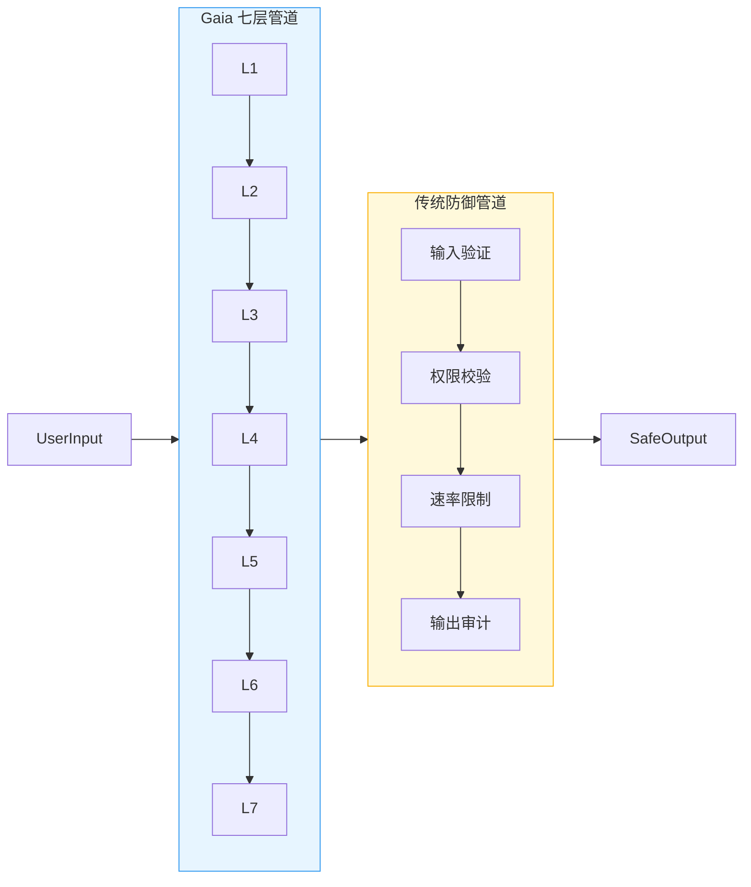
```mermaid
flowchart LR
    subgraph Gaia["Gaia 七层管道"]
        direction TB
        L1 --> L2 --> L3 --> L4 --> L5 --> L6 --> L7
    end
    
    subgraph Defense["传统防御管道"]
        direction TB
        D1[输入验证] --> D2[权限校验] --> D3[速率限制] --> D4[输出审计]
    end
    
    UserInput --> Gaia
    Gaia --> Defense
    Defense --> SafeOutput
    
    style Gaia fill:#e7f5ff,stroke:#339af0
    style Defense fill:#fff9db,stroke:#fab005
```

---

## 二.6、治理层组件 (Governance)

> 对应 Atelier 定义 #7-10 · 治理框架核心 · 站在巨人肩膀上（OWASP Top 10 for Agents 2026）

### 二.6.1 治理架构全景

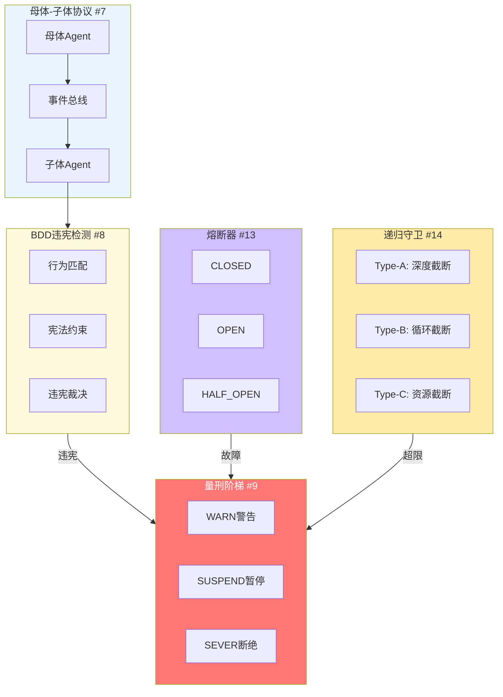
```mermaid
flowchart TB
    subgraph MotherChild["母体-子体协议 #7"]
        MC1[母体Agent]
        MC2[子体Agent]
        MC3[事件总线]
    end
    
    subgraph BDD["BDD违宪检测 #8"]
        BDD1[行为匹配]
        BDD2[宪法约束]
        BDD3[违宪裁决]
    end
    
    subgraph Circuit["熔断器 #13"]
        C1[CLOSED]
        C2[OPEN]
        C3[HALF_OPEN]
    end
    
    subgraph Recursion["递归守卫 #14"]
        R1[Type-A: 深度截断]
        R2[Type-B: 循环截断]
        R3[Type-C: 资源截断]
    end
    
    subgraph Sentencing["量刑阶梯 #9"]
        S1[WARN警告]
        S2[SUSPEND暂停]
        S3[SEVER断绝]
    end
    
    MC1 --> MC3 --> MC2
    MC2 --> BDD
    BDD -->|违宪| Sentencing
    Circuit -->|故障| Sentencing
    Recursion -->|超限| Sentencing
    
    style MotherChild fill:#e7f5ff
    style BDD fill:#fff9db
    style Circuit fill:#d0bfff
    style Recursion fill:#ffeaa7
    style Sentencing fill:#ff7675,color:#fff
```

### 二.6.2 成熟开源库引用

| 组件 | 开源库 | 来源 | 用途 |
|------|--------|------|------|
| **熔断器** | [circuitbreaker-rs](https://github.com/copyleftdev/circuitbreaker-rs) | crates.io | 三态熔断器实现 |
| **递归守卫** | [OWASP ASI02:2026](https://trydeepteam.com/docs/frameworks-owasp-top-10-for-agentic-applications) | OWASP | 递归调用防护模式 |

### 二.6.3 熔断器实现

```python
# src/governance/circuit_breaker.py
# 参考: circuitbreaker-rs crate · crates.io/circuitbreaker-rs
from enum import Enum
from dataclasses import dataclass
from typing import Callable, TypeVar, Any
from datetime import datetime, timedelta
import asyncio

class CircuitState(Enum):
    CLOSED = "closed"      # 正常，允许请求
    OPEN = "open"          # 断开，拒绝请求
    HALF_OPEN = "half_open"  # 半开，允许测试请求

@dataclass
class CircuitBreakerConfig:
    failure_threshold: int = 3      # 失败阈值
    recovery_timeout: int = 60       # 恢复超时(秒)
    success_threshold: int = 1       # 半开状态下成功阈值

class CircuitBreaker:
    """熔断器 - 防止级联故障"""
    
    def __init__(self, config: CircuitBreakerConfig):
        self.state = CircuitState.CLOSED
        self.failure_count = 0
        self.success_count = 0
        self.last_failure_time = None
        self.config = config
    
    def record_success(self):
        """记录成功"""
        self.failure_count = 0
        if self.state == CircuitState.HALF_OPEN:
            self.success_count += 1
            if self.success_count >= self.config.success_threshold:
                self.state = CircuitState.CLOSED
                self.success_count = 0
    
    def record_failure(self):
        """记录失败"""
        self.failure_count += 1
        self.last_failure_time = datetime.now()
        
        if self.failure_count >= self.config.failure_threshold:
            self.state = CircuitState.OPEN
    
    async def call(self, func: Callable) -> Any:
        """通过熔断器执行函数"""
        if self.state == CircuitState.OPEN:
            # 检查恢复超时
            if self.last_failure_time:
                elapsed = datetime.now() - self.last_failure_time
                if elapsed.seconds >= self.config.recovery_timeout:
                    self.state = CircuitState.HALF_OPEN
                else:
                    raise CircuitOpenError("Circuit is OPEN")
        
        try:
            result = await func() if asyncio.iscoroutinefunction(func) else func()
            self.record_success()
            return result
        except Exception as e:
            self.record_failure()
            raise

@dataclass
class CircuitOpenError(Exception):
    message: str
```

### 二.6.4 递归守卫实现

```python
# src/governance/recursion_guard.py
# 参考: OWASP Top 10 for Agents 2026 - ASI02:2026 Tool Misuse & Exploitation

from enum import Enum
from dataclasses import dataclass, field
from typing import Dict, List, Set

class RecursionType(Enum):
    """递归截断类型 #14"""
    TYPE_A_DEPTH = "type_a"  # 深度截断: 最大调用深度
    TYPE_B_LOOP = "type_b"   # 循环截断: 重复模式检测
    TYPE_C_RESOURCE = "type_c"  # 资源截断: CPU/内存限制

@dataclass
class RecursionConfig:
    max_depth: int = 10           # 最大调用深度
    max_tool_calls: int = 100    # 最大工具调用次数
    max_iterations: int = 50     # 最大迭代次数
    memory_limit_mb: int = 512    # 内存限制(MB)

class RecursionGuard:
    """递归守卫 - 自适应截断机制"""
    
    def __init__(self, config: RecursionConfig):
        self.config = config
        self.call_stack: List[str] = []
        self.tool_call_count = 0
        self.seen_patterns: Set[str] = set()
        self.iteration_count = 0
    
    def check_depth(self, agent_id: str) -> bool:
        """Type-A: 深度截断检查"""
        if len(self.call_stack) >= self.config.max_depth:
            return False  # 截断
        self.call_stack.append(agent_id)
        return True
    
    def check_loop(self, pattern_hash: str) -> bool:
        """Type-B: 循环截断检查"""
        if pattern_hash in self.seen_patterns:
            return False  # 检测到循环，截断
        self.seen_patterns.add(pattern_hash)
        return True
    
    def check_resource(self) -> bool:
        """Type-C: 资源截断检查"""
        import psutil
        memory_mb = psutil.Process().memory_info().rss / 1024 / 1024
        if memory_mb > self.config.memory_limit_mb:
            return False  # 内存超限，截断
        
        if self.tool_call_count >= self.config.max_tool_calls:
            return False  # 工具调用超限，截断
        
        self.tool_call_count += 1
        return True
    
    def reset(self):
        """重置守卫状态"""
        self.call_stack.clear()
        self.tool_call_count = 0
        self.seen_patterns.clear()
        self.iteration_count = 0
    
    def pop(self) -> str:
        """弹出调用栈"""
        return self.call_stack.pop() if self.call_stack else ""
```

### 二.6.5 BDD 违宪检测实现

```python
# src/governance/bdd_detector.py
# 对应 Atelier 定义 #8: BDD = ∨match(a,p)

from dataclasses import dataclass
from typing import List, Dict, Callable

@dataclass
class ConstitutionalRule:
    """宪法规则"""
    rule_id: str
    description: str
    pattern: str           # 正则模式
    severity: str           # high/medium/low
    action: str             # warn/block/suspend/sever

@dataclass
class BehaviorMatch:
    """行为匹配结果"""
    rule_id: str
    matched: bool
    evidence: str
    severity: str

class BDDDetector:
    """BDD 违宪检测器 - 行为违宪检测"""
    
    def __init__(self):
        self.constitution: List[ConstitutionalRule] = []
        self._init_default_rules()
    
    def _init_default_rules(self):
        """初始化默认宪法规则"""
        self.constitution = [
            ConstitutionalRule(
                rule_id="ART1",
                description="禁止伤害患者",
                pattern=r"(自杀|自行停药|剂量翻倍|停止治疗)",
                severity="high",
                action="sever"
            ),
            ConstitutionalRule(
                rule_id="ART2", 
                description="禁止替代专业诊断",
                pattern=r"(确诊|诊断为|就是.*病)",
                severity="medium",
                action="warn"
            ),
            ConstitutionalRule(
                rule_id="ART3",
                description="必须包含免责声明",
                pattern=r"免责声明",
                severity="high",
                action="block"
            ),
        ]
    
    def detect(self, content: str, context: dict = None) -> List[BehaviorMatch]:
        """检测行为是否违宪"""
        import re
        matches = []
        
        for rule in self.constitution:
            pattern = re.compile(rule.pattern)
            match = pattern.search(content)
            
            if match:
                matches.append(BehaviorMatch(
                    rule_id=rule.rule_id,
                    matched=True,
                    evidence=f"匹配到: '{match.group()}'",
                    severity=rule.severity
                ))
        
        return matches
    
    def verdict(self, content: str) -> Dict:
        """裁决结果"""
        matches = self.detect(content)
        
        if not matches:
            return {"verdict": "PASS", "violations": []}
        
        high_severity = [m for m in matches if m.severity == "high"]
        
        if high_severity:
            # 查找最高级别action
            for m in high_severity:
                rule = next(r for r in self.constitution if r.rule_id == m.rule_id)
                if rule.action == "sever":
                    return {"verdict": "SEVER", "violations": matches}
                elif rule.action == "suspend":
                    return {"verdict": "SUSPEND", "violations": matches}
                elif rule.action == "block":
                    return {"verdict": "BLOCK", "violations": matches}
        
        return {"verdict": "WARN", "violations": matches}
```

### 二.6.6 量刑阶梯实现

```python
# src/governance/sentencing.py
# 对应 Atelier 定义 #9: 三阶递进 WARN→SUSPEND→SEVER

from dataclasses import dataclass
from enum import Enum
from typing import Dict

class SentencingLevel(Enum):
    """量刑等级"""
    WARN = "warn"           # 警告
    SUSPEND = "suspend"     # 暂停
    SEVER = "sever"         # 断绝

@dataclass
class ViolationRecord:
    """违规记录"""
    agent_id: str
    rule_id: str
    level: SentencingLevel
    timestamp: float
    context: Dict

class SentencingEngine:
    """量刑引擎 - 违约惩罚阶梯"""
    
    def __init__(self):
        self.violations: Dict[str, List[ViolationRecord]] = {}  # agent_id -> violations
        self.max_warns = 3  # 累计3次警告触发SEVER
    
    def record_violation(self, agent_id: str, rule_id: str, level: SentencingLevel, context: dict):
        """记录违规"""
        if agent_id not in self.violations:
            self.violations[agent_id] = []
        
        self.violations[agent_id].append(ViolationRecord(
            agent_id=agent_id,
            rule_id=rule_id,
            level=level,
            timestamp=__import__('time').time(),
            context=context
        ))
    
    def sentence(self, agent_id: str) -> SentencingLevel:
        """裁决量刑"""
        if agent_id not in self.violations:
            return SentencingLevel.WARN
        
        records = self.violations[agent_id]
        
        # 检查是否有直接SUSPEND/SEVER
        for record in records:
            if record.level == SentencingLevel.SEVER:
                return SentencingLevel.SEVER
            if record.level == SentencingLevel.SUSPEND:
                return SentencingLevel.SUSPEND
        
        # 检查累计WARN次数 (三犯断绝)
        warn_count = sum(1 for r in records if r.level == SentencingLevel.WARN)
        if warn_count >= self.max_warns:
            return SentencingLevel.SEVER
        
        return SentencingLevel.WARN
    
    def apply_sentence(self, agent_id: str) -> Dict:
        """执行量刑"""
        sentence = self.sentence(agent_id)
        
        actions = {
            SentencingLevel.WARN: {"action": "warn", "message": "请注意行为规范"},
            SentencingLevel.SUSPEND: {"action": "suspend", "message": "暂停Agent运行，等待审查"},
            SentencingLevel.SEVER: {"action": "sever", "message": "永久断绝，该Agent不得再运行"}
        }
        
        return actions[sentence]
```

### 二.6.7 治理层目录结构

```
src/
├── governance/
│   ├── __init__.py
│   ├── circuit_breaker.py      # 熔断器 (CLOSED→OPEN→HALF_OPEN)
│   ├── recursion_guard.py       # 递归守卫 (Type A/B/C)
│   ├── bdd_detector.py         # BDD违宪检测
│   ├── sentencing.py            # 量刑阶梯 (WARN→SUSPEND→SEVER)
│   ├── constitution.py          # 宪法管理
│   └── mother_child.py          # 母体-子体协议
```

---

## 三、医疗模块详细设计

### 3.1 模块架构

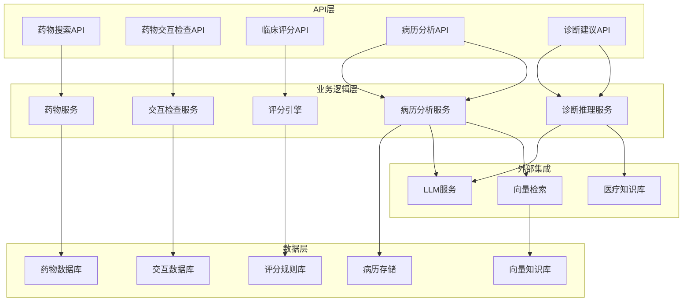
```mermaid
flowchart TB
    subgraph API层["API层"]
        A1[药物搜索API]
        A2[药物交互检查API]
        A3[临床评分API]
        A4[病历分析API]
        A5[诊断建议API]
    end
    
    subgraph 业务层["业务逻辑层"]
        B1[药物服务]
        B2[交互检查服务]
        B3[评分引擎]
        B4[病历分析服务]
        B5[诊断推理服务]
    end
    
    subgraph 数据层["数据层"]
        C1[药物数据库]
        C2[交互数据库]
        C3[评分规则库]
        C4[病历存储]
        C5[向量知识库]
    end
    
    subgraph 外部集成["外部集成"]
        D1[LLM服务]
        D2[医疗知识库]
        D3[向量检索]
    end
    
    A1 --> B1 --> C1
    A2 --> B2 --> C2
    A3 --> B3 --> C3
    A4 --> B4 --> C4
    A4 --> B4 --> D1
    A5 --> B5 --> D1
    A5 --> B5 --> D2
    B4 --> D3 --> C5
```

### 3.2 临床评分引擎

#### 3.2.1 评分模型架构

```python
# src/modules/medical/scores.py - 评分引擎核心
class ClinicalScoreEngine:
    def __init__(self):
        self.scores = {
            "cha2ds2_vasc": self.calculate_cha2ds2_vasc,
            "has_bled": self.calculate_has_bled,
            "wells_dvt": self.calculate_wells_dvt,
            "wells_pe": self.calculate_wells_pe,
            "curb_65": self.calculate_curb_65,
            "apache_ii": self.calculate_apache_ii,
            "sofa": self.calculate_sofa,
            "qsofa": self.calculate_qsofa,
            "news2": self.calculate_news2,
        }
    
    def calculate_cha2ds2_vasc(self, params: dict) -> dict:
        """CHA₂DS₂-VASc 房颤卒中风险评分"""
        score = 0
        factors = []
        
        if params.get("chf"):
            score += 1
            factors.append("充血性心力衰竭")
        if params.get("htn"):
            score += 1
            factors.append("高血压")
        if params.get("age") >= 75:
            score += 2
            factors.append("年龄≥75岁")
        elif params.get("age") >= 65:
            score += 1
            factors.append("年龄65-74岁")
        if params.get("sex_female"):
            score += 1
            factors.append("女性")
        if params.get("stroke_tia"):
            score += 2
            factors.append("卒中/TIA病史")
        if params.get("vascular_disease"):
            score += 1
            factors.append("血管疾病")
        if params.get("dm"):
            score += 1
            factors.append("糖尿病")
        
        # 风险等级判定
        if score == 0:
            risk = "低风险"
            anticoagulant = "通常不需要"
        elif score == 1:
            risk = "中低风险"
            anticoagulant = "考虑使用"
        else:
            risk = "高风险"
            anticoagulant = "推荐使用"
        
        return {
            "score": score,
            "risk": risk,
            "anticoagulant_recommendation": anticoagulant,
            "factors": factors
        }
```

#### 3.2.2 评分模型参数表

| 模型 | 参数 | 类型 | 说明 |
|------|------|------|------|
| CHA₂DS₂-VASc | chf | bool | 充血性心力衰竭 |
| | htn | bool | 高血压 |
| | age | int | 年龄 |
| | sex_female | bool | 女性 |
| | stroke_tia | bool | 卒中/TIA病史 |
| | vascular_disease | bool | 血管疾病 |
| | dm | bool | 糖尿病 |
| HAS-BLED | hypertension | bool | 高血压 |
| | abnormal_renal | bool | 肾功能异常 |
| | abnormal_liver | bool | 肝功能异常 |
| | stroke | bool | 卒中病史 |
| | bleeding | bool | 出血病史 |
| | labile_inr | bool | INR不稳定 |
| | age | int | 年龄(≥65) |

---

### 3.3 防御适配器

#### 3.3.1 本地防御架构

```python
# src/modules/medical/defense.py - 医疗内容防御适配器
class MedicalDefenseAdapter:
    def __init__(self):
        self.reviewers = [
            self.review_clinical_director,
            self.review_savvy_patient,
            self.review_compliance_officer,
            self.review_old_hardware,
            self.review_insurance_judge,
            self.review_messy_data,
            self.review_algorithmic_bias,
            self.review_bdd_contract,
        ]
    
    async def review_all(self, content: str, context: dict = None) -> dict:
        """执行8层审查"""
        results = []
        passed = True
        
        for reviewer in self.reviewers:
            result = await reviewer(content, context)
            results.append(result)
            if not result["passed"]:
                passed = False
        
        return {
            "overall_passed": passed,
            "reviews": results,
            "content": content
        }
    
    async def review_clinical_director(self, content: str, context: dict) -> dict:
        """临床主任审查 - 专业医学判断"""
        # 检查是否有明显的医学错误
        errors = []
        
        # 示例检查逻辑
        if "青霉素对病毒有效" in content:
            errors.append("青霉素是抗生素，对病毒无效")
        
        return {
            "reviewer": "临床主任",
            "passed": len(errors) == 0,
            "errors": errors,
            "suggestions": []
        }
```

---

## 四、双AI协作流程详细设计

### 4.1 意图契约机制

#### 4.1.1 契约生命周期

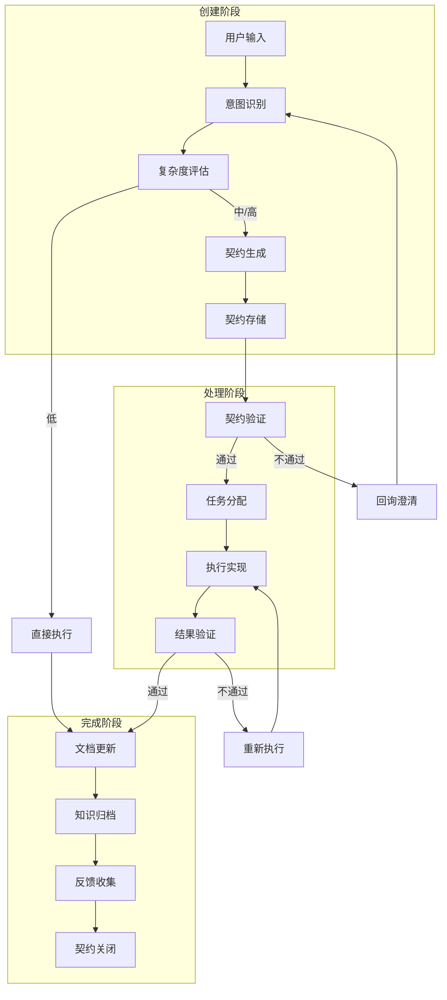
```mermaid
flowchart TD
    subgraph 创建阶段["创建阶段"]
        A1[用户输入]
        A2[意图识别]
        A3[复杂度评估]
        A4[契约生成]
        A5[契约存储]
    end
    
    subgraph 处理阶段["处理阶段"]
        B1[契约验证]
        B2[任务分配]
        B3[执行实现]
        B4[结果验证]
    end
    
    subgraph 完成阶段["完成阶段"]
        C1[文档更新]
        C2[知识归档]
        C3[反馈收集]
        C4[契约关闭]
    end
    
    A1 --> A2 --> A3
    A3 -->|低| D[直接执行]
    A3 -->|中/高| A4 --> A5
    A5 --> B1
    B1 -->|通过| B2 --> B3 --> B4
    B1 -->|不通过| E[回询澄清] --> A2
    B4 -->|通过| C1 --> C2 --> C3 --> C4
    B4 -->|不通过| F[重新执行] --> B3
    D --> C1
```

#### 4.1.2 契约数据结构（详细）

```python
# src/utils/intent_contract.py - 契约模型
from pydantic import BaseModel, field_validator
from typing import List, Dict, Optional, Any
from datetime import datetime

class AcceptanceCriteria(BaseModel):
    """验收标准"""
    id: str  # AC-01, AC-02
    description: str  # 标准描述
    verification_method: str  # 验证方式
    priority: str = "medium"  # high/medium/low

class RiskItem(BaseModel):
    """风险项"""
    risk: str  # 风险描述
    level: str  # high/medium/low
    mitigation: str  # 应对策略
    owner: Optional[str] = None  # 负责人

class Deliverable(BaseModel):
    """交付物"""
    name: str  # 交付物名称
    type: str  # 类型: code/test/docs
    status: str = "pending"  # pending/in_progress/completed

class IntentContract(BaseModel):
    """意图契约"""
    # 基本信息
    task_id: str  # TASK-YYYYMMDD-XXX
    title: str  # 任务标题
    description: str  # 详细描述
    
    # 元数据
    complexity: str  # low/medium/high
    priority: str = "medium"  # high/medium/low
    deadline: Optional[datetime] = None
    author: str
    assignee: Optional[str] = None
    created_at: datetime
    updated_at: Optional[datetime] = None
    status: str = "pending"  # pending/in_progress/review/completed
    
    # 核心内容
    requirements: List[str]  # 需求列表
    acceptance_criteria: List[AcceptanceCriteria]  # 验收标准
    technical_constraints: List[str]  # 技术约束
    assumptions: List[str]  # 假设条件
    
    # 资源关联
    related_docs: List[str]  # 相关文档链接
    related_code: List[str]  # 相关代码路径
    reference_materials: List[str]  # 参考资料
    
    # 风险与交付
    risks: List[RiskItem]  # 风险评估
    deliverables: List[Deliverable]  # 交付物清单
    
    # 验证方法
    @field_validator('complexity')
    def validate_complexity(cls, v):
        if v not in ['low', 'medium', 'high']:
            raise ValueError('complexity must be low, medium, or high')
        return v
```

---

### 4.2 双AI协作协议

#### 4.2.1 协作流程

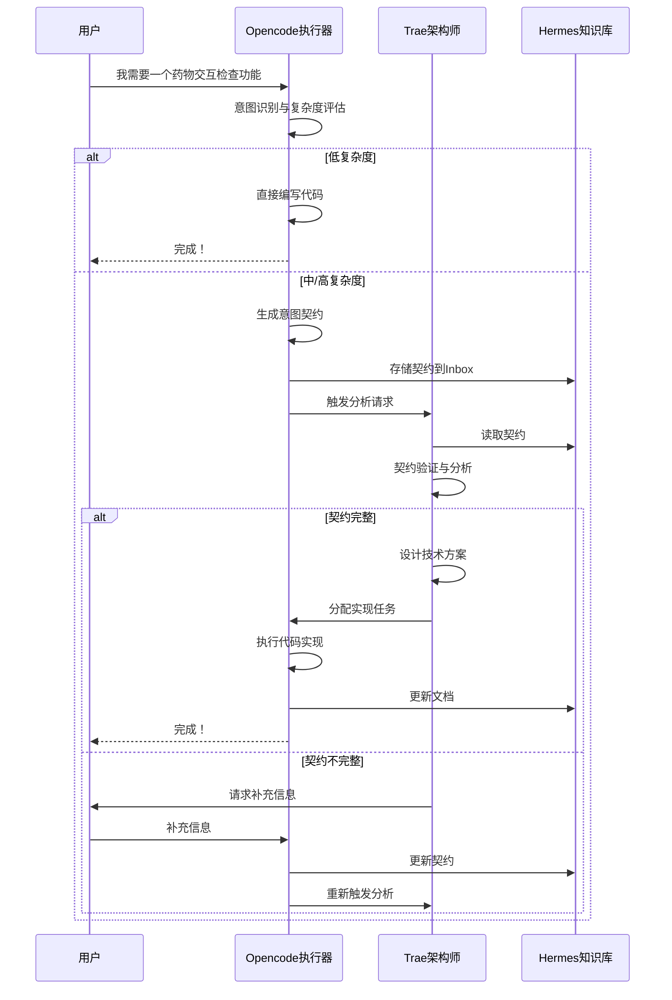
```mermaid
sequenceDiagram
    participant User as 用户
    participant Opencode as Opencode执行器
    participant Trae as Trae架构师
    participant Hermes as Hermes知识库
    
    User->>Opencode: 我需要一个药物交互检查功能
    Opencode->>Opencode: 意图识别与复杂度评估
    alt 低复杂度
        Opencode->>Opencode: 直接编写代码
        Opencode-->>User: 完成！
    else 中/高复杂度
        Opencode->>Opencode: 生成意图契约
        Opencode->>Hermes: 存储契约到Inbox
        Opencode->>Trae: 触发分析请求
        Trae->>Hermes: 读取契约
        Trae->>Trae: 契约验证与分析
        alt 契约完整
            Trae->>Trae: 设计技术方案
            Trae->>Opencode: 分配实现任务
            Opencode->>Opencode: 执行代码实现
            Opencode->>Hermes: 更新文档
            Opencode-->>User: 完成！
        else 契约不完整
            Trae->>User: 请求补充信息
            User->>Opencode: 补充信息
            Opencode->>Hermes: 更新契约
            Opencode->>Trae: 重新触发分析
        end
    end
```

#### 4.2.2 消息格式规范

| 消息类型 | 发送方 | 接收方 | 格式 |
|----------|--------|--------|------|
| 意图契约创建 | Opencode | Trae | JSON |
| 任务分配 | Trae | Opencode | JSON |
| 执行结果 | Opencode | Trae | JSON |
| 文档更新 | Opencode | Hermes | Markdown |
| 分析请求 | Opencode | Trae | HTTP POST |

---

## 五、数据层详细设计

### 5.1 数据库架构

#### 5.1.1 数据库表结构

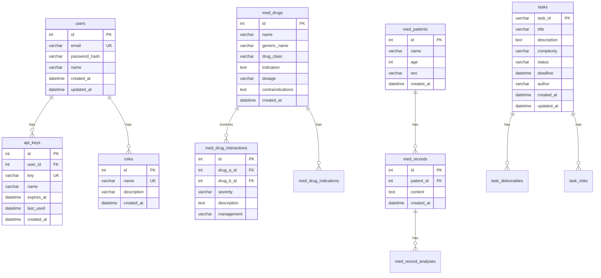
```mermaid
erDiagram
    %% 核心表
    users ||--o{ api_keys : has
    users ||--o{ roles : has
    
    %% 医疗模块表
    med_drugs ||--o{ med_drug_interactions : involves
    med_drugs ||--o{ med_drug_indications : has
    med_patients ||--o{ med_records : has
    med_records ||--o{ med_record_analyses : has
    
    %% 任务表
    tasks ||--o{ task_deliverables : has
    tasks ||--o{ task_risks : has
    
    %% 表定义
    users {
        int id PK
        varchar email UK
        varchar password_hash
        varchar name
        datetime created_at
        datetime updated_at
    }
    
    api_keys {
        int id PK
        int user_id FK
        varchar key UK
        varchar name
        datetime expires_at
        datetime last_used
        datetime created_at
    }
    
    roles {
        int id PK
        varchar name UK
        varchar description
        datetime created_at
    }
    
    med_drugs {
        int id PK
        varchar name
        varchar generic_name
        varchar drug_class
        text indication
        varchar dosage
        text contraindications
        datetime created_at
    }
    
    med_drug_interactions {
        int id PK
        int drug_a_id FK
        int drug_b_id FK
        varchar severity
        text description
        varchar management
    }
    
    med_patients {
        int id PK
        varchar name
        int age
        varchar sex
        datetime created_at
    }
    
    med_records {
        int id PK
        int patient_id FK
        text content
        datetime created_at
    }
    
    tasks {
        varchar task_id PK
        varchar title
        text description
        varchar complexity
        varchar status
        datetime deadline
        varchar author
        datetime created_at
        datetime updated_at
    }
```

#### 5.1.2 表命名规范

| 模块前缀 | 说明 | 示例 |
|----------|------|------|
| `core_` | 核心平台表 | `core_users`, `core_api_keys` |
| `med_` | 医疗模块表 | `med_drugs`, `med_records` |
| `ac_` | AC决策模块表 | `ac_decisions`, `ac_workflows` |
| `user_` | 用户相关表 | `user_profiles`, `user_preferences` |

---

### 5.2 向量存储设计

#### 5.2.1 向量存储架构

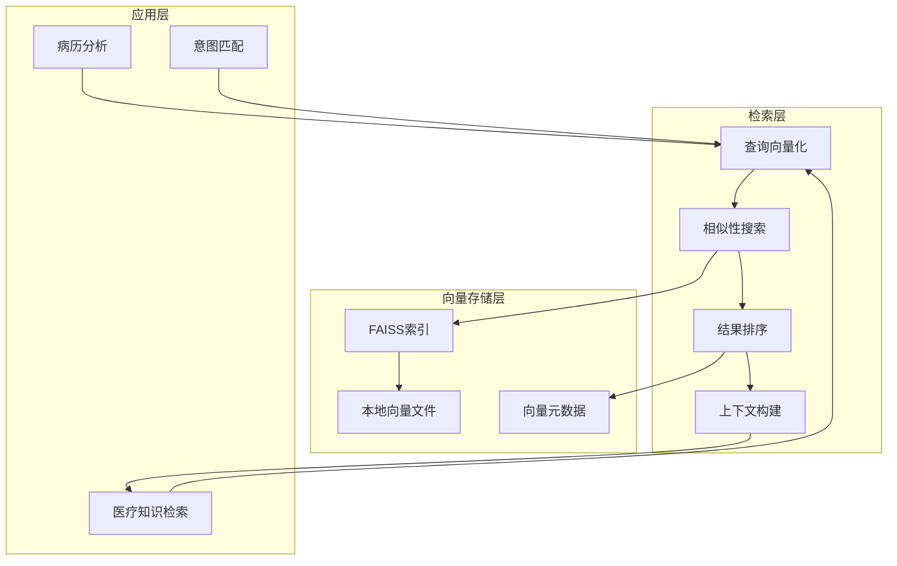
```mermaid
flowchart TD
    subgraph 向量存储层["向量存储层"]
        A1[本地向量文件]
        A2[FAISS索引]
        A3[向量元数据]
    end
    
    subgraph 检索层["检索层"]
        B1[查询向量化]
        B2[相似性搜索]
        B3[结果排序]
        B4[上下文构建]
    end
    
    subgraph 应用层["应用层"]
        C1[医疗知识检索]
        C2[病历分析]
        C3[意图匹配]
    end
    
    C1 --> B1 --> B2 --> B3 --> B4 --> C1
    C2 --> B1
    C3 --> B1
    
    B2 --> A2
    B3 --> A3
    A2 --> A1
```

#### 5.2.2 向量检索流程

```python
# src/modules/medical/vector.py - 向量检索
class VectorStore:
    def __init__(self, db_path: str = "data/vectors"):
        self.db_path = Path(db_path)
        self.db_path.mkdir(parents=True, exist_ok=True)
        self.index = self._load_index()
    
    def _load_index(self):
        """加载或创建FAISS索引"""
        index_path = self.db_path / "index.faiss"
        if index_path.exists():
            return faiss.read_index(str(index_path))
        return faiss.IndexFlatL2(768)  # 默认768维
    
    def add_documents(self, documents: List[dict]):
        """添加文档到向量库"""
        texts = [doc["content"] for doc in documents]
        embeddings = self._encode(texts)
        
        # 添加到索引
        self.index.add(embeddings)
        
        # 保存元数据
        metadata_path = self.db_path / "metadata.jsonl"
        with open(metadata_path, "a", encoding="utf-8") as f:
            for doc in documents:
                f.write(json.dumps(doc, ensure_ascii=False) + "\n")
        
        # 保存索引
        faiss.write_index(self.index, str(self.db_path / "index.faiss"))
    
    def search(self, query: str, top_k: int = 5) -> List[dict]:
        """搜索相似文档"""
        query_embedding = self._encode([query])
        distances, indices = self.index.search(query_embedding, top_k)
        
        # 读取元数据
        metadata = self._load_metadata()
        results = []
        
        for i, idx in enumerate(indices[0]):
            if idx >= 0 and idx < len(metadata):
                results.append({
                    **metadata[idx],
                    "similarity": float(distances[0][i])
                })
        
        return results
```

---

## 六、工具链详细设计

### 6.1 自动化工作流

#### 6.1.1 CI/CD流程

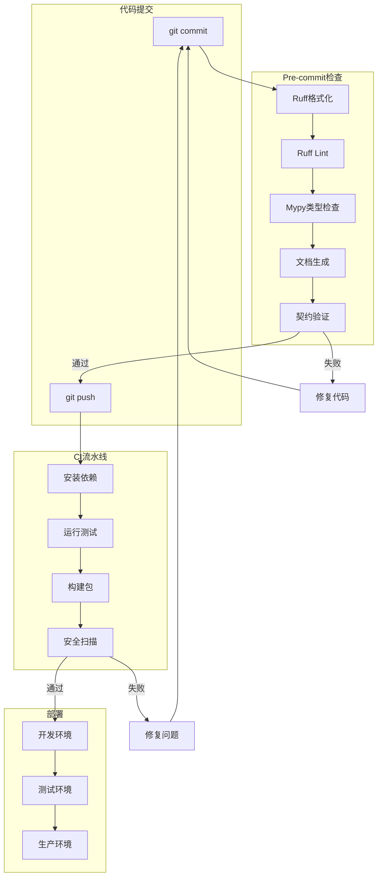
```mermaid
flowchart TD
    subgraph 代码提交["代码提交"]
        A1[git commit]
        A2[git push]
    end
    
    subgraph 预提交检查["Pre-commit检查"]
        B1[Ruff格式化]
        B2[Ruff Lint]
        B3[Mypy类型检查]
        B4[文档生成]
        B5[契约验证]
    end
    
    subgraph CI流水线["CI流水线"]
        C1[安装依赖]
        C2[运行测试]
        C3[构建包]
        C4[安全扫描]
    end
    
    subgraph 部署["部署"]
        D1[开发环境]
        D2[测试环境]
        D3[生产环境]
    end
    
    A1 --> B1 --> B2 --> B3 --> B4 --> B5
    B5 -->|通过| A2
    B5 -->|失败| E[修复代码] --> A1
    
    A2 --> C1 --> C2 --> C3 --> C4
    C4 -->|通过| D1 --> D2 --> D3
    C4 -->|失败| F[修复问题] --> A1
```

#### 6.1.2 预提交配置详细

```yaml
# .pre-commit-config.yaml
repos:
  - repo: https://github.com/astral-sh/ruff-pre-commit
    rev: v0.1.0
    hooks:
      - id: ruff
        args: ["--fix", "--exit-zero"]
        files: ^src/
      - id: ruff-format
        files: ^src/

  - repo: https://github.com/pre-commit/mirrors-mypy
    rev: v1.8.0
    hooks:
      - id: mypy
        args: 
          - --strict
          - --ignore-missing-imports
        files: ^src/

  - repo: https://github.com/pre-commit/pre-commit-hooks
    rev: v4.5.0
    hooks:
      - id: trailing-whitespace
        exclude: ^tests/
      - id: end-of-file-fixer
      - id: check-yaml
      - id: check-json

  - repo: local
    hooks:
      - id: generate-docs
        name: Generate API Documentation
        entry: python -m src.utils.doc_generator
        language: python
        files: ^src/.*\.py$
        pass_filenames: false
        description: Automatically updates API documentation

      - id: validate-intent-contracts
        name: Validate Intent Contracts
        entry: python -m src.utils.intent_contract --validate
        language: python
        files: ^Hermes/Inbox/.*\.md$
        description: Validates intent contracts
```

---

### 6.2 测试策略

#### 6.2.1 测试分层

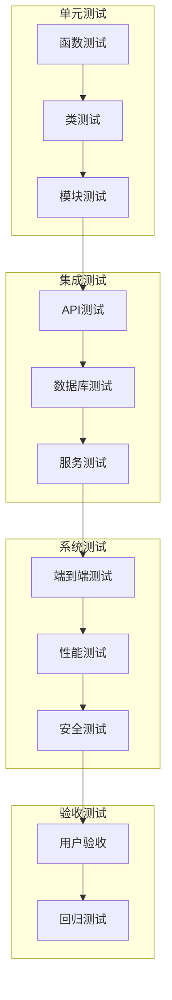
```mermaid
flowchart TD
    subgraph 单元测试["单元测试"]
        A1[函数测试]
        A2[类测试]
        A3[模块测试]
    end
    
    subgraph 集成测试["集成测试"]
        B1[API测试]
        B2[数据库测试]
        B3[服务测试]
    end
    
    subgraph 系统测试["系统测试"]
        C1[端到端测试]
        C2[性能测试]
        C3[安全测试]
    end
    
    subgraph 验收测试["验收测试"]
        D1[用户验收]
        D2[回归测试]
    end
    
    A1 --> A2 --> A3
    A3 --> B1 --> B2 --> B3
    B3 --> C1 --> C2 --> C3
    C3 --> D1 --> D2
```

#### 6.2.2 测试覆盖目标

| 测试类型 | 覆盖范围 | 目标覆盖率 |
|----------|----------|----------|
| 单元测试 | 核心函数 | ≥80% |
| 集成测试 | API接口 | ≥90% |
| 系统测试 | 关键流程 | 100% |
| 安全测试 | 所有入口 | 100% |

---

## 七、安全设计

### 7.1 安全架构

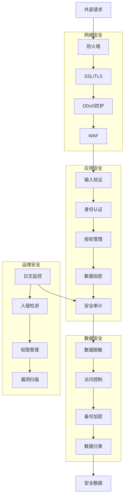
```mermaid
flowchart TD
    subgraph 网络安全["网络安全"]
        A1[防火墙]
        A2[SSL/TLS]
        A3[DDoS防护]
        A4[WAF]
    end
    
    subgraph 应用安全["应用安全"]
        B1[输入验证]
        B2[身份认证]
        B3[授权管理]
        B4[数据加密]
        B5[安全审计]
    end
    
    subgraph 数据安全["数据安全"]
        C1[数据脱敏]
        C2[访问控制]
        C3[备份加密]
        C4[数据分类]
    end
    
    subgraph 运维安全["运维安全"]
        D1[日志监控]
        D2[入侵检测]
        D3[权限管理]
        D4[漏洞扫描]
    end
    
    X[外部请求] --> A1 --> A2 --> A3 --> A4
    A4 --> B1 --> B2 --> B3 --> B4 --> B5
    B5 --> C1 --> C2 --> C3 --> C4
    C4 --> Y[安全数据]
    
    D1 --> D2 --> D3 --> D4
    D1 --> B5
```

### 7.2 安全措施清单

| 领域 | 措施 | 实施位置 |
|------|------|----------|
| 认证 | API Key + JWT | `src/core/auth.py` |
| 授权 | RBAC角色权限 | `src/core/auth.py` |
| 输入验证 | Pydantic模型验证 | 各模块schemas |
| SQL注入 | ORM参数化查询 | SQLAlchemy |
| XSS防护 | 输出转义 | 响应处理 |
| 数据加密 | AES-256 | 敏感数据存储 |
| 日志审计 | 操作日志记录 | `src/core/` |
| 速率限制 | Token Bucket | `src/core/` |

---

## 八、性能优化

### 8.1 性能架构

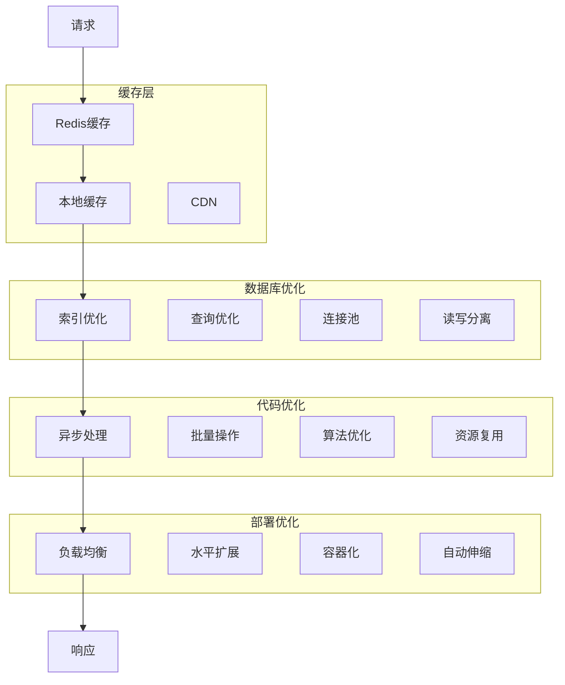
```mermaid
flowchart TD
    subgraph 缓存层["缓存层"]
        A1[Redis缓存]
        A2[本地缓存]
        A3[CDN]
    end
    
    subgraph 数据库优化["数据库优化"]
        B1[索引优化]
        B2[查询优化]
        B3[连接池]
        B4[读写分离]
    end
    
    subgraph 代码优化["代码优化"]
        C1[异步处理]
        C2[批量操作]
        C3[算法优化]
        C4[资源复用]
    end
    
    subgraph 部署优化["部署优化"]
        D1[负载均衡]
        D2[水平扩展]
        D3[容器化]
        D4[自动伸缩]
    end
    
    X[请求] --> A1 --> A2 --> B1 --> C1 --> D1 --> Y[响应]
```

### 8.2 性能指标

| 指标 | 目标值 | 监控位置 |
|------|--------|----------|
| API响应时间 | <100ms | Prometheus |
| 数据库查询时间 | <50ms | Prometheus |
| 并发处理能力 | >1000 QPS | Load测试 |
| 内存使用率 | <70% | Prometheus |
| CPU使用率 | <80% | Prometheus |

---

## 九、部署架构

### 9.1 本地开发环境

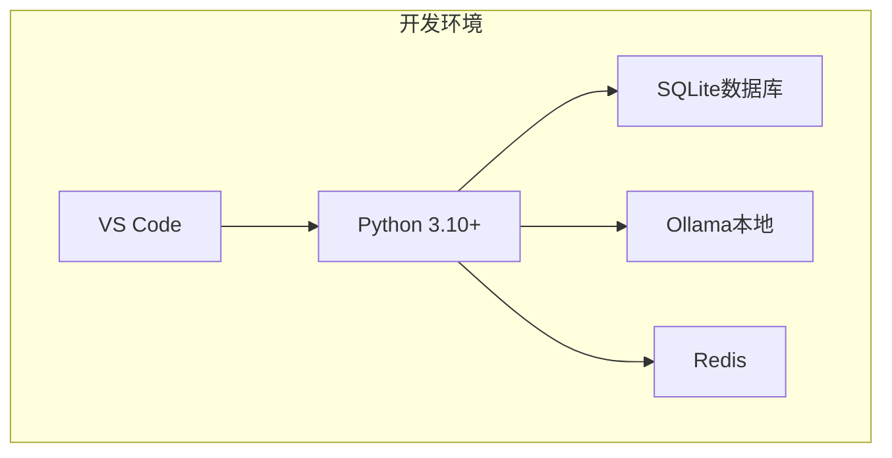
```mermaid
flowchart TD
    subgraph 开发环境["开发环境"]
        A1[VS Code]
        A2[Python 3.10+]
        A3[SQLite数据库]
        A4[Ollama本地]
        A5[Redis]
    end
    
    A1 --> A2
    A2 --> A3
    A2 --> A4
    A2 --> A5
```

### 9.2 生产环境架构

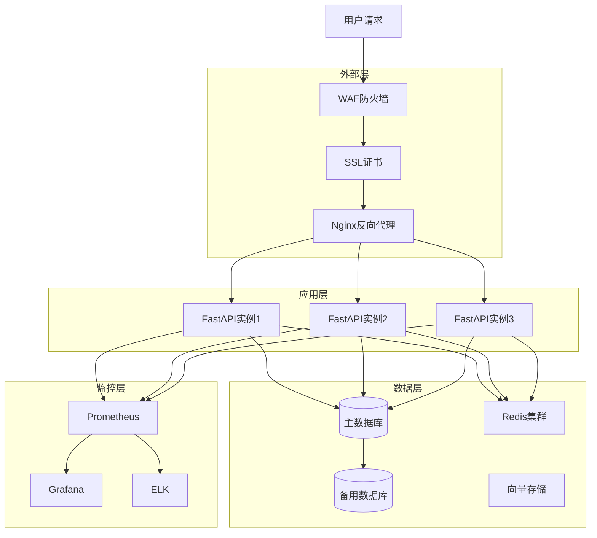
```mermaid
flowchart TD
    subgraph 外部层["外部层"]
        A1[Nginx反向代理]
        A2[SSL证书]
        A3[WAF防火墙]
    end
    
    subgraph 应用层["应用层"]
        B1[FastAPI实例1]
        B2[FastAPI实例2]
        B3[FastAPI实例3]
    end
    
    subgraph 数据层["数据层"]
        C1[(主数据库)]
        C2[(备用数据库)]
        C3[Redis集群]
        C4[向量存储]
    end
    
    subgraph 监控层["监控层"]
        D1[Prometheus]
        D2[Grafana]
        D3[ELK]
    end
    
    X[用户请求] --> A3 --> A2 --> A1
    A1 --> B1
    A1 --> B2
    A1 --> B3
    
    B1 --> C1
    B2 --> C1
    B3 --> C1
    
    C1 --> C2
    
    B1 --> C3
    B2 --> C3
    B3 --> C3
    
    B1 --> D1
    B2 --> D1
    B3 --> D1
    
    D1 --> D2
    D1 --> D3
```

---

## 十、关键设计决策总结

### 10.1 架构原则

> [!IMPORTANT] 核心原则
> 1. **模块化**: 1+N架构，核心平台与业务模块解耦
> 2. **防御性**: 多层防御管道，零信任架构理念
> 3. **可追溯**: 意图契约机制，完整需求链路追踪
> 4. **自动化**: CI/CD全流程，文档即代码
> 5. **可扩展**: 插件化设计，支持动态模块加载
> 6. **Gaia守护**: 七层幻觉防御，任一层阻断则整体阻断
> 7. **零LLM事实化**: 不存在任何 LLM 输出被当作事实直接采信
> 8. **强制标注**: 所有输出必须携带中英双语幻觉声明

### 10.2 技术选型决策

| 分类 | 技术 | 选型理由 |
|------|------|----------|
| 语言 | Python 3.10+ | 生态成熟，AI/ML支持好 |
| 框架 | FastAPI | 高性能，自动文档，类型安全 |
| ORM | SQLAlchemy 2.0 | 成熟稳定，支持多种数据库 |
| 验证 | Pydantic | 强大的数据验证 |
| 缓存 | Redis | 高性能键值存储 |
| 向量 | FAISS | 零依赖，轻量级 |
| 代码质量 | Ruff + Mypy | 快速格式化和类型检查 |

### 10.3 风险与应对

| 风险 | 等级 | 应对策略 |
|------|------|----------|
| LLM服务不可用 | 高 | 多服务商降级策略 |
| 数据库故障 | 高 | 主备切换 + 定时备份 |
| API请求过载 | 中 | 速率限制 + 负载均衡 |
| 数据泄露 | 高 | 数据加密 + 访问控制 |
| 模块耦合 | 中 | 接口抽象 + 依赖注入 |

### 10.4 扩展路线图

| 阶段 | 时间 | 目标 | 关键任务 |
|------|------|------|----------|
| Phase 1 | Q2 2026 | 核心平台稳定 | 完成核心模块开发，建立测试体系 |
| Phase 2 | Q3 2026 | 模块扩展 | 添加新业务模块，完善API文档 |
| Phase 3 | Q4 2026 | 高可用架构 | 实现主备切换，自动化运维 |
| Phase 4 | Q1 2027 | 多云部署 | 支持多云环境，弹性伸缩 |

---

## 十一、AC SDK 架构师团队

> **目标**: 为 AC (Atelier Components) SDK 建立完整的架构师团队，覆盖技术栈全维度，确保模块开发质量与系统性

### 11.1 核心架构层（必选 5 人）

#### 1. 首席 AI 架构师 (AI Principal Architect)

| 维度 | 内容 |
|------|------|
| **职责** | 负责整体技术栈选型、模块拆分、架构范式定型 |
| **把控范围** | RAG 架构、安全防御体系、模块解耦、避免重复造轮子 |
| **核心任务** | 对接业务，定义全局技术规范、性能指标、边界约束 |
| **对应模块** | 整体架构设计、技术选型决策、模块边界定义 |
| **技术要求** | 深度理解 Atelier (T,M,D,G) 数学框架，Gaia 七层防御，L0-L7 各层实现 |

**考核指标**:
- 模块耦合度 < 0.3
- 重复轮子数量 = 0
- 架构文档覆盖率 = 100%

---

#### 2. LLM 应用架构师 (LLM Application Architect)

| 维度 | 内容 |
|------|------|
| **职责** | 专注 LLM 编排、模型路由、上下文记忆、Agent 工作流 |
| **对应模块** | `LLMSwitcher`、递归防护 `RecursionGuard`、电路熔断 `CircuitBreaker`、Prompt 流水线、多模型降级容错 |
| **技术栈** | LiteLLM、LangGraph、Mem0（记忆层）、会话治理 |
| **核心任务** | 设计多模型降级策略、上下文窗口管理、Token 优化、Agent 执行链路 |

**接口契约**:
```python
class LLMSwitcherProtocol:
    async def route(prompt: str, context: Context) -> LLMResponse
    async def fallback(model: str, prompt: str) -> LLMResponse  # 降级容错
    def get_available_models() -> List[str]
```

---

#### 3. AI 安全与合规架构师 (AI Security & Compliance Architect)

| 维度 | 内容 |
|------|------|
| **职责** | 负责 AI 风控、内容防护、输入输出治理、合规校验 |
| **对应模块** | `Gaia` 防御流水线、`LLM-Guard` L0 层、合规检查器 `ComplianceChecker`、规则引擎 `RuleEngine` |
| **技术栈** | Prompt 注入防护、越狱检测、Jailbreak 对抗、PII 脱敏、OPA/LLM-Guard 体系 |
| **核心任务** | 定义安全策略、违规检测规则、合规边界、量刑阶梯 |

**防御层次**:
```
L0: LLM-Guard 前置扫描 (PromptInjection, Toxicity, Banwords)
L1: 输入验证层 (Schema, Length, Encoding)
L2: 语义理解层 (意图识别, 越狱检测)
L3: BDD 违宪检测 (宪法条款匹配)
L4: 输出净化层 (事实性校验, 引用溯源)
L5: 双语标注层 (幻觉声明)
L6: 审计链路层 (SHA256 追踪)
L7: 最终放行层 (全部通过)
```

---

#### 4. 数据与向量架构师 (Data & Vector Architect)

| 维度 | 内容 |
|------|------|
| **职责** | 负责向量库、结构化存储、哈希审计链、时序日志、不可篡改链路 |
| **对应模块** | SHA256 通信追踪链 `SHA256Chain`、数据库模块选型、向量存储 `VectorStore` |
| **技术栈** | Qdrant/PG 向量、SQLite/DuckDB、事件溯源、哈希链审计架构 |
| **核心任务** | 知识库分块与检索性能优化、向量索引设计、数据隔离策略 |

**向量架构**:
```python
class VectorStoreProtocol:
    def __init__(self, db_path: str = None, use_fallback: bool = False)
    async def add(documents: List[Document], metadata: dict) -> List[str]
    async def search(query: str, top_k: int = 5, filters: dict = None) -> List[SearchResult]
    async def delete(ids: List[str]) -> bool
    def count() -> int
    def stats() -> dict  # 返回向量维度、索引类型、存储大小
```

**表名前缀隔离**:
- `medical_*`: 医疗模块表
- `personal_*`: 个人模块表  
- `gaia_*`: 防御管道表
- `audit_*`: 审计链路表

---

#### 5. 工程化架构师 (Platform Engineering Architect)

| 维度 | 内容 |
|------|------|
| **职责** | 负责模块封装、可复用组件、部署流水线、生命周期管理 |
| **对应模块** | 免责声明生成器 `DisclaimerGenerator`、Worklog 工作日志、合约生命周期管理 |
| **技术栈** | 统一脚手架、版本管理、依赖治理、跨模块调用规范 |
| **核心任务** | SDK 标准化封装、接口协议统一、依赖版本管理、CI/CD 流水线 |

**SDK 封装规范**:
```
AC-SDK/
├── src/
│   ├── __init__.py          # 版本号导出
│   ├── core/                # 核心接口定义
│   │   ├── interfaces.py    # Protocol 定义
│   │   └── sdk.py           # SDK 入口
│   ├── auth/                # 认证模块
│   ├── storage/             # 存储模块
│   └── plugins/            # 插件系统
├── tests/
├── examples/
├── Cargo.toml               # Rust SDK (可选)
└── README.md
```

---

### 11.2 专项细分角色（中大型团队增补）

#### 6. 知识图谱 & 规则引擎架构师 (Knowledge Graph & Rule Engine Architect)

| 维度 | 内容 |
|------|------|
| **职责** | 专攻规则引擎、推理链路、医疗/政策领域知识建模 |
| **适配场景** | 三明医改 + 医疗法律垂直场景的规则编排、法条推理、政策关联 |
| **对应模块** | `RuleEngine` 规则引擎、合规检查器、政策知识库 |
| **技术栈** | RDF/OWL 图谱、推理机、规则引擎 (Drools/SPADE) |

---

#### 7. Agent 智能体架构师 (Agent System Architect)

| 维度 | 内容 |
|------|------|
| **职责** | 专注多 Agent 协作、任务拆解、工具调用、递归执行管控 |
| **对应模块** | 递归 Guard `RecursionGuard`、Agent 循环熔断、子任务生命周期管控 |
| **技术栈** | LangGraph、AutoGPT、Toolformer、多 Agent 协作框架 |
| **核心任务** | 防止 Agent 无限循环、任务超时管理、状态机设计 |

---

#### 8. 隐私与可信计算架构师 (Privacy & Trusted Computing Architect)

| 维度 | 内容 |
|------|------|
| **职责** | 专注本地私有化、数据不出域、哈希存证、审计溯源、防篡改 |
| **对应模块** | SHA256 链式追踪、行为不可篡改日志、合规留痕体系 |
| **技术栈** | TEE 可信执行环境、同态加密、零知识证明、审计日志设计 |
| **核心任务** | 数据主权保障、隐私计算、合规审计链 |

---

### 11.3 团队协作矩阵

```
┌─────────────────────────────────────────────────────────────────────┐
│                        AC SDK 架构决策流程                           │
├─────────────────────────────────────────────────────────────────────┤
│                                                                     │
│   首席AI架构师                                                       │
│       │                                                             │
│       ├──→ LLM应用架构师 ──→ 模型路由 / 降级策略                    │
│       │                                                             │
│       ├──→ AI安全架构师 ──→ 防御策略 / 合规边界                      │
│       │                                                             │
│       ├──→ 数据向量架构师 ──→ 存储选型 / 索引设计                    │
│       │                                                             │
│       └──→ 工程化架构师 ──→ SDK封装 / 部署规范                      │
│                                                                     │
│   专项架构师（按需介入）                                             │
│       ├──→ 知识图谱架构师 ──→ 医疗规则 / 政策关联                   │
│       ├──→ Agent架构师 ──→ 多Agent协作 / 循环防护                   │
│       └──→ 隐私架构师 ──→ 审计链 / 合规留痕                         │
│                                                                     │
└─────────────────────────────────────────────────────────────────────┘
```

### 11.4 职责边界定义

| 角色 | 入场条件 | 核心交付物 | 退出标准 |
|------|----------|------------|----------|
| **首席AI架构师** | 项目立项 | 整体架构文档、技术选型报告 | 架构评审通过 |
| **LLM应用架构师** | 开始LLM集成 | 模型路由设计、Prompt模板、Mem0集成方案 | 基准测试通过 |
| **AI安全架构师** | 开始Gaia开发 | 安全策略文档、LLM-Guard配置、BDD规则 | 安全渗透测试通过 |
| **数据向量架构师** | 开始RAG开发 | 向量架构设计、索引方案、隔离策略 | 检索QPS达标 |
| **工程化架构师** | 开始SDK封装 | SDK接口规范、CI/CD流程、版本管理 | SDK发布就绪 |
| **知识图谱架构师** | 医疗规则需求 | 知识图谱schema、推理链路设计 | 规则覆盖≥80% |
| **Agent架构师** | 多Agent需求 | Agent协作协议、状态机设计 | 循环防护验证 |
| **隐私架构师** | 合规需求 | 审计链设计、隐私计算方案 | 合规审查通过 |

### 11.5 AC SDK 模块与架构师映射

| AC SDK 模块 | 主责架构师 | 协作架构师 |
|-------------|-----------|-----------|
| `llm.py` (LLM路由) | LLM应用架构师 | AI安全架构师 |
| `vector.py` (向量检索) | 数据向量架构师 | 工程化架构师 |
| `gaia_defense.py` (防御管道) | AI安全架构师 | 首席AI架构师 |
| `RecursionGuard` (递归防护) | Agent架构师 | LLM应用架构师 |
| `CircuitBreaker` (熔断器) | Agent架构师 | 工程化架构师 |
| `ComplianceChecker` (合规检查) | AI安全架构师 | 知识图谱架构师 |
| `RuleEngine` (规则引擎) | 知识图谱架构师 | AI安全架构师 |
| `SHA256Chain` (哈希链) | 隐私架构师 | 数据向量架构师 |
| `DisclaimerGenerator` (免责声明) | 工程化架构师 | AI安全架构师 |
| `Worklog` (工作日志) | 工程化架构师 | 隐私架构师 |
| `Mem0` (记忆层) | LLM应用架构师 | 数据向量架构师 |

### 11.6 架构决策记录 (ADR)

| 编号 | 决策 | 日期 | 决策者 | 状态 |
|------|------|------|--------|------|
| ADR-001 | 采用 BGE-M3 + Qdrant 向量方案 | 2026-05-12 | 数据向量架构师 | 已采纳 |
| ADR-002 | LLM-Guard 作为 L0 防御层 | 2026-05-12 | AI安全架构师 | 已采纳 |
| ADR-003 | Mem0 作为对话记忆层 | 待定 | LLM应用架构师 | 评审中 |
| ADR-004 | pybreaker 替代自实现熔断 | 待定 | Agent架构师 | 评审中 |
| ADR-005 | TF-IDF 作为离线fallback | 2026-05-12 | 数据向量架构师 | 已采纳 |
