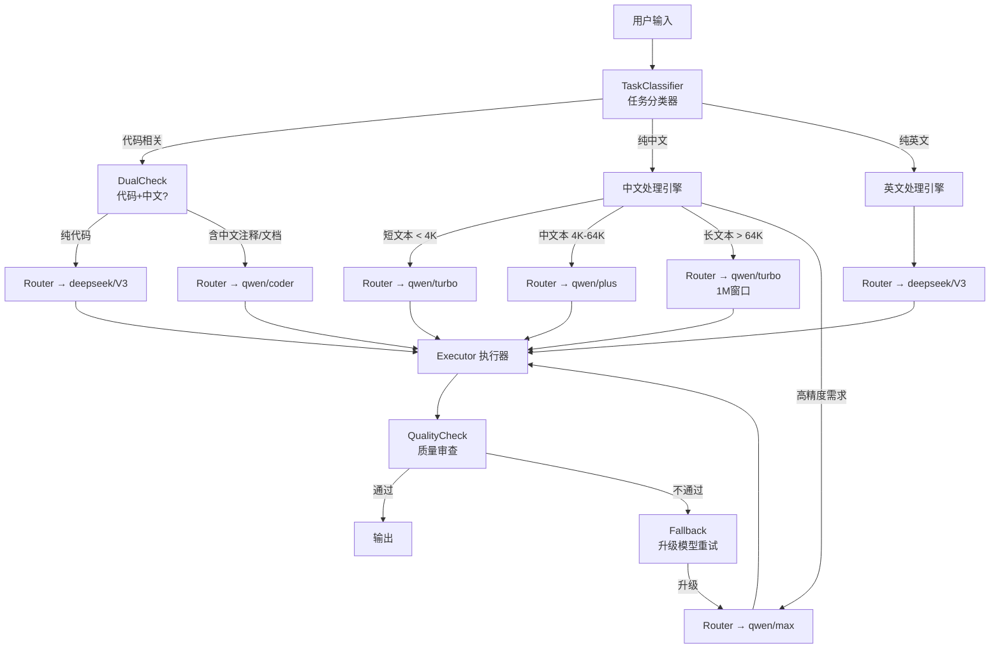

# AC 多模型指挥架构 — 极致颗粒度调度体系

## 定位

AC 决策中心作为"AI 指挥官"，不直接执行所有任务，而是根据任务类型、语言、复杂度、成本预算四个维度，将子任务按极致颗粒度路由到最合适的 AI 模型。

---

## 一、模型能力矩阵

### 1.1 当前接入的 AI 节点

| 节点 ID | 提供商 | 主力模型 | 中文能力 | 代码能力 | 上下文窗口 | 速度 | 成本 |
|---------|--------|----------|---------|---------|-----------|------|------|
| `deepseek/V3` | DeepSeek | deepseek-chat | ★★★☆☆ | ★★★★★ | 128K | 快 | 极低 |
| `deepseek/R1` | DeepSeek | deepseek-reasoner | ★★★☆☆ | ★★★★★ | 128K | 慢 | 低 |
| `qwen/turbo` | 阿里灵码 | qwen-turbo | ★★★★★ | ★★★☆☆ | 1M | 极快 | 低 |
| `qwen/plus` | 阿里灵码 | qwen-plus | ★★★★★ | ★★★★☆ | 128K | 快 | 中 |
| `qwen/max` | 阿里灵码 | qwen-max | ★★★★★ | ★★★★★ | 128K | 慢 | 高 |
| `qwen/coder` | 阿里灵码 | qwen-coder | ★★★★☆ | ★★★★★ | 128K | 快 | 中 |

### 1.2 模型选型决策矩阵

```
任务维度 ────────────────────────────────────────────→ 推荐模型

纯代码生成 (Python/JS)         → deepseek/V3
算法复杂逻辑推理               → deepseek/R1
中文文书 (病历/政策解读)       → qwen/max
长文本理解 (>64K tokens)       → qwen/turbo (1M窗口)
中文 + 代码混合                → qwen/coder
快速原型 (速度优先)            → qwen/turbo
精准级 (质量第一)              → qwen/max
成本敏感 (大批量处理)          → deepseek/V3
法律/合规语义分析              → qwen/max
```

---

## 二、极致颗粒度路由引擎

### 2.1 架构图



### 2.2 路由决策伪代码

```python
class ACRouter:
    def route(self, task: Task) -> ModelTarget:
        
        # Layer 1: 语言检测
        lang = detect_language(task.content)
        has_code = detect_code_blocks(task.content)
        token_count = estimate_tokens(task.content)
        
        # Layer 2: 意图分类
        intent = classify_intent(task.content)
        
        # Layer 3: 颗粒度路由决策
        if intent == "CODE_GENERATION":
            if lang == "zh" and has_code:
                return ModelTarget("qwen/coder")      # 中文+代码
            if task.complexity == "high":
                return ModelTarget("deepseek/R1")     # 复杂算法
            return ModelTarget("deepseek/V3")         # 纯代码
        
        if intent == "DOCUMENT_GENERATION":
            if token_count > 64_000:
                return ModelTarget("qwen/turbo")      # 超长文本
            if task.priority == "precision":
                return ModelTarget("qwen/max")        # 高精度
            return ModelTarget("qwen/plus")           # 常规
        
        if intent == "LEGAL_COMPLIANCE":
            return ModelTarget("qwen/max")            # 法律必用最强
        
        if intent == "TRANSLATION":
            return ModelTarget("qwen/turbo")          # 翻译追求速度
        
        if task.budget == "low":
            return ModelTarget("deepseek/V3")         # 成本优先
        
        return ModelTarget("qwen/plus")               # 默认
```

---

## 三、Fallback 保底策略

```
┌─────────────────┐
│ 主模型调用       │
└────────┬────────┘
         │
    ┌────▼────┐
    │ 响应正常? │──→ 是 ──→ 输出
    └────┬────┘
         │ 否 (超时/429/5xx)
    ┌────▼────────────────────────────────┐
    │ Fallback L1: 同能力级切换            │
    │ qwen/plus → deepseek/V3             │
    │ deepseek/V3 → qwen/turbo            │
    └────┬────────────────────────────────┘
         │ 仍然失败
    ┌────▼────────────────────────────────┐
    │ Fallback L2: 降级模型 (牺牲质量保可用)│
    │ 全线 → qwen/turbo (最快/最稳定)      │
    └─────────────────────────────────────┘
```

---

## 四、并发调度策略

### 4.1 独立子任务并行

当 AC 拆解出 N 个子任务且彼此无依赖时，同时向多个模型发送请求：

```python
# 示例: 诊断报告生成
tasks = [
    Task("症状分析",      content=symptoms,  target="qwen/max"),
    Task("检验解读",      content=lab_data,  target="deepseek/V3"),
    Task("DRG费用评估",   content=cost_data, target="qwen/plus"),
    Task("合规风险扫描",  content=case_info, target="qwen/max"),
]
results = await parallel_execute(tasks)
report = merge(results)
```

### 4.2 串行依赖链

```
用户症状
  → [qwen/max] 初步诊断
    → [deepseek/V3] 实验室指标分析
      → [qwen/plus] 治疗方案推荐
        → [qwen/max] 知情同意书生成
```

---

## 五、成本控制与配额管理

### 5.1 按优先级配额分配

| 优先级 | deepseek/V3 | qwen/turbo | qwen/plus | qwen/max | deepseek/R1 |
|--------|-------------|------------|-----------|----------|-------------|
| P0 急救 | 不限 | 不限 | 不限 | 不限 | 不限 |
| P1 临床 | 不限 | 不限 | 不限 | 500次/日 | 100次/日 |
| P2 研究 | 10000次/日 | 不限 | 5000次/日 | 200次/日 | 50次/日 |
| P3 学习 | 1000次/日 | 不限 | 200次/日 | 50次/日 | 0 |

### 5.2 成本预估 (每 1K tokens)

| 模型 | 输入 | 输出 |
|------|------|------|
| deepseek/V3 | ¥0.001 | ¥0.002 |
| deepseek/R1 | ¥0.004 | ¥0.016 |
| qwen/turbo | ¥0.003 | ¥0.006 |
| qwen/plus | ¥0.004 | ¥0.012 |
| qwen/max | ¥0.020 | ¥0.060 |

---

## 六、AC 指挥日志格式

每次模型调用记录到 `data/ac_routing.log`：

```json
{
  "ts": "2026-05-11T21:30:00CST",
  "task_id": "T-042",
  "intent": "DIAGNOSIS",
  "lang": "zh",
  "tokens": 2840,
  "routed_to": "qwen/max",
  "reason": "高精度中文诊断",
  "latency_ms": 3200,
  "tokens_used": 3150,
  "cost": 0.067,
  "fallback_used": false
}
```

---

## 七、Opencode 集成入口

### 7.1 OpenCode 配置 (已完成)

```json
{
  "provider": {
    "aliyun": {
      "type": "openai-compatible",
      "apiKey": "sk-***",
      "apiBase": "https://dashscope.aliyuncs.com/compatible-mode/v1"
    },
    "deepseek": {
      "type": "openai-compatible",
      "apiKey": "sk-***",
      "apiBase": "https://api.deepseek.com/v1"
    }
  }
}
```

### 7.2 切换命令

```
/model aliyun/qwen-plus     # 通义灵码 (日常中文)
/model deepseek/deepseek-chat  # DeepSeek V3 (代码生成)
/model aliyun/qwen-max      # 最强中文精度模式
```

---

## 八、下一步：AC 智能化

当前路由基于硬编码规则 → 下一步引入轻量分类模型自动学习调度偏好：

```
┌────────────┐    ┌──────────────┐    ┌─────────────┐
│ 历史日志    │──→│ 偏好学习      │──→│ 自动路由     │
│ routing.log │    │ (小型ML模型) │    │ (零配置)    │
└────────────┘    └──────────────┘    └─────────────┘
```

---

*文档版本: v1.0 | 创建时间: 2026-05-11 | 维护人: Opencode / AC*
