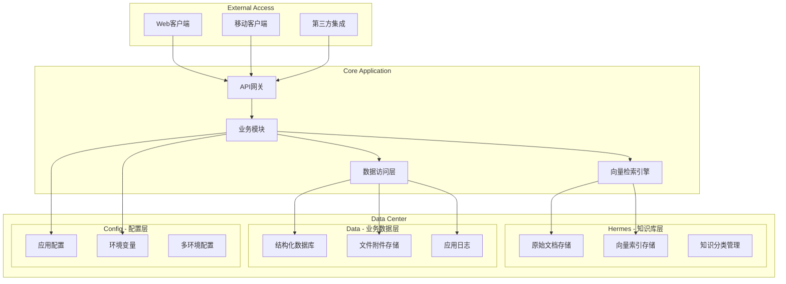
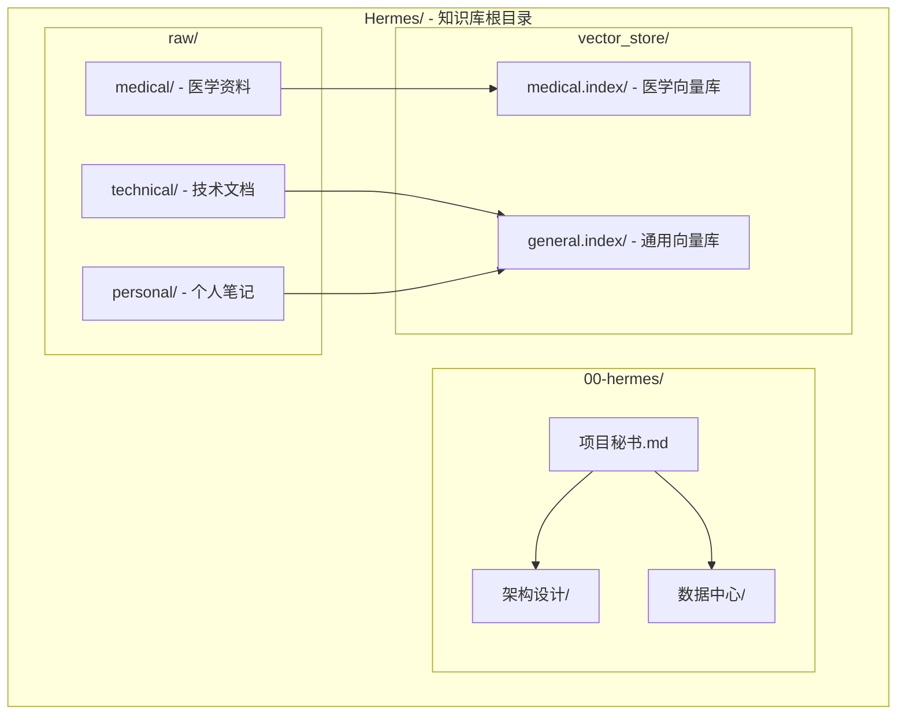
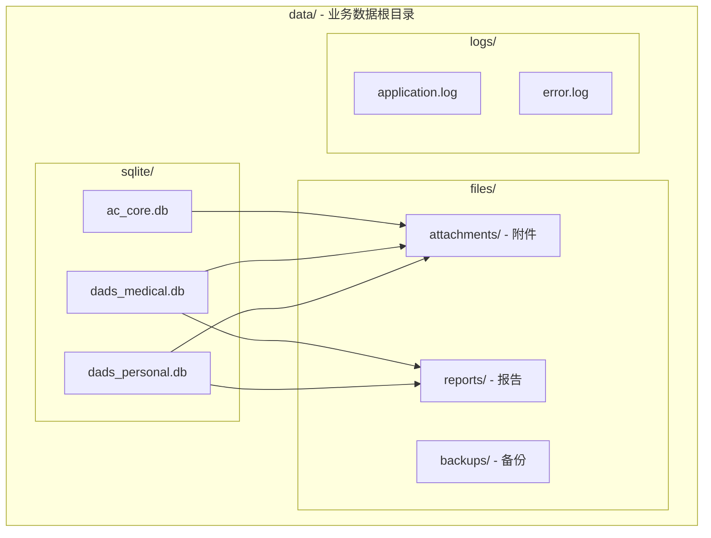
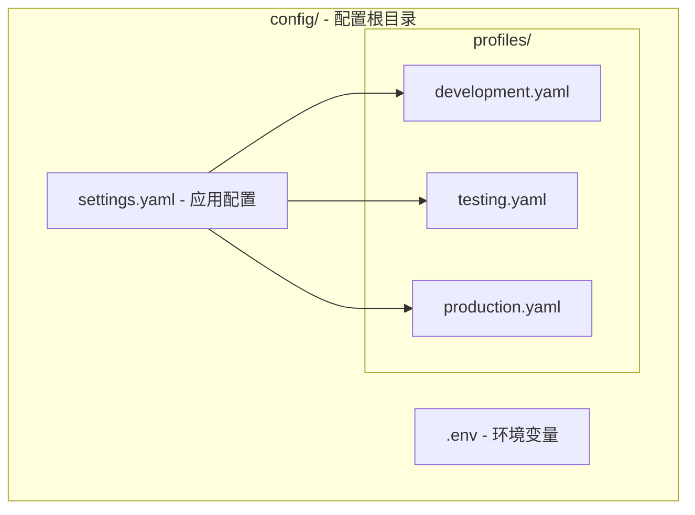
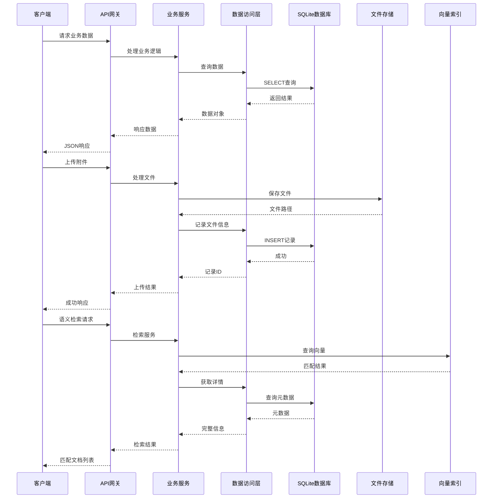
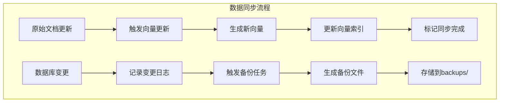
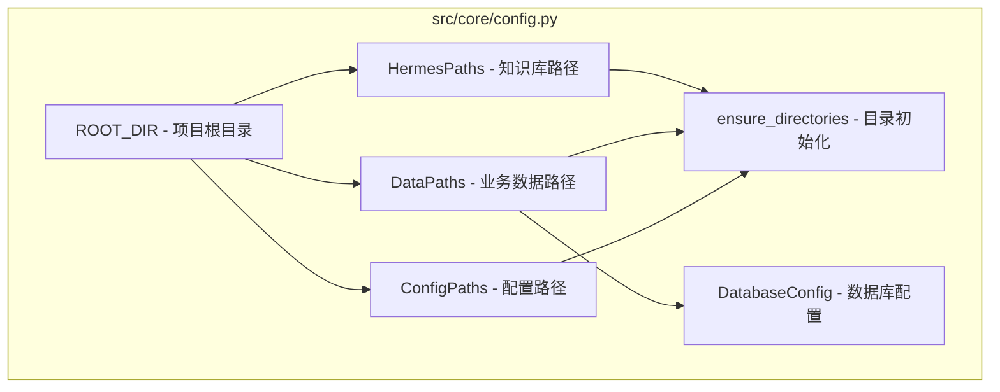
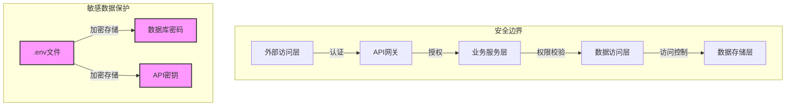

# 数据中心高颗粒度架构图

## 概述

本文档详细描述 TRAE 项目数据中心的高颗粒度架构设计，涵盖知识库层、业务数据层、配置层的完整结构和交互关系。

---

## 一、数据中心整体架构



---

## 二、知识库层（Hermes）架构

### 2.1 目录结构



### 2.2 组件职责

| 组件 | 职责 | 存储内容 | 访问方式 |
|------|------|----------|----------|
| **00-hermes/** | 元数据管理 | 架构文档、项目配置 | 直接读取 |
| **raw/medical/** | 医学知识存储 | 医学笔记、临床指南 | 文件系统 |
| **raw/technical/** | 技术文档存储 | API文档、架构说明 | 文件系统 |
| **raw/personal/** | 个人笔记存储 | 经验总结、避坑指南 | 文件系统 |
| **vector_store/** | 向量索引存储 | 语义检索索引 | 向量数据库API |

---

## 三、业务数据层（Data）架构

### 3.1 目录结构



### 3.2 数据库职责

| 数据库 | 所属模块 | 存储内容 | 表前缀 |
|--------|----------|----------|--------|
| **dads_personal.db** | DADS个人版 | 合规记录、沟通留痕、工作日志 | `personal_` |
| **dads_medical.db** | DADS医疗版 | 诊断数据、评分系统、临床决策 | `medical_` |
| **ac_core.db** | AC决策中心 | 用户配置、任务记录、分析结果 | `ac_` |

### 3.3 文件存储分类

| 目录 | 职责 | 文件类型 | 生命周期 |
|------|------|----------|----------|
| **attachments/** | 沟通附件存储 | PDF、图片、音频 | 长期保存 |
| **reports/** | 生成报告存储 | PDF、Excel | 定期清理 |
| **backups/** | 数据备份存储 | SQL备份、压缩包 | 按策略保留 |

---

## 四、配置层（Config）架构

### 4.1 目录结构



### 4.2 配置文件职责

| 文件 | 职责 | 存储内容 | 安全性 |
|------|------|----------|--------|
| **settings.yaml** | 应用基础配置 | 路径、端口、日志级别 | 非敏感 |
| **.env** | 环境敏感配置 | 数据库密码、API密钥 | 敏感，不提交Git |
| **profiles/*.yaml** | 多环境配置 | 各环境特有参数 | 根据环境决定 |

---

## 五、数据流动与交互

### 5.1 数据读写流程



### 5.2 数据同步机制



---

## 六、路径配置与跨平台兼容

### 6.1 配置代码结构



### 6.2 路径定义示例

```python
# 核心路径定义逻辑
ROOT_DIR = Path(__file__).resolve().parent.parent.parent

class DataPaths:
    BASE = ROOT_DIR / "data"
    SQLITE = BASE / "sqlite"
    FILES = BASE / "files"
    LOGS = BASE / "logs"
```

---

## 七、安全与权限设计



---

## 八、扩展与演进规划

### 8.1 短期规划（0-6个月）

| 目标 | 描述 | 优先级 |
|------|------|--------|
| 向量数据库集成 | 接入专业向量数据库（如Pinecone、Milvus） | 高 |
| 备份自动化 | 实现定时自动备份 | 高 |
| 日志管理 | 集成ELK或类似日志系统 | 中 |

### 8.2 长期规划（6-18个月）

| 目标 | 描述 | 优先级 |
|------|------|--------|
| 分布式存储 | 引入对象存储（如MinIO） | 中 |
| 多数据库支持 | 支持PostgreSQL、MySQL | 中 |
| 数据同步 | 实现跨设备数据同步 | 低 |

---

## 九、架构优势总结

| 优势 | 说明 |
|------|------|
| **分层清晰** | 知识库、业务数据、配置三层分离，职责明确 |
| **模块隔离** | 各模块独立数据库，避免数据混杂 |
| **安全设计** | 敏感配置独立管理，不提交版本控制 |
| **跨平台兼容** | 使用pathlib实现路径统一处理 |
| **可扩展性** | 预留向量数据库、分布式存储扩展空间 |

---

*文档版本: v1.0*  
*创建时间: 2026年5月*  
*所属项目: TRAE数据中心架构*
