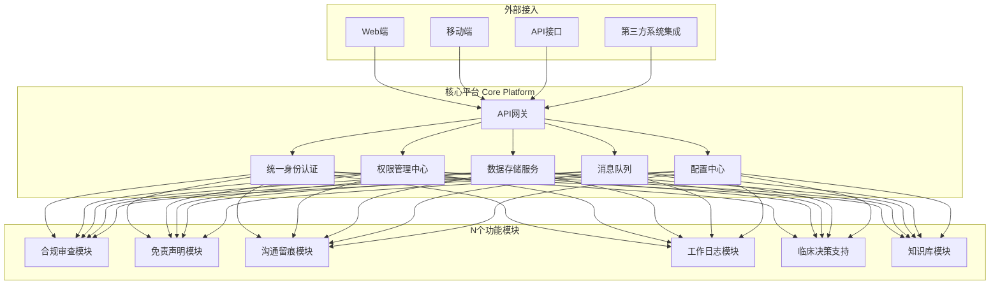
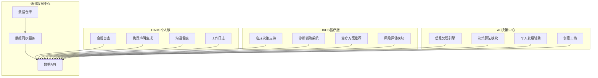
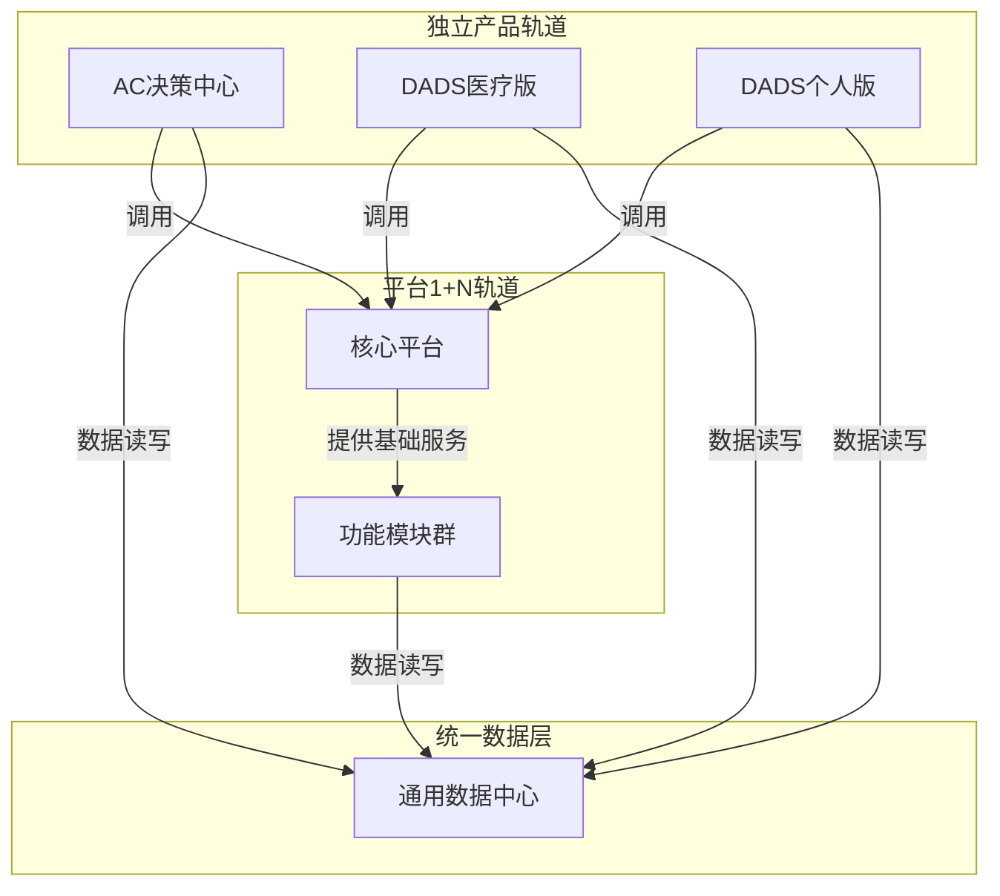

# 平台1+N轨道与独立产品轨道架构对比

## 概述

本架构文档详细描述了 DADS 生态系统中的两种核心运行轨道：**平台1+N轨道**和**独立产品轨道**。这两种轨道在架构设计、运行模式、数据隔离和部署策略上存在显著差异。

---

## 一、平台1+N轨道架构

### 1.1 架构图

### 1.2 架构特征

| 特征 | 描述 |
|------|------|
| **架构模式** | 插件化、模块化设计 |
| **核心特点** | 一个核心平台 + N个可插拔模块 |
| **模块依赖** | 所有模块依赖核心平台服务 |
| **数据共享** | 统一数据存储，模块间数据可共享 |
| **部署方式** | 统一部署，模块按需加载 |
| **扩展方式** | 通过添加新模块扩展功能 |

### 1.3 核心平台组件说明

**1. 统一身份认证**
- 集中管理用户身份信息
- 支持多租户隔离
- 提供统一的登录入口

**2. 权限管理中心**
- 细粒度权限控制
- 角色-权限映射
- 动态权限调整

**3. 数据存储服务**
- 统一数据库管理
- 模块级数据隔离（表前缀区分）
- 数据备份与恢复

**4. 消息队列**
- 异步任务处理
- 模块间解耦通信
- 任务优先级管理

**5. API网关**
- 统一入口管理
- 请求路由分发
- 流量控制与监控

**6. 配置中心**
- 集中配置管理
- 动态配置更新
- 环境隔离配置

---

## 二、独立产品轨道架构

### 2.1 架构图

### 2.2 架构特征

| 特征 | 描述 |
|------|------|
| **架构模式** | 独立产品集群，松耦合设计 |
| **核心特点** | 多个独立产品共享数据中心 |
| **产品独立性** | 每个产品可独立运行、独立部署 |
| **数据共享** | 通过数据中心实现有限数据共享 |
| **部署方式** | 产品独立部署，可按需启停 |
| **扩展方式** | 通过添加新产品扩展生态 |

### 2.3 独立产品说明

**1. AC决策中心**
- 信息处理与分析
- 决策算法支持
- 个人发展辅助工具
- 创意内容生成

**2. DADS医疗版**
- 临床决策支持系统
- 智能诊断辅助
- 治疗方案推荐
- 医疗风险评估

**3. DADS个人版**
- 病历合规自查
- 免责声明生成
- 医患沟通留痕
- 工作日志自动化

**4. 通用数据中心**
- 统一数据存储
- 跨产品数据同步
- 标准化数据API

---

## 三、架构对比矩阵

| 对比维度 | 平台1+N轨道 | 独立产品轨道 |
|----------|-------------|-------------|
| **架构定位** | 内部模块组织方式 | 外部产品划分方式 |
| **耦合度** | 高耦合（模块依赖核心） | 低耦合（产品独立） |
| **数据隔离** | 模块级隔离（表前缀） | 产品级隔离（独立数据库） |
| **部署策略** | 单体部署，统一管理 | 分布式部署，独立管理 |
| **扩展方式** | 添加模块 | 添加产品 |
| **升级影响** | 核心升级可能影响所有模块 | 产品升级不影响其他产品 |
| **资源共享** | 高度共享核心服务 | 有限共享数据中心 |
| **开发模式** | 统一技术栈，协同开发 | 独立技术栈，自主开发 |
| **运维复杂度** | 相对简单（单点管理） | 相对复杂（多点协调） |
| **适用场景** | 功能型产品，模块复用 | 独立业务线，产品差异化 |

---

## 四、双轨协同架构

### 4.1 协同关系图

### 4.2 协同机制

**1. 服务调用**
- 独立产品可调用核心平台的基础服务
- 模块通过核心平台访问资源

**2. 数据共享**
- 通过通用数据中心实现跨轨道数据共享
- 数据同步服务保证一致性

**3. 部署协调**
- 核心平台统一部署
- 独立产品按需部署
- 共享基础设施资源

---

## 五、设计原则总结

### 平台1+N轨道设计原则

1. **单一职责**：每个模块专注于一个业务领域
2. **依赖倒置**：模块依赖抽象接口而非具体实现
3. **开闭原则**：对扩展开放，对修改封闭
4. **接口隔离**：模块间通过精确定义的接口交互

### 独立产品轨道设计原则

1. **产品自治**：每个产品具备完整的业务能力
2. **松耦合**：产品间最小化直接依赖
3. **独立演进**：产品可独立更新迭代
4. **数据契约**：通过明确的数据契约实现跨产品协作

---

## 六、典型应用场景

| 场景 | 推荐轨道 | 原因 |
|------|----------|------|
| 添加新的合规检查规则 | 平台1+N | 规则属于功能模块，可复用核心服务 |
| 开发新的临床决策产品 | 独立产品 | 需要完整的产品形态和独立市场定位 |
| 扩展沟通留痕功能 | 平台1+N | 在现有模块基础上扩展 |
| 打造全新的AI助手产品 | 独立产品 | 需要独立品牌和用户体验 |
| 优化权限管理逻辑 | 平台1+N | 属于核心平台能力升级 |

---

*文档版本: v1.0*  
*创建时间: 2026年5月*  
*所属项目: DADS生态系统架构*
