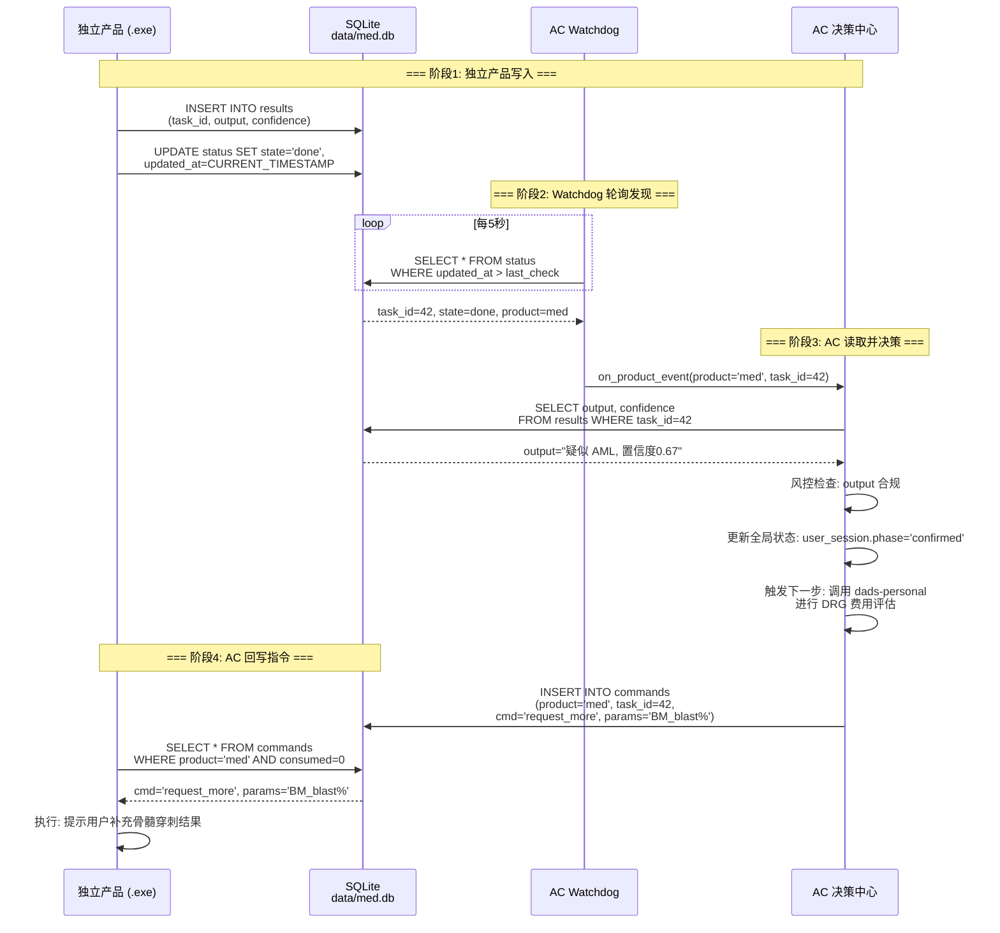

# 混合生态系统架构 — AC 离线共生协议

## 一、架构原则

```
                    ┌──────────────────────┐
                    │   AC 决策中心        │ src/core/AC/
                    │   (绝对控制权)       │
                    └────────┬─────────────┘
                             │
            ┌────────────────┼────────────────┐
            ▼                ▼                ▼
     ┌─────────────┐  ┌─────────────┐  ┌─────────────┐
     │ 平台内插件   │  │ 独立产品     │  │ 独立产品     │
     │ (Module)    │  │ (.exe)      │  │ (.exe)      │
     │ dads-medical│  │ DADS-医疗    │  │ DADS-个人    │
     └──────┬──────┘  └──────┬──────┘  └──────┬──────┘
            │                │                │
            │          SQLite DB        SQLite DB
            │          data/med.db      data/personal.db
            │                │                │
            └────────────────┼────────────────┘
                             │
                    ┌────────▼────────┐
                    │  Watchdog 监听   │
                    │  (轮询 DB 变化)  │
                    └────────┬────────┘
                             │
                    ┌────────▼────────┐
                    │  AC 全局决策    │
                    └─────────────────┘
```

### 1.1 三种运行模式

| 模式 | 加载方式 | 通信信道 | AC 管控力度 |
|------|----------|----------|------------|
| **平台内插件** | Python import | 直接函数调用 | 全控 (同步) |
| **独立产品 (在线)** | 独立进程 | DB + REST API | 强控 (准实时) |
| **独立产品 (离线)** | 独立进程 | DB 唯一信道 | 松控 (异步) |

### 1.2 AC 核心职责

- **意图识别**: 解析用户输入，判断应路由到哪个插件/独立产品
- **任务拆解**: 将复杂意图分解为可执行步骤序列
- **风控**: 拦截越权操作、敏感数据泄露、违规建议
- **环境注入**: 动态填充时间/地点到 Prompt 上下文
- **Watchdog 调度**: 轮询独立产品 DB，感知状态变化

---

## 二、交互逻辑设计

### 2.1 独立产品写入 → AC 感知 → 决策 全流程

```
1. 独立产品启动
   └→ 检查 data/{product_id}.db 是否存在
      └→ 不存在则按 AC Schema 建表 (logs, results, status)

2. 独立产品执行业务
   └→ 将日志/结果写入 db
      └→ 更新 status 表: { task_id, state, timestamp }

3. AC Watchdog 轮询 (每 N 秒)
   └→ 扫描所有 data/*.db 的 status 表
      └→ WHERE updated_at > last_check_time
         └→ 发现新记录 → 触发 AC.on_product_event()

4. AC 决策
   └→ 读取完整日志链
   └→ 风控检查
   └→ 更新全局状态
   └→ 必要时向独立产品写入指令 (status 表 → command 字段)
```

### 2.2 Mermaid 时序图



---

## 三、数据契约 (AC Schema)

### 3.1 通用表结构

```sql
-- 每个独立产品必须创建的三张表

CREATE TABLE IF NOT EXISTS status (
    task_id     TEXT PRIMARY KEY,
    state       TEXT NOT NULL,          -- pending/running/done/error
    progress    REAL DEFAULT 0.0,       -- 0.0 ~ 1.0
    created_at  TEXT DEFAULT (datetime('now')),
    updated_at  TEXT DEFAULT (datetime('now'))
);

CREATE TABLE IF NOT EXISTS results (
    id          INTEGER PRIMARY KEY AUTOINCREMENT,
    task_id     TEXT NOT NULL,
    output      TEXT,                   -- 诊断结果/评估建议
    confidence  REAL DEFAULT 0.0,
    severity    TEXT,                   -- critical/severe/moderate/mild
    metadata    TEXT DEFAULT '{}',      -- JSON, 扩展字段
    created_at  TEXT DEFAULT (datetime('now')),
    FOREIGN KEY (task_id) REFERENCES status(task_id)
);

CREATE TABLE IF NOT EXISTS commands (
    id          INTEGER PRIMARY KEY AUTOINCREMENT,
    product     TEXT NOT NULL,          -- 'med' | 'personal'
    task_id     TEXT NOT NULL,
    cmd         TEXT NOT NULL,          -- 指令类型
    params      TEXT DEFAULT '{}',      -- JSON 参数
    consumed    INTEGER DEFAULT 0,      -- 0=未消费, 1=已消费
    created_at  TEXT DEFAULT (datetime('now'))
);
```

---

## 四、Watchdog 伪代码

```python
import sqlite3
import time
from pathlib import Path
from datetime import datetime


class ACWatchdog:
    def __init__(self, data_dir: str, poll_interval: float = 5.0):
        self.data_dir = Path(data_dir)
        self.poll_interval = poll_interval
        self.last_check: dict[str, str] = {}   # db_path → last_updated_at
        self.callbacks: list = []

    def register_callback(self, cb):
        self.callbacks.append(cb)

    def scan(self) -> list[dict]:
        events = []
        for db_path in self.data_dir.glob("*.db"):
            conn = sqlite3.connect(str(db_path))
            cursor = conn.cursor()
            product = db_path.stem
            last = self.last_check.get(product, "1970-01-01")
            cursor.execute(
                "SELECT task_id, state, updated_at FROM status "
                "WHERE updated_at > ? ORDER BY updated_at",
                (last,),
            )
            for row in cursor.fetchall():
                events.append({
                    "product": product,
                    "task_id": row[0],
                    "state": row[1],
                    "updated_at": row[2],
                    "db_path": str(db_path),
                })
                self.last_check[product] = max(
                    self.last_check.get(product, ""), row[2]
                )
            conn.close()
        return events

    def run_forever(self):
        while True:
            events = self.scan()
            for evt in events:
                for cb in self.callbacks:
                    cb(evt)
            time.sleep(self.poll_interval)
```

---

## 五、动态环境注入

### 5.1 问题

旧方案中的系统提示词包含硬编码变量:
```
当前时间: <time_location>     ← 写死, 时空僵化
地点: <geo_info>
```

### 5.2 解决方案

在 AC 核心层实现 `inject_dynamic_context()`, 每次唤醒时动态填充。

```python
import platform
import socket
from datetime import datetime, timezone, timedelta
from pathlib import Path


def inject_dynamic_context(prompt_template: str) -> str:
    now = datetime.now(timezone(timedelta(hours=8)))
    template_vars = {
        "{{datetime}}": now.strftime("%Y-%m-%d %H:%M:%S CST"),
        "{{date_iso}}": now.strftime("%Y-%m-%d"),
        "{{time_iso}}": now.strftime("%H:%M:%S"),
        "{{weekday}}": ["周一","周二","周三","周四","周五","周六","周日"][now.weekday()],
        "{{unix_ts}}": str(int(now.timestamp())),
        "{{hostname}}": socket.gethostname(),
        "{{os}}": f"{platform.system()} {platform.release()}",
        "{{timezone}}": "Asia/Shanghai",
        "{{tz_offset}}": "+08:00",
    }

    result = prompt_template
    for placeholder, value in template_vars.items():
        result = result.replace(placeholder, value)

    return result


# 使用示例
SYSTEM_PROMPT_TEMPLATE = """你是一位临床决策助手。
当前时间: {{datetime}} ({{weekday}})
运行环境: {{os}} @ {{hostname}}
时区: {{timezone}}
"""

if __name__ == "__main__":
    filled = inject_dynamic_context(SYSTEM_PROMPT_TEMPLATE)
    print(filled)
    # 输出:
    # 你是一位临床决策助手。
    # 当前时间: 2026-05-11 18:30:00 CST (周一)
    # 运行环境: Windows 10 @ DESKTOP-XXX
    # 时区: Asia/Shanghai
```

### 5.3 扩展：地理位置注入 (可选)

```python
def _get_geo_info() -> str:
    try:
        import json, urllib.request
        with urllib.request.urlopen("http://ip-api.com/json/", timeout=3) as resp:
            data = json.loads(resp.read())
            return f"{data.get('city','')}, {data.get('regionName','')}, {data.get('country','')}"
    except Exception:
        return "未知位置"

# 注册到 template_vars:
#   "{{geo_info}}": _get_geo_info()
```

---

## 六、目录规划

```
AgentHub/
├── src/
│   ├── core/
│   │   └── AC/                    ← AC 决策中心 (新)
│   │       ├── __init__.py
│   │       ├── agent.py           ← ACAgent (继承 BaseAgent, 增强风控+路由)
│   │       ├── watchdog.py        ← ACWatchdog (DB 轮询)
│   │       ├── environment.py     ← inject_dynamic_context()
│   │       └── schema.sql         ← 数据契约 DDL
│   ├── modules/
│   │   ├── medical/               ← 平台内插件形态 (Trae 已生成)
│   │   │   └── diagnosis.py
│   │   └── personal/              ← 平台内插件形态 (Trae 已生成)
│   │       ├── compliance.py
│   │       ├── disclaimer.py
│   │       ├── communication.py
│   │       └── worklog.py
│   └── shared/
│       └── hermes/                ← 连接器 (共用)
├── data/                          ← SQLite 数据库目录 (新)
│   ├── med.db                     ← 医疗独立产品 (运行时生成)
│   └── personal.db                ← 个人独立产品 (运行时生成)
├── standalone/                    ← 独立产品打包目录 (新)
│   ├── dads-medical.exe
│   └── dads-personal.exe
└── ac-core/                       ← 旧版平台底座 (保留/迁移中)
```

---

*文档版本: v1.0 | 创建时间: 2026-05-11 | 作者: Opencode (Trae 罢工期间接管)*
