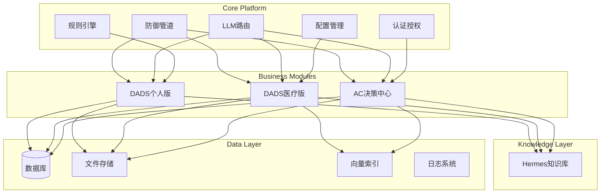

# TRAE 平台重建说明书 - 通用版

**版本**: v1.0  
**日期**: 2026年5月  
**适用对象**: 团队协作、公开分享  
**文档级别**: 高颗粒度  

---

## 目录

1. [平台概述](#1-平台概述)
2. [系统架构](#2-系统架构)
3. [环境准备](#3-环境准备)
4. [安装步骤](#4-安装步骤)
5. [配置说明](#5-配置说明)
6. [启动方式](#6-启动方式)
7. [功能模块](#7-功能模块)
8. [故障排查](#8-故障排查)
9. [数据备份与恢复](#9-数据备份与恢复)
10. [安全注意事项](#10-安全注意事项)

---

## 1. 平台概述

### 1.1 项目简介

TRAE 是一个基于双 AI 工程流的个人开发生态系统，包含以下核心组件：

| 组件 | 说明 | 状态 |
|------|------|------|
| **AC 决策中心** | 个人发展辅助与创意工坊 | ✅ 已实现 |
| **DADS 医疗版** | 临床决策支持系统 | ✅ 已实现 |
| **DADS 个人版** | 医生自我保护与合规助手 | ✅ 已实现 |
| **Hermes 知识库** | 知识管理与向量检索 | ✅ 已实现 |
| **DataCenter 数据中心** | 数据存储与可视化 | ✅ 已实现 |

### 1.2 设计理念

- **AI原生**：系统设计目标是实现自我迭代和无人值守
- **双轨架构**：1+N 核心平台 + 模块化设计
- **防御管道**：内置安全防护机制
- **知识驱动**：基于私有知识库的决策引擎

---

## 2. 系统架构

### 2.1 整体架构图



### 2.2 目录结构

```
TRAE/                              # 项目根目录
├── src/                           # 核心代码
│   ├── core/                      # 核心模块
│   │   ├── auth.py                # 认证授权
│   │   ├── config.py              # 配置管理
│   │   ├── rule_engine.py         # 规则引擎
│   │   ├── llm_router.py          # LLM路由
│   │   └── gaia_defense.py        # 防御管道
│   ├── modules/                   # 业务模块
│   │   ├── medical/               # DADS医疗版
│   │   ├── personal/              # DADS个人版
│   │   └── ac/                    # AC决策中心
│   ├── shared/                    # 共享依赖
│   └── utils/                     # 工具函数
├── data/                          # 业务数据
│   ├── sqlite/                    # SQLite数据库
│   └── files/                     # 文件存储
├── Hermes/                        # 知识库
├── DataCenter/                    # 数据中心（可视化）
├── .RecoveryCenter/               # 隐蔽恢复中心
└── config/                        # 配置文件
```

---

## 3. 环境准备

### 3.1 硬件要求

| 项目 | 最低配置 | 推荐配置 |
|------|----------|----------|
| CPU | 双核 2.0GHz | 四核 3.0GHz+ |
| 内存 | 8GB | 16GB+ |
| 存储 | 50GB可用空间 | 200GB+ SSD |

### 3.2 软件要求

| 软件 | 版本 | 说明 |
|------|------|------|
| Python | 3.10+ | 核心运行环境 |
| Git | 2.30+ | 版本控制 |
| SQLite | 3.30+ | 数据库（内置） |
| Opencode | 最新版 | 代码执行器（双AI工程流核心组件） |
| Obsidian | 1.5+ | 知识库管理（可选） |

### 3.3 Python 依赖

```text
fastapi==0.104.1
uvicorn==0.24.0
pydantic==2.5.2
sqlalchemy==2.0.23
python-dotenv==1.0.0
cryptography==41.0.7
```

---

## 4. 安装步骤

### 4.1 克隆项目

```bash
# 打开终端，切换到工作目录
cd /path/to/workspace

# 克隆项目（替换为实际仓库地址）
git clone <repository-url>
cd TRAE
```

### 4.2 创建虚拟环境

```bash
# Windows
python -m venv venv
venv\Scripts\activate

# macOS/Linux
python3 -m venv venv
source venv/bin/activate
```

### 4.3 安装依赖

```bash
# 安装基础依赖
pip install -r requirements.txt

# 安装开发依赖（可选）
pip install pytest pytest-asyncio mypy ruff
```

### 4.4 初始化数据库

```bash
# 创建数据库目录
mkdir -p data/sqlite

# 运行数据库初始化脚本
python -c "from src.core.database import init_db; init_db()"
```

---

## 5. 配置说明

### 5.1 环境变量配置

创建 `config/.env` 文件：

```env
# 数据库配置
DB_PATH=./data/sqlite/
DB_NAME=trae_main

# LLM配置
LLM_PROVIDER=ollama
OLLAMA_MODEL=llama3
OLLAMA_HOST=http://localhost:11434

# 安全配置
SECRET_KEY=<your-secret-key>
ALGORITHM=HS256
ACCESS_TOKEN_EXPIRE_MINUTES=30

# 日志配置
LOG_LEVEL=INFO
LOG_PATH=./data/logs/

# 运行配置
HOST=0.0.0.0
PORT=8000
DEBUG=false
```

### 5.2 配置文件结构

```
config/
├── .env              # 环境变量（敏感信息，不提交版本控制）
├── settings.yaml     # 应用配置（非敏感）
└── profiles/         # 多环境配置
    ├── development.yaml
    ├── testing.yaml
    └── production.yaml
```

---

## 6. 启动方式

### 6.1 开发模式

```bash
# 方式1：直接运行
python src/api_main.py

# 方式2：使用 uvicorn
uvicorn src.api_main:app --host 0.0.0.0 --port 8000 --reload
```

### 6.2 生产模式

```bash
# 使用 Gunicorn（推荐）
gunicorn -w 4 -k uvicorn.workers.UvicornWorker src.api_main:app

# 或使用 Docker
docker build -t trae-platform .
docker run -p 8000:8000 trae-platform
```

### 6.3 服务验证

启动后访问：
- API文档：http://localhost:8000/docs
- 健康检查：http://localhost:8000/health

---

## 7. 功能模块

### 7.1 DADS 个人版

| 功能 | 路径 | 说明 |
|------|------|------|
| 合规自查 | `/api/personal/compliance/check` | 病历/处方合规性检测 |
| 免责话术生成 | `/api/personal/disclaimer/generate` | 标准化告知话术 |
| 沟通留痕 | `/api/personal/communication/record` | 医患沟通记录 |
| 工作日志 | `/api/personal/worklog/report` | 自动生成日报 |

### 7.2 DADS 医疗版

| 功能 | 路径 | 说明 |
|------|------|------|
| 诊断支持 | `/api/medical/diagnosis` | 辅助诊断建议 |
| 用药推荐 | `/api/medical/prescription` | 用药指导 |
| 风险评估 | `/api/medical/risk` | 临床风险评分 |

### 7.3 AC 决策中心

| 功能 | 路径 | 说明 |
|------|------|------|
| 创意生成 | `/api/ac/generate` | AI创意辅助 |
| 信息处理 | `/api/ac/process` | 信息分析整理 |
| 决策支持 | `/api/ac/decision` | 决策建议生成 |

---

## 8. 故障排查

### 8.1 常见问题

| 问题 | 原因 | 解决方案 |
|------|------|----------|
| **端口占用** | 8000端口被占用 | 更换端口：`--port 8080` |
| **模块导入错误** | 路径配置问题 | 检查 PYTHONPATH |
| **数据库连接失败** | SQLite文件权限 | 确保 data/sqlite 目录可写 |
| **LLM响应超时** | Ollama未启动 | 启动 Ollama 服务 |
| **依赖冲突** | 包版本不兼容 | 使用虚拟环境重新安装 |

### 8.2 日志查看

```bash
# 查看应用日志
tail -f data/logs/application.log

# 查看错误日志
tail -f data/logs/error.log
```

---

## 9. 数据备份与恢复

### 9.1 创建备份

```bash
# 使用恢复工具
python .RecoveryCenter/tools/restore.py --backup ./data

# 或手动备份
zip -r backup_$(date +%Y%m%d).zip data/
```

### 9.2 恢复数据

```bash
# 使用恢复工具
python .RecoveryCenter/tools/restore.py --restore <backup_name> --target ./data

# 或手动恢复
unzip backup_YYYYMMDD.zip
```

### 9.3 验证完整性

```bash
python .RecoveryCenter/tools/restore.py --verify
```

---

## 10. 安全注意事项

### 10.1 数据安全

- ✅ 敏感配置存放在 `.env` 文件中
- ✅ 数据库文件定期备份
- ✅ 禁止将密钥提交到版本控制

### 10.2 访问控制

- ✅ 启用 API 认证机制
- ✅ 限制敏感接口访问权限
- ✅ 定期更新密码和密钥

### 10.3 日志审计

- ✅ 记录所有操作日志
- ✅ 定期审查异常访问
- ✅ 日志保留90天

---

## 附录：命令速查

| 命令 | 说明 |
|------|------|
| `git pull` | 拉取最新代码 |
| `pip install -r requirements.txt` | 安装依赖 |
| `uvicorn src.api_main:app --reload` | 启动开发服务器 |
| `python -m pytest` | 运行测试 |
| `ruff check .` | 代码检查 |
| `mypy .` | 类型检查 |

---

**文档结束**

*TRAE Platform Rebuild Guide v1.0*  
*2026年5月*
