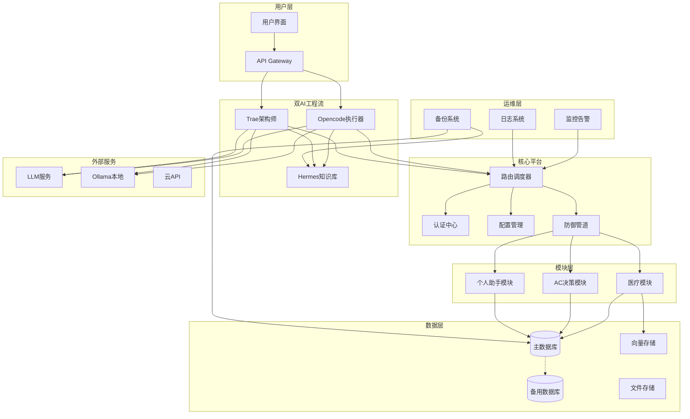
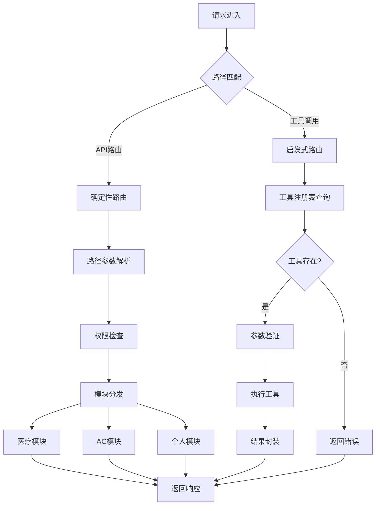
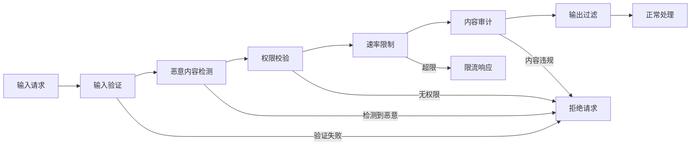
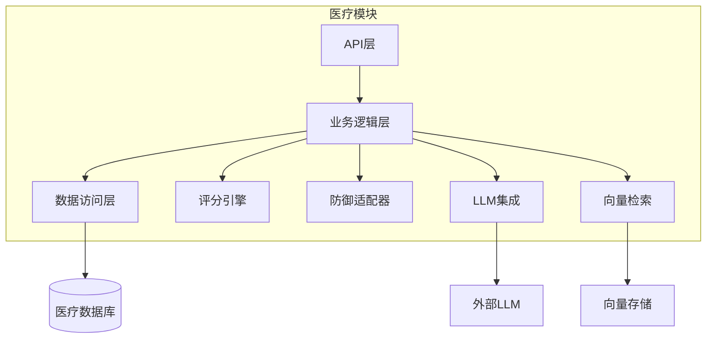
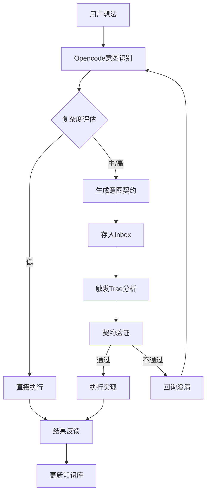
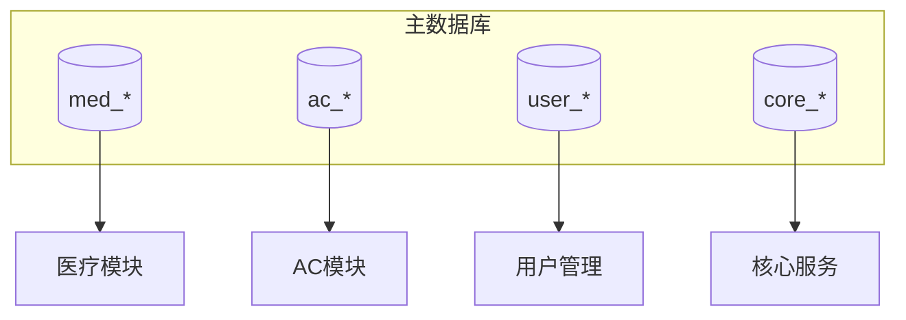
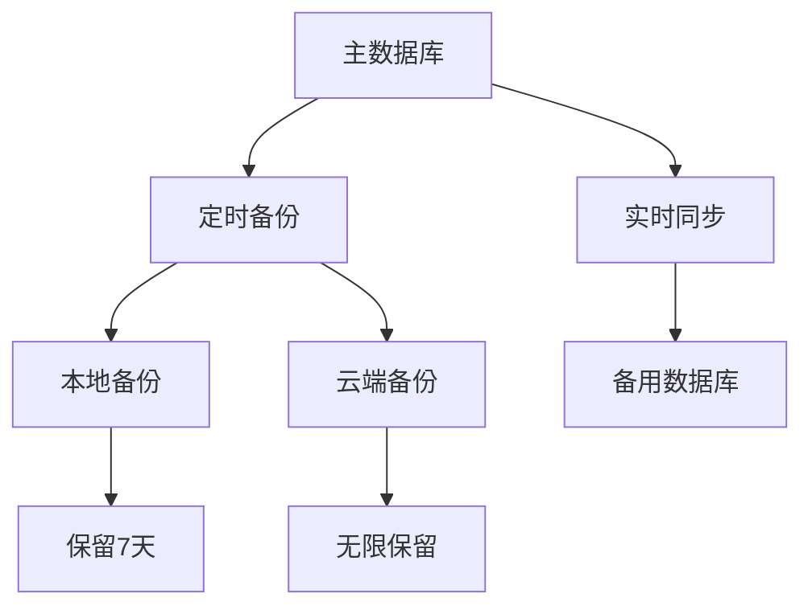
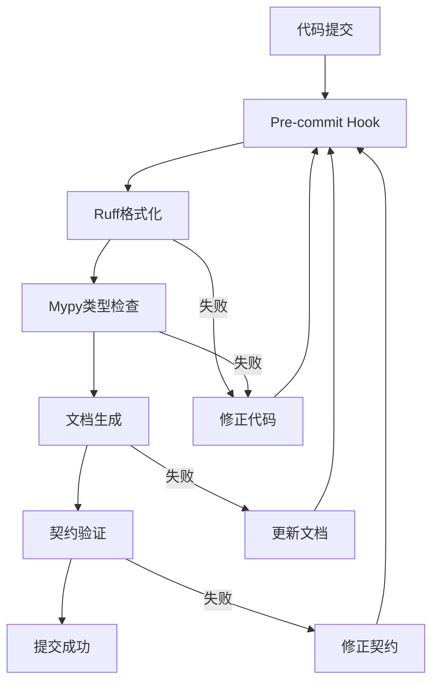

***

title: "AC Platform 完整架构图"
date: 2026-05-11
tags: \[architecture, system-design]
category: 架构设计
--------------

# 🏗️ AC Platform 完整架构图

## 一、系统总览



## 二、核心平台架构

### 2.1 路由调度器



### 2.2 认证中心

| 认证方式    | 适用场景  | 实现方式           |
| ------- | ----- | -------------- |
| API Key | 服务间调用 | Header Token   |
| OAuth2  | 用户登录  | 授权码流程          |
| 会话认证    | Web界面 | Cookie/Session |

### 2.3 防御管道



## 三、医疗模块架构

### 3.1 模块内部结构



### 3.2 临床评分引擎

| 评分模型         | 用途     | 参数数量 |
| ------------ | ------ | ---- |
| CHA₂DS₂-VASc | 房颤卒中风险 | 7    |
| HAS-BLED     | 出血风险   | 6    |
| Wells DVT    | DVT概率  | 7    |
| Wells PE     | PE概率   | 8    |
| CURB-65      | 肺炎严重程度 | 5    |

## 四、双AI协作流程

### 4.1 意图契约机制



### 4.2 契约数据结构

| 字段                   | 类型   | 必填 | 说明              |
| -------------------- | ---- | -- | --------------- |
| task\_id             | str  | ✅  | 唯一标识            |
| title                | str  | ✅  | 任务标题            |
| complexity           | enum | ✅  | low/medium/high |
| deadline             | date | ❌  | 截止日期            |
| requirements         | str  | ✅  | 需求描述            |
| acceptance\_criteria | list | ✅  | 验收标准            |
| risks                | list | ❌  | 风险评估            |

## 五、数据层架构

### 5.1 数据库隔离策略



### 5.2 备份与冗余



## 六、工具链架构

### 6.1 自动化流程



### 6.2 工具配置矩阵

| 工具         | 配置文件                    | 用途       | 触发时机       |
| ---------- | ----------------------- | -------- | ---------- |
| Ruff       | ruff.toml               | 格式化+Lint | pre-commit |
| Mypy       | mypy.ini                | 类型检查     | pre-commit |
| Pytest     | pyproject.toml          | 单元测试     | make test  |
| Pre-commit | .pre-commit-config.yaml | 钩子管理     | git commit |

## 七、目录结构

```
TRAE/
├── src/                          # 源代码
│   ├── core/                     # 核心平台
│   │   ├── config.py             # 配置管理
│   │   ├── database.py           # 数据库连接
│   │   ├── auth.py               # 认证中心
│   │   ├── router.py             # 路由调度
│   │   └── gaia_defense.py       # 防御管道
│   ├── modules/                  # 业务模块
│   │   ├── medical/              # 医疗模块
│   │   ├── ac/                   # AC决策模块
│   │   └── personal/             # 个人助手模块
│   ├── shared/                   # 共享组件
│   │   ├── dependencies.py       # 依赖注入
│   │   └── exceptions.py         # 异常体系
│   └── utils/                    # 工具函数
│       ├── date_utils.py         # 日期工具
│       ├── intent_contract.py    # 意图契约
│       ├── doc_generator.py      # 文档生成
│       └── backup_manager.py     # 备份管理
├── Hermes/                       # 知识库
│   ├── Templates/                # 模板
│   ├── Inbox/                    # 待处理
│   └── Docs/                     # 生成文档
├── tests/                        # 测试用例
├── backups/                      # 备份文件
├── pyproject.toml                # 项目配置
├── Makefile                      # 命令脚本
└── .pre-commit-config.yaml       # 钩子配置
```

## 八、关键设计决策

> \[!IMPORTANT] 核心原则
>
> 1. **模块化**: 1+N架构，核心平台+业务模块分离
> 2. **防御性**: 多层防御管道，零信任架构
> 3. **可追溯**: 意图契约机制，完整需求链路
> 4. **自动化**: CI/CD全流程，文档即代码

> \[!WARNING] 风险提示
>
> - 单点故障: 主数据库需要冗余备份
> - 依赖外部服务: LLM服务需要降级策略
> - 数据一致性: 多模块共享数据需要事务管理

## 九、扩展规划

| 阶段      | 目标     | 时间      |
| ------- | ------ | ------- |
| Phase 1 | 核心平台稳定 | Q2 2026 |
| Phase 2 | 模块扩展   | Q3 2026 |
| Phase 3 | 高可用架构  | Q4 2026 |
| Phase 4 | 多云部署   | Q1 2027 |

