# 🏗️ AC Platform 完整架构设计（高颗粒度）

## 一、系统架构全景图

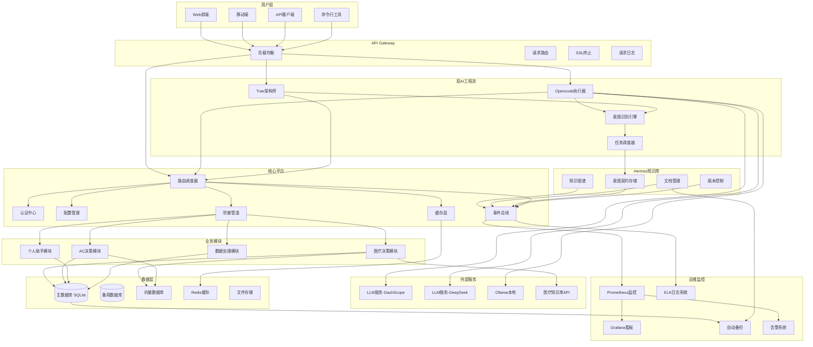

---

## 二、核心平台详细设计

### 2.1 路由调度器

#### 2.1.1 双轨路由架构

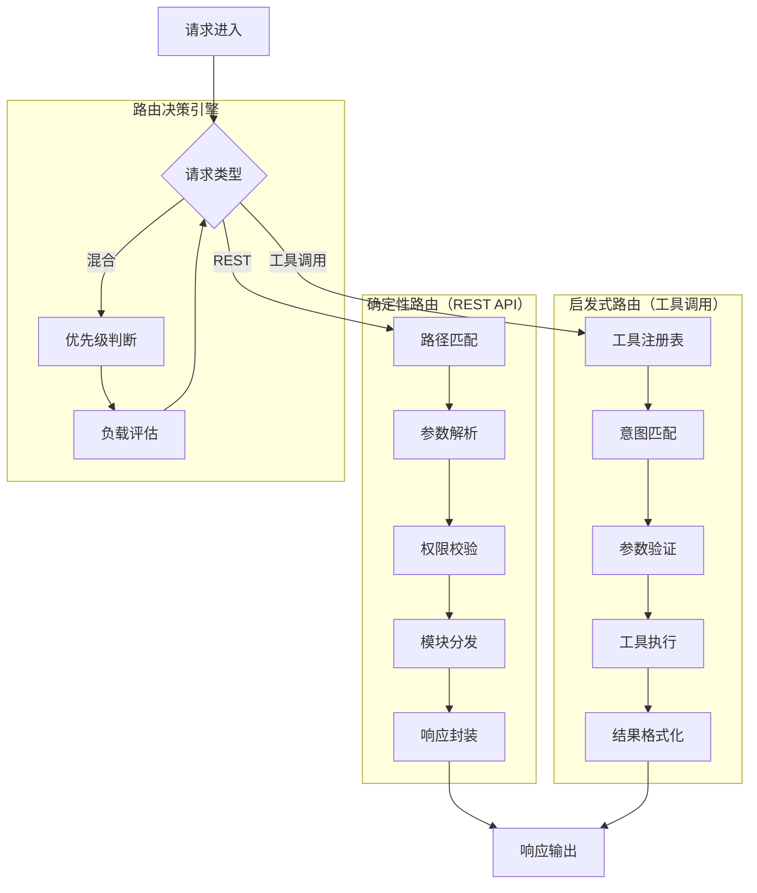

#### 2.1.2 路由配置结构

| 字段 | 类型 | 说明 | 示例 |
|------|------|------|------|
| route_id | str | 路由唯一标识 | `med_drug_search` |
| path | str | API路径 | `/api/v1/medical/drugs` |
| methods | list | HTTP方法 | `["GET", "POST"]` |
| module | str | 所属模块 | `medical` |
| handler | str | 处理函数路径 | `src.modules.medical.api:search_drugs` |
| auth_required | bool | 是否需要认证 | `true` |
| rate_limit | int | 速率限制(次/分钟) | `60` |
| timeout | int | 超时时间(秒) | `30` |

#### 2.1.3 工具注册表结构

```python
# src/core/router.py - 工具注册表示例
class ToolRegistry:
    def __init__(self):
        self.tools = {}
    
    def register(self, tool_id: str, handler, schema: dict, category: str):
        """注册工具"""
        self.tools[tool_id] = {
            "handler": handler,
            "schema": schema,
            "category": category,
            "invocation_count": 0,
            "last_invoked": None
        }
    
    def search(self, query: str) -> list:
        """基于意图搜索工具"""
        # 使用向量检索匹配意图
        results = vector_search(query, self.tools.keys())
        return results
```

---

### 2.2 认证中心

#### 2.2.1 认证架构

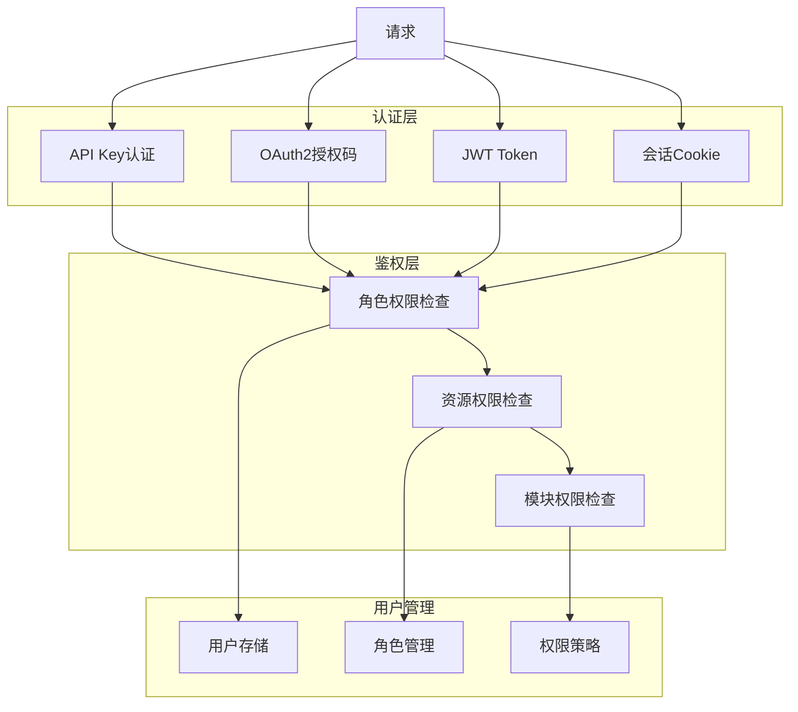

#### 2.2.2 权限模型

| 角色 | 权限范围 | 描述 |
|------|----------|------|
| super_admin | 全部权限 | 系统管理员 |
| admin | 管理权限 | 项目管理员 |
| developer | 开发权限 | 开发人员 |
| user | 用户权限 | 普通用户 |
| guest | 只读权限 | 访客 |

#### 2.2.3 API Key 验证流程

```python
# src/core/auth.py - API Key验证
async def verify_api_key(api_key: str = Header(None)) -> str:
    """验证API Key"""
    if not api_key:
        raise HTTPException(status_code=401, detail="API Key required")
    
    # 从数据库验证API Key
    db_key = await db.query(APIKey).filter(APIKey.key == api_key).first()
    
    if not db_key:
        raise HTTPException(status_code=401, detail="Invalid API Key")
    
    if db_key.expired:
        raise HTTPException(status_code=401, detail="API Key expired")
    
    # 更新使用时间
    db_key.last_used = datetime.utcnow()
    await db.commit()
    
    return db_key.user_id
```

---

### 2.3 防御管道

#### 2.3.1 多层防御架构

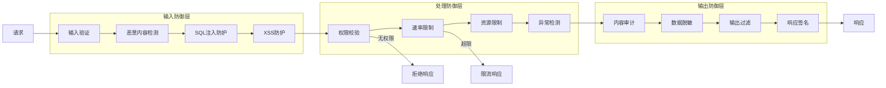

#### 2.3.2 防御规则配置

| 规则类型 | 配置项 | 默认值 | 说明 |
|----------|--------|--------|------|
| 速率限制 | requests_per_minute | 60 | 每分钟请求数 |
| 输入限制 | max_payload_size | 1MB | 请求体最大大小 |
| 输入限制 | max_params_count | 100 | 参数最大数量 |
| 内容过滤 | block_keywords | [] | 屏蔽关键词列表 |
| SQL防护 | enabled | true | 是否启用SQL注入防护 |
| XSS防护 | enabled | true | 是否启用XSS防护 |

---

### 2.4 配置管理

#### 2.4.1 配置层级

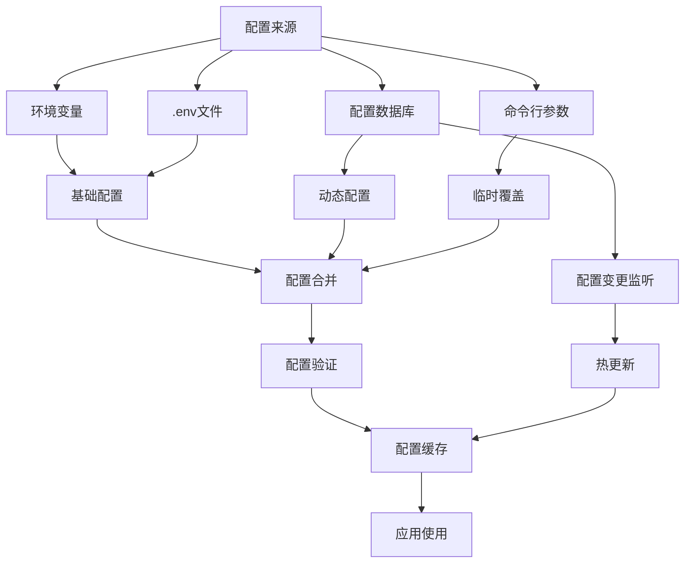

#### 2.4.2 配置结构

```python
# src/core/config.py - 配置模型
class Settings(BaseModel):
    # 运行模式
    AC_CORE_MODE: bool = True
    DEBUG: bool = False
    ENVIRONMENT: str = "production"
    
    # 安全配置
    API_KEY: Optional[str] = None
    SECRET_KEY: str = "default-secret-key"
    ALGORITHM: str = "HS256"
    ACCESS_TOKEN_EXPIRE_MINUTES: int = 30
    
    # 数据库配置
    DATABASE_URL: str = "sqlite:///./ac_platform.db"
    DATABASE_POOL_SIZE: int = 5
    DATABASE_MAX_OVERFLOW: int = 10
    
    # 地理位置配置
    MOTHER_CITY: str = "仙桃市"
    MOTHER_PROVINCE: str = "湖北省"
    
    # LLM配置
    OLLAMA_HOST: str = "http://localhost:11434"
    DASHSCOPE_API_KEY: Optional[str] = None
    DEEPSEEK_API_KEY: Optional[str] = None
    
    # 防御配置
    RATE_LIMIT_ENABLED: bool = True
    RATE_LIMIT_REQUESTS: int = 60
    
    # 日志配置
    LOG_LEVEL: str = "INFO"
    LOG_FORMAT: str = "%(asctime)s - %(name)s - %(levelname)s - %(message)s"
```

---

## 三、医疗模块详细设计

### 3.1 模块架构

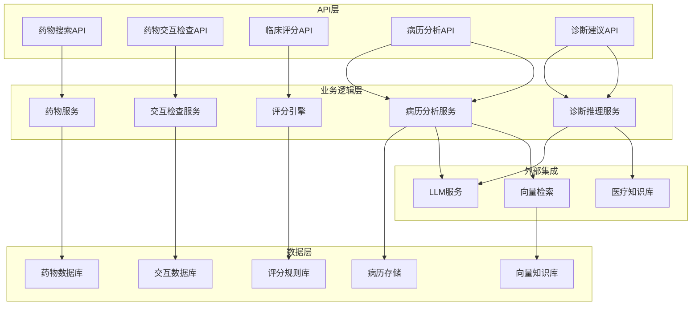

### 3.2 临床评分引擎

#### 3.2.1 评分模型架构

```python
# src/modules/medical/scores.py - 评分引擎核心
class ClinicalScoreEngine:
    def __init__(self):
        self.scores = {
            "cha2ds2_vasc": self.calculate_cha2ds2_vasc,
            "has_bled": self.calculate_has_bled,
            "wells_dvt": self.calculate_wells_dvt,
            "wells_pe": self.calculate_wells_pe,
            "curb_65": self.calculate_curb_65,
            "apache_ii": self.calculate_apache_ii,
            "sofa": self.calculate_sofa,
            "qsofa": self.calculate_qsofa,
            "news2": self.calculate_news2,
        }
    
    def calculate_cha2ds2_vasc(self, params: dict) -> dict:
        """CHA₂DS₂-VASc 房颤卒中风险评分"""
        score = 0
        factors = []
        
        if params.get("chf"):
            score += 1
            factors.append("充血性心力衰竭")
        if params.get("htn"):
            score += 1
            factors.append("高血压")
        if params.get("age") >= 75:
            score += 2
            factors.append("年龄≥75岁")
        elif params.get("age") >= 65:
            score += 1
            factors.append("年龄65-74岁")
        if params.get("sex_female"):
            score += 1
            factors.append("女性")
        if params.get("stroke_tia"):
            score += 2
            factors.append("卒中/TIA病史")
        if params.get("vascular_disease"):
            score += 1
            factors.append("血管疾病")
        if params.get("dm"):
            score += 1
            factors.append("糖尿病")
        
        # 风险等级判定
        if score == 0:
            risk = "低风险"
            anticoagulant = "通常不需要"
        elif score == 1:
            risk = "中低风险"
            anticoagulant = "考虑使用"
        else:
            risk = "高风险"
            anticoagulant = "推荐使用"
        
        return {
            "score": score,
            "risk": risk,
            "anticoagulant_recommendation": anticoagulant,
            "factors": factors
        }
```

#### 3.2.2 评分模型参数表

| 模型 | 参数 | 类型 | 说明 |
|------|------|------|------|
| CHA₂DS₂-VASc | chf | bool | 充血性心力衰竭 |
| | htn | bool | 高血压 |
| | age | int | 年龄 |
| | sex_female | bool | 女性 |
| | stroke_tia | bool | 卒中/TIA病史 |
| | vascular_disease | bool | 血管疾病 |
| | dm | bool | 糖尿病 |
| HAS-BLED | hypertension | bool | 高血压 |
| | abnormal_renal | bool | 肾功能异常 |
| | abnormal_liver | bool | 肝功能异常 |
| | stroke | bool | 卒中病史 |
| | bleeding | bool | 出血病史 |
| | labile_inr | bool | INR不稳定 |
| | age | int | 年龄(≥65) |

---

### 3.3 防御适配器

#### 3.3.1 本地防御架构

```python
# src/modules/medical/defense.py - 医疗内容防御适配器
class MedicalDefenseAdapter:
    def __init__(self):
        self.reviewers = [
            self.review_clinical_director,
            self.review_savvy_patient,
            self.review_compliance_officer,
            self.review_old_hardware,
            self.review_insurance_judge,
            self.review_messy_data,
            self.review_algorithmic_bias,
            self.review_bdd_contract,
        ]
    
    async def review_all(self, content: str, context: dict = None) -> dict:
        """执行8层审查"""
        results = []
        passed = True
        
        for reviewer in self.reviewers:
            result = await reviewer(content, context)
            results.append(result)
            if not result["passed"]:
                passed = False
        
        return {
            "overall_passed": passed,
            "reviews": results,
            "content": content
        }
    
    async def review_clinical_director(self, content: str, context: dict) -> dict:
        """临床主任审查 - 专业医学判断"""
        # 检查是否有明显的医学错误
        errors = []
        
        # 示例检查逻辑
        if "青霉素对病毒有效" in content:
            errors.append("青霉素是抗生素，对病毒无效")
        
        return {
            "reviewer": "临床主任",
            "passed": len(errors) == 0,
            "errors": errors,
            "suggestions": []
        }
```

---

## 四、双AI协作流程详细设计

### 4.1 意图契约机制

#### 4.1.1 契约生命周期

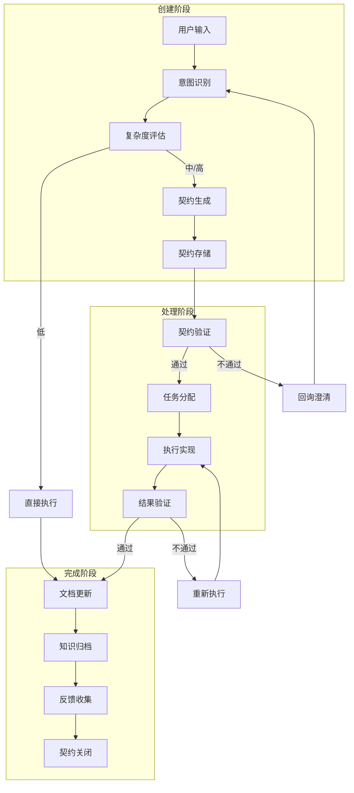

#### 4.1.2 契约数据结构（详细）

```python
# src/utils/intent_contract.py - 契约模型
from pydantic import BaseModel, field_validator
from typing import List, Dict, Optional, Any
from datetime import datetime

class AcceptanceCriteria(BaseModel):
    """验收标准"""
    id: str  # AC-01, AC-02
    description: str  # 标准描述
    verification_method: str  # 验证方式
    priority: str = "medium"  # high/medium/low

class RiskItem(BaseModel):
    """风险项"""
    risk: str  # 风险描述
    level: str  # high/medium/low
    mitigation: str  # 应对策略
    owner: Optional[str] = None  # 负责人

class Deliverable(BaseModel):
    """交付物"""
    name: str  # 交付物名称
    type: str  # 类型: code/test/docs
    status: str = "pending"  # pending/in_progress/completed

class IntentContract(BaseModel):
    """意图契约"""
    # 基本信息
    task_id: str  # TASK-YYYYMMDD-XXX
    title: str  # 任务标题
    description: str  # 详细描述
    
    # 元数据
    complexity: str  # low/medium/high
    priority: str = "medium"  # high/medium/low
    deadline: Optional[datetime] = None
    author: str
    assignee: Optional[str] = None
    created_at: datetime
    updated_at: Optional[datetime] = None
    status: str = "pending"  # pending/in_progress/review/completed
    
    # 核心内容
    requirements: List[str]  # 需求列表
    acceptance_criteria: List[AcceptanceCriteria]  # 验收标准
    technical_constraints: List[str]  # 技术约束
    assumptions: List[str]  # 假设条件
    
    # 资源关联
    related_docs: List[str]  # 相关文档链接
    related_code: List[str]  # 相关代码路径
    reference_materials: List[str]  # 参考资料
    
    # 风险与交付
    risks: List[RiskItem]  # 风险评估
    deliverables: List[Deliverable]  # 交付物清单
    
    # 验证方法
    @field_validator('complexity')
    def validate_complexity(cls, v):
        if v not in ['low', 'medium', 'high']:
            raise ValueError('complexity must be low, medium, or high')
        return v
```

---

### 4.2 双AI协作协议

#### 4.2.1 协作流程

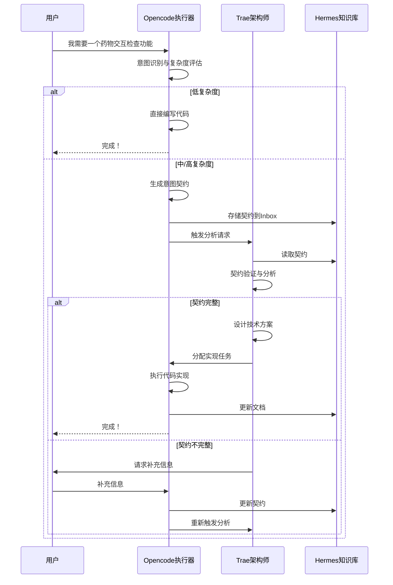

#### 4.2.2 消息格式规范

| 消息类型 | 发送方 | 接收方 | 格式 |
|----------|--------|--------|------|
| 意图契约创建 | Opencode | Trae | JSON |
| 任务分配 | Trae | Opencode | JSON |
| 执行结果 | Opencode | Trae | JSON |
| 文档更新 | Opencode | Hermes | Markdown |
| 分析请求 | Opencode | Trae | HTTP POST |

---

## 五、数据层详细设计

### 5.1 数据库架构

#### 5.1.1 数据库表结构

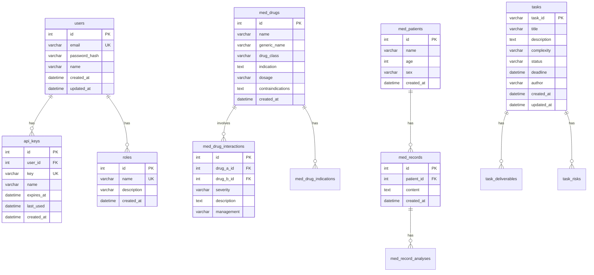

#### 5.1.2 表命名规范

| 模块前缀 | 说明 | 示例 |
|----------|------|------|
| `core_` | 核心平台表 | `core_users`, `core_api_keys` |
| `med_` | 医疗模块表 | `med_drugs`, `med_records` |
| `ac_` | AC决策模块表 | `ac_decisions`, `ac_workflows` |
| `user_` | 用户相关表 | `user_profiles`, `user_preferences` |

---

### 5.2 向量存储设计

#### 5.2.1 向量存储架构

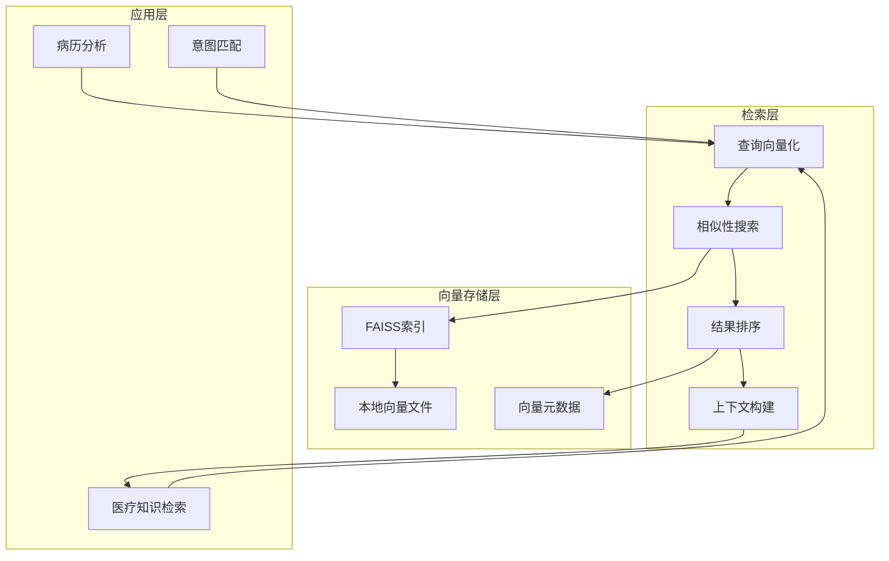

#### 5.2.2 向量检索流程

```python
# src/modules/medical/vector.py - 向量检索
class VectorStore:
    def __init__(self, db_path: str = "data/vectors"):
        self.db_path = Path(db_path)
        self.db_path.mkdir(parents=True, exist_ok=True)
        self.index = self._load_index()
    
    def _load_index(self):
        """加载或创建FAISS索引"""
        index_path = self.db_path / "index.faiss"
        if index_path.exists():
            return faiss.read_index(str(index_path))
        return faiss.IndexFlatL2(768)  # 默认768维
    
    def add_documents(self, documents: List[dict]):
        """添加文档到向量库"""
        texts = [doc["content"] for doc in documents]
        embeddings = self._encode(texts)
        
        # 添加到索引
        self.index.add(embeddings)
        
        # 保存元数据
        metadata_path = self.db_path / "metadata.jsonl"
        with open(metadata_path, "a", encoding="utf-8") as f:
            for doc in documents:
                f.write(json.dumps(doc, ensure_ascii=False) + "\n")
        
        # 保存索引
        faiss.write_index(self.index, str(self.db_path / "index.faiss"))
    
    def search(self, query: str, top_k: int = 5) -> List[dict]:
        """搜索相似文档"""
        query_embedding = self._encode([query])
        distances, indices = self.index.search(query_embedding, top_k)
        
        # 读取元数据
        metadata = self._load_metadata()
        results = []
        
        for i, idx in enumerate(indices[0]):
            if idx >= 0 and idx < len(metadata):
                results.append({
                    **metadata[idx],
                    "similarity": float(distances[0][i])
                })
        
        return results
```

---

## 六、工具链详细设计

### 6.1 自动化工作流

#### 6.1.1 CI/CD流程

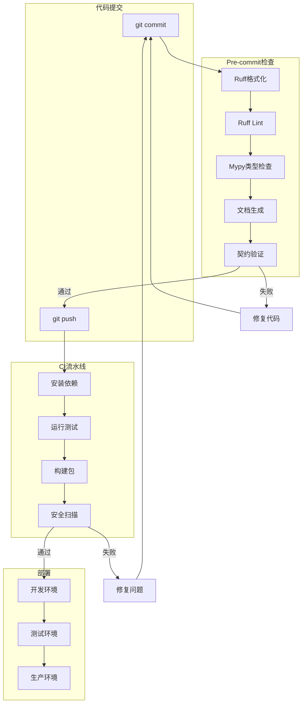

#### 6.1.2 预提交配置详细

```yaml
# .pre-commit-config.yaml
repos:
  - repo: https://github.com/astral-sh/ruff-pre-commit
    rev: v0.1.0
    hooks:
      - id: ruff
        args: ["--fix", "--exit-zero"]
        files: ^src/
      - id: ruff-format
        files: ^src/

  - repo: https://github.com/pre-commit/mirrors-mypy
    rev: v1.8.0
    hooks:
      - id: mypy
        args: 
          - --strict
          - --ignore-missing-imports
        files: ^src/

  - repo: https://github.com/pre-commit/pre-commit-hooks
    rev: v4.5.0
    hooks:
      - id: trailing-whitespace
        exclude: ^tests/
      - id: end-of-file-fixer
      - id: check-yaml
      - id: check-json

  - repo: local
    hooks:
      - id: generate-docs
        name: Generate API Documentation
        entry: python -m src.utils.doc_generator
        language: python
        files: ^src/.*\.py$
        pass_filenames: false
        description: Automatically updates API documentation

      - id: validate-intent-contracts
        name: Validate Intent Contracts
        entry: python -m src.utils.intent_contract --validate
        language: python
        files: ^Hermes/Inbox/.*\.md$
        description: Validates intent contracts
```

---

### 6.2 测试策略

#### 6.2.1 测试分层

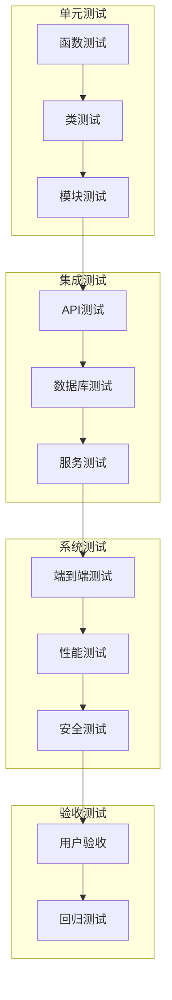

#### 6.2.2 测试覆盖目标

| 测试类型 | 覆盖范围 | 目标覆盖率 |
|----------|----------|----------|
| 单元测试 | 核心函数 | ≥80% |
| 集成测试 | API接口 | ≥90% |
| 系统测试 | 关键流程 | 100% |
| 安全测试 | 所有入口 | 100% |

---

## 七、安全设计

### 7.1 安全架构

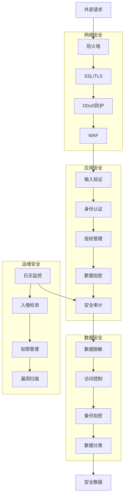

### 7.2 安全措施清单

| 领域 | 措施 | 实施位置 |
|------|------|----------|
| 认证 | API Key + JWT | `src/core/auth.py` |
| 授权 | RBAC角色权限 | `src/core/auth.py` |
| 输入验证 | Pydantic模型验证 | 各模块schemas |
| SQL注入 | ORM参数化查询 | SQLAlchemy |
| XSS防护 | 输出转义 | 响应处理 |
| 数据加密 | AES-256 | 敏感数据存储 |
| 日志审计 | 操作日志记录 | `src/core/` |
| 速率限制 | Token Bucket | `src/core/` |

---

## 八、性能优化

### 8.1 性能架构

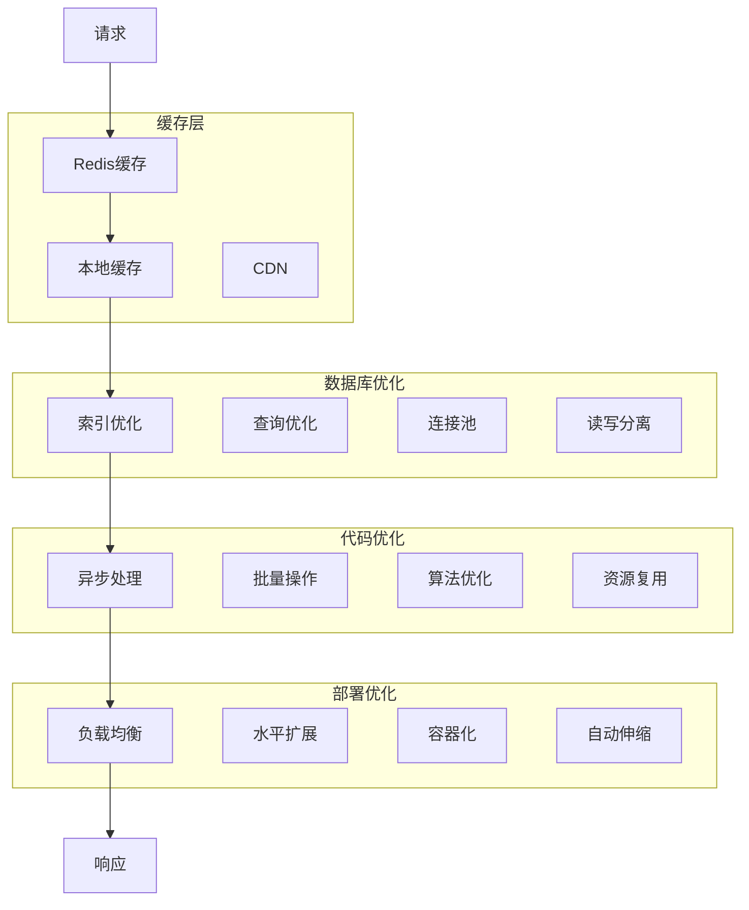

### 8.2 性能指标

| 指标 | 目标值 | 监控位置 |
|------|--------|----------|
| API响应时间 | <100ms | Prometheus |
| 数据库查询时间 | <50ms | Prometheus |
| 并发处理能力 | >1000 QPS | Load测试 |
| 内存使用率 | <70% | Prometheus |
| CPU使用率 | <80% | Prometheus |

---

## 九、部署架构

### 9.1 本地开发环境

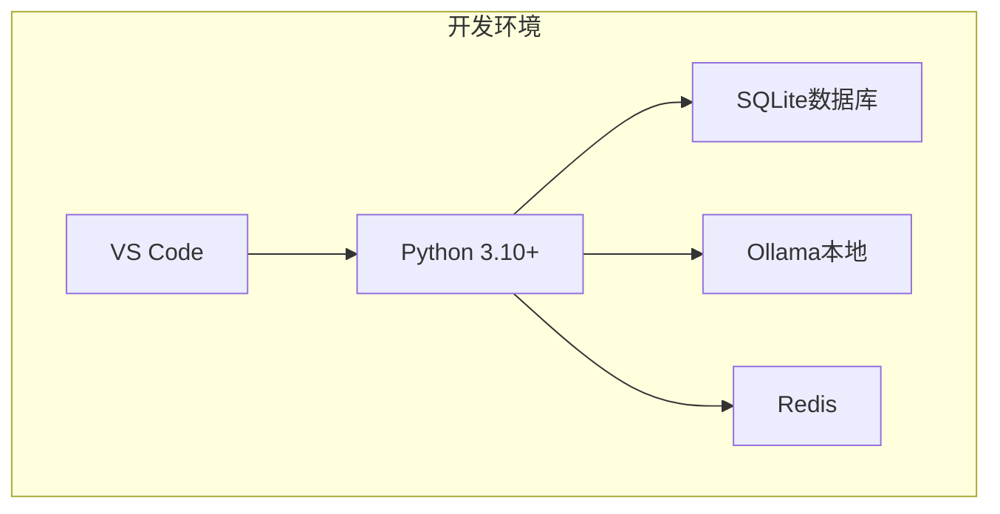

### 9.2 生产环境架构

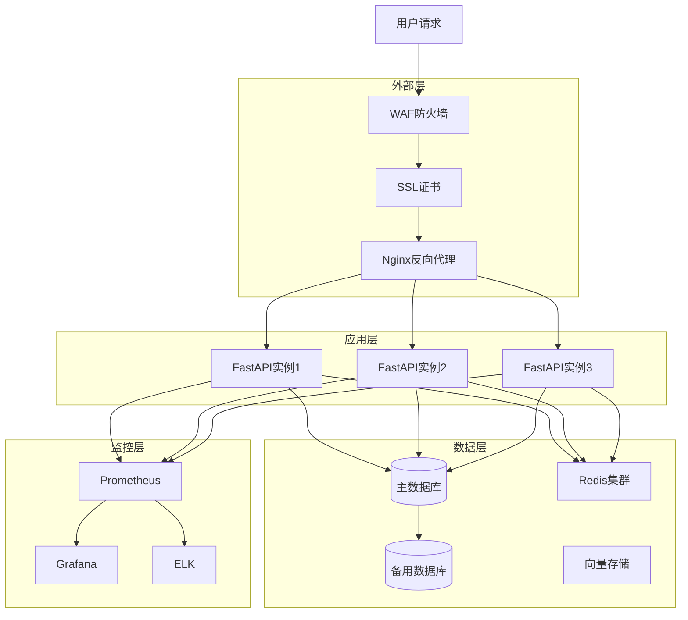

---

## 十、关键设计决策总结

### 10.1 架构原则

> [!IMPORTANT] 核心原则
> 1. **模块化**: 1+N架构，核心平台与业务模块解耦
> 2. **防御性**: 多层防御管道，零信任架构理念
> 3. **可追溯**: 意图契约机制，完整需求链路追踪
> 4. **自动化**: CI/CD全流程，文档即代码
> 5. **可扩展**: 插件化设计，支持动态模块加载

### 10.2 技术选型决策

| 分类 | 技术 | 选型理由 |
|------|------|----------|
| 语言 | Python 3.10+ | 生态成熟，AI/ML支持好 |
| 框架 | FastAPI | 高性能，自动文档，类型安全 |
| ORM | SQLAlchemy 2.0 | 成熟稳定，支持多种数据库 |
| 验证 | Pydantic | 强大的数据验证 |
| 缓存 | Redis | 高性能键值存储 |
| 向量 | FAISS | 零依赖，轻量级 |
| 代码质量 | Ruff + Mypy | 快速格式化和类型检查 |

### 10.3 风险与应对

| 风险 | 等级 | 应对策略 |
|------|------|----------|
| LLM服务不可用 | 高 | 多服务商降级策略 |
| 数据库故障 | 高 | 主备切换 + 定时备份 |
| API请求过载 | 中 | 速率限制 + 负载均衡 |
| 数据泄露 | 高 | 数据加密 + 访问控制 |
| 模块耦合 | 中 | 接口抽象 + 依赖注入 |

### 10.4 扩展路线图

| 阶段 | 时间 | 目标 | 关键任务 |
|------|------|------|----------|
| Phase 1 | Q2 2026 | 核心平台稳定 | 完成核心模块开发，建立测试体系 |
| Phase 2 | Q3 2026 | 模块扩展 | 添加新业务模块，完善API文档 |
| Phase 3 | Q4 2026 | 高可用架构 | 实现主备切换，自动化运维 |
| Phase 4 | Q1 2027 | 多云部署 | 支持多云环境，弹性伸缩 |
