# 📚 Hermes 知识库目录结构

## 一、目录组织原则

```
Hermes/
├── 01-医学笔记/           # 医学知识（临床、基础、考试）
├── 02-数据中心/           # 数据资产（数据库设计、数据模型）
├── 03-架构设计/           # 系统架构（架构图、设计文档）
├── 04-意图契约/           # 意图契约（模板、历史契约）
├── 05-系统文档/           # 系统文档（API文档、操作手册）
└── 99-归档/               # 归档文件（历史版本、旧文档）
```

## 二、各目录说明

### 1️⃣ 医学笔记 (01-医学笔记/)
| 子目录 | 内容 |
|--------|------|
| 临床指南/ | 疾病诊疗指南、临床路径 |
| 考试备考/ | 医学生考试、执业医师考试笔记 |
| 专科知识/ | 内科、外科、妇产科等专科内容 |
| 思维导图/ | 疾病思维导图 |

### 2️⃣ 数据中心 (02-数据中心/)
| 子目录 | 内容 |
|--------|------|
| 数据库设计/ | ER图、表结构、数据字典 |
| 数据模型/ | 业务实体模型、领域模型 |
| 数据规范/ | 数据标准、编码规范 |
| 数据治理/ | 数据质量、数据安全 |

### 3️⃣ 架构设计 (03-架构设计/)
| 子目录 | 内容 |
|--------|------|
| 系统架构/ | 整体架构图、组件关系图 |
| 模块设计/ | 各模块详细设计 |
| 技术选型/ | 技术栈决策记录 |
| 安全设计/ | 安全架构、防护策略 |

### 4️⃣ 意图契约 (04-意图契约/)
| 子目录 | 内容 |
|--------|------|
| 模板库/ | 契约模板 |
| Inbox/ | 待处理契约 |
| 已归档/ | 已完成契约 |
| 规则引擎/ | 复杂度判定规则 |

### 5️⃣ 系统文档 (05-系统文档/)
| 子目录 | 内容 |
|--------|------|
| API文档/ | 自动生成的API文档 |
| 操作手册/ | 用户指南、管理员手册 |
| 运维文档/ | 部署指南、监控说明 |
| 变更记录/ | 版本变更日志 |

### 6️⃣ 归档 (99-归档/)
| 子目录 | 内容 |
|--------|------|
| 历史版本/ | 文档历史版本 |
| 废弃文档/ | 不再使用的文档 |
| 备份/ | 定期备份 |

## 三、文件命名规范

| 类型 | 格式 | 示例 |
|------|------|------|
| 文档 | `YYYYMMDD_标题.md` | `20260511_急性白血病学习笔记.md` |
| 模板 | `模板_名称.md` | `模板_意图契约.md` |
| 设计图 | `架构_模块名称.md` | `架构_医疗模块设计.md` |

## 四、标签规范

| 标签前缀 | 用途 | 示例 |
|----------|------|------|
| #医学 | 医学相关 | #医学 #白血病 |
| #数据 | 数据相关 | #数据 #数据库设计 |
| #架构 | 架构相关 | #架构 #系统设计 |
| #契约 | 契约相关 | #契约 #意图契约 |
| #考试 | 考试相关 | #考试 #执业医师 |

## 五、目录结构可视化

```mermaid
flowchart TB
    subgraph Hermes知识库
        A[01-医学笔记]
        B[02-数据中心]
        C[03-架构设计]
        D[04-意图契约]
        E[05-系统文档]
        F[99-归档]
    end
    
    A --> A1[临床指南]
    A --> A2[考试备考]
    A --> A3[专科知识]
    A --> A4[思维导图]
    
    B --> B1[数据库设计]
    B --> B2[数据模型]
    B --> B3[数据规范]
    B --> B4[数据治理]
    
    C --> C1[系统架构]
    C --> C2[模块设计]
    C --> C3[技术选型]
    C --> C4[安全设计]
    
    D --> D1[模板库]
    D --> D2[Inbox]
    D --> D3[已归档]
    D --> D4[规则引擎]
    
    E --> E1[API文档]
    E --> E2[操作手册]
    E --> E3[运维文档]
    E --> E4[变更记录]
    
    F --> F1[历史版本]
    F --> F2[废弃文档]
    F --> F3[备份]
```


