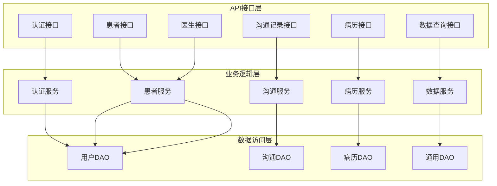
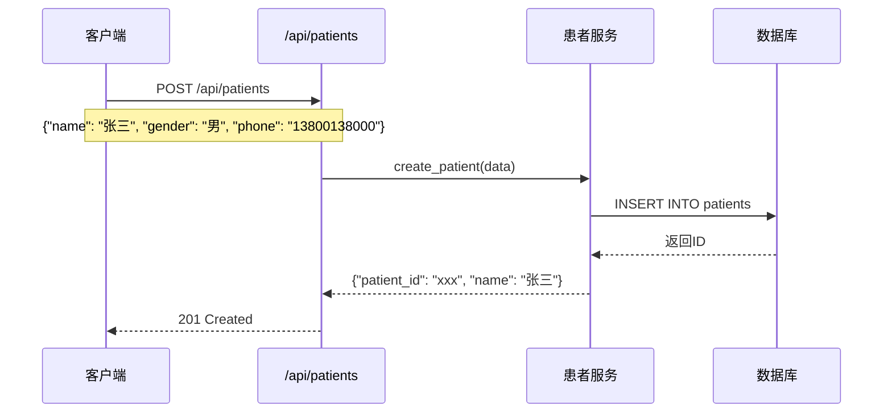
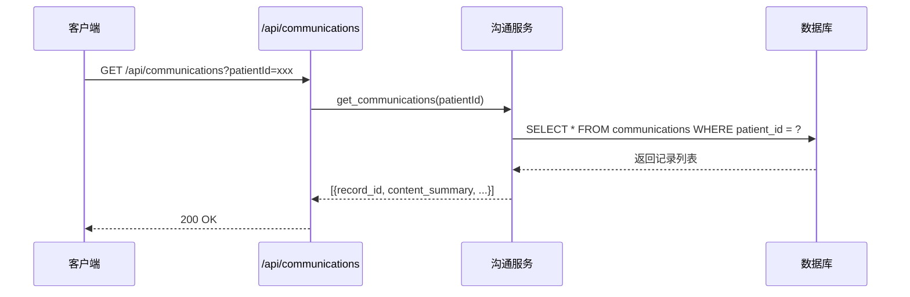

# 🔌 API接口文档

## 一、接口架构图

## 二、接口清单

### 1. 认证接口

| 接口 | 方法 | 路径 | 说明 |
|------|------|------|------|
| 登录 | POST | /api/auth/login | 用户登录 |
| 登出 | POST | /api/auth/logout | 用户登出 |
| 获取用户信息 | GET | /api/auth/me | 获取当前用户 |

### 2. 患者接口

| 接口 | 方法 | 路径 | 说明 |
|------|------|------|------|
| 创建患者 | POST | /api/patients | 创建患者记录 |
| 获取患者列表 | GET | /api/patients | 查询患者列表 |
| 获取患者详情 | GET | /api/patients/{id} | 获取单个患者 |
| 更新患者 | PUT | /api/patients/{id} | 更新患者信息 |
| 删除患者 | DELETE | /api/patients/{id} | 删除患者 |

### 3. 沟通记录接口

| 接口 | 方法 | 路径 | 说明 |
|------|------|------|------|
| 创建记录 | POST | /api/communications | 创建沟通记录 |
| 获取列表 | GET | /api/communications | 查询记录列表 |
| 获取详情 | GET | /api/communications/{id} | 获取记录详情 |
| 验证完整性 | GET | /api/communications/verify | 验证链完整性 |
| 获取时间线 | GET | /api/communications/timeline/{patientId} | 获取患者时间线 |

### 4. 病历接口

| 接口 | 方法 | 路径 | 说明 |
|------|------|------|------|
| 创建病历 | POST | /api/medical-records | 创建病历 |
| 获取列表 | GET | /api/medical-records | 查询病历列表 |
| 获取详情 | GET | /api/medical-records/{id} | 获取病历详情 |
| 更新病历 | PUT | /api/medical-records/{id} | 更新病历 |

## 三、接口调用示例

### 创建患者

### 查询沟通记录

---

*API接口文档 v1.0* | *2026年5月*
