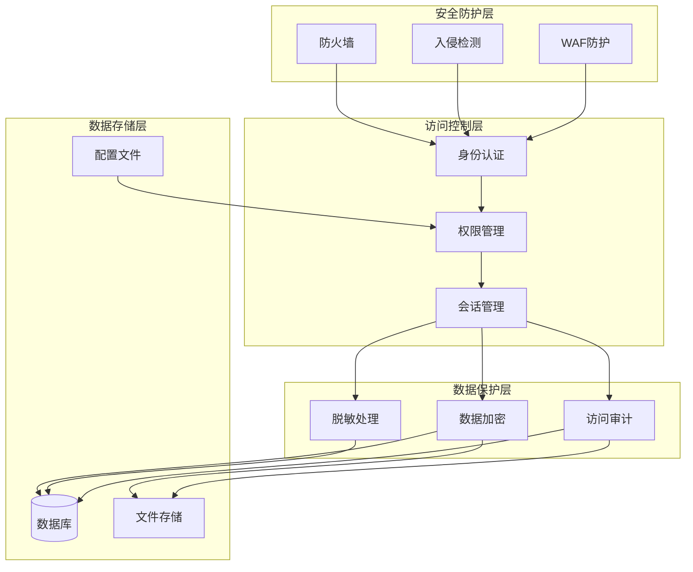
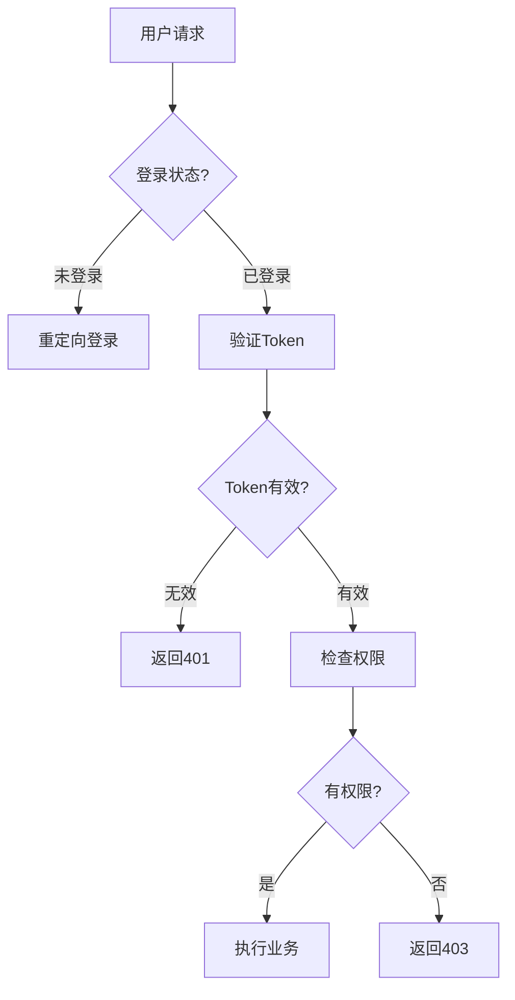
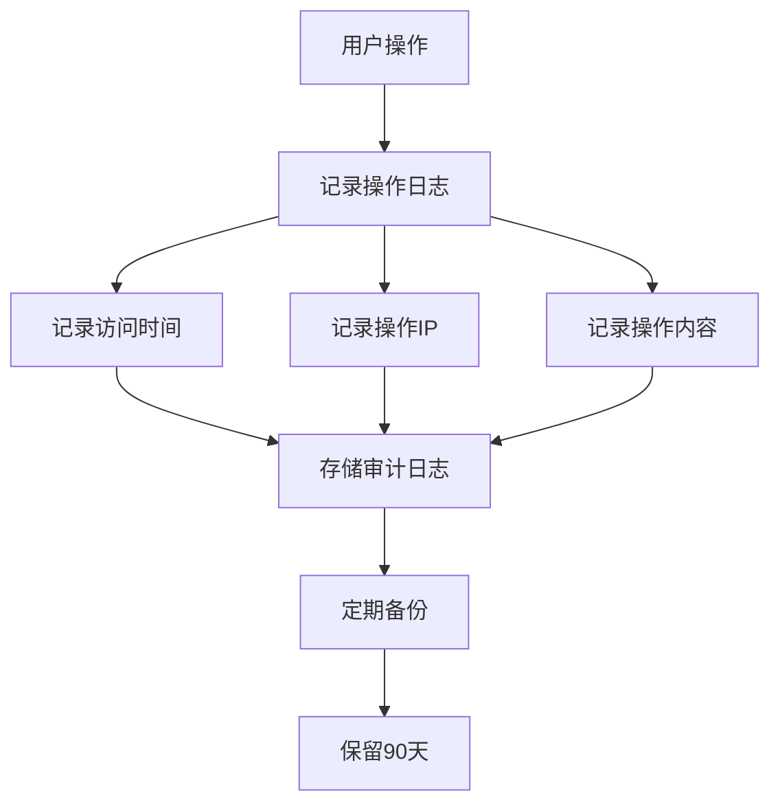

# 🔒 数据安全

## 一、安全架构图

## 二、安全策略

### 1. 认证与授权

### 2. 数据加密

| 数据类型 | 加密方式 | 密钥管理 |
|----------|----------|----------|
| 数据库密码 | AES-256 | .env文件 |
| API密钥 | 环境变量 | 操作系统 |
| 敏感数据 | 字段级加密 | 密钥管理服务 |
| 文件存储 | 传输加密 | HTTPS |

### 3. 访问审计

## 三、安全措施矩阵

| 安全领域 | 措施 | 实施状态 |
|----------|------|----------|
| 身份认证 | JWT Token | ✅ 已实施 |
| 权限控制 | RBAC权限模型 | ✅ 已实施 |
| 数据加密 | 字段级加密 | ⚙️ 规划中 |
| 访问审计 | 操作日志记录 | ✅ 已实施 |
| 备份恢复 | 定期自动备份 | ✅ 已实施 |
| 安全监控 | 异常检测 | ⚙️ 规划中 |

---

*数据安全 v1.0* | *2026年5月*
