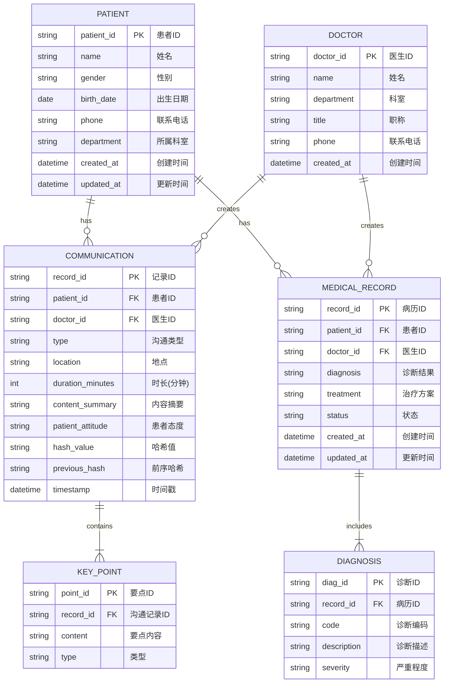
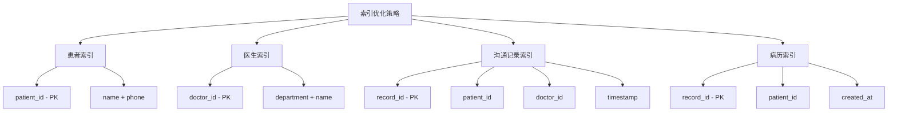

# 🗄️ 数据库设计

## 一、数据库架构

## 二、表结构详细设计

### 1. 患者表 (patients)

| 字段名 | 类型 | 约束 | 说明 |
|--------|------|------|------|
| patient_id | VARCHAR(36) | PRIMARY KEY | UUID格式 |
| name | VARCHAR(100) | NOT NULL | 患者姓名 |
| gender | VARCHAR(10) | | 男/女/其他 |
| birth_date | DATE | | 出生日期 |
| phone | VARCHAR(20) | | 联系电话 |
| department | VARCHAR(50) | | 所属科室 |
| created_at | DATETIME | DEFAULT CURRENT_TIMESTAMP | 创建时间 |
| updated_at | DATETIME | DEFAULT CURRENT_TIMESTAMP | 更新时间 |

### 2. 医生表 (doctors)

| 字段名 | 类型 | 约束 | 说明 |
|--------|------|------|------|
| doctor_id | VARCHAR(36) | PRIMARY KEY | UUID格式 |
| name | VARCHAR(100) | NOT NULL | 医生姓名 |
| department | VARCHAR(50) | | 科室 |
| title | VARCHAR(50) | | 职称 |
| phone | VARCHAR(20) | | 联系电话 |
| created_at | DATETIME | DEFAULT CURRENT_TIMESTAMP | 创建时间 |

### 3. 沟通记录表 (communications)

| 字段名 | 类型 | 约束 | 说明 |
|--------|------|------|------|
| record_id | VARCHAR(36) | PRIMARY KEY | UUID格式 |
| patient_id | VARCHAR(36) | FOREIGN KEY | 关联患者 |
| doctor_id | VARCHAR(36) | FOREIGN KEY | 关联医生 |
| type | VARCHAR(20) | NOT NULL | 沟通类型 |
| location | VARCHAR(100) | | 沟通地点 |
| duration_minutes | INTEGER | DEFAULT 0 | 时长 |
| content_summary | TEXT | | 内容摘要 |
| patient_attitude | VARCHAR(20) | | 患者态度 |
| hash_value | VARCHAR(64) | NOT NULL | SHA256哈希 |
| previous_hash | VARCHAR(64) | | 前序哈希 |
| timestamp | DATETIME | NOT NULL | 时间戳 |

### 4. 病历表 (medical_records)

| 字段名 | 类型 | 约束 | 说明 |
|--------|------|------|------|
| record_id | VARCHAR(36) | PRIMARY KEY | UUID格式 |
| patient_id | VARCHAR(36) | FOREIGN KEY | 关联患者 |
| doctor_id | VARCHAR(36) | FOREIGN KEY | 关联医生 |
| diagnosis | TEXT | | 诊断结果 |
| treatment | TEXT | | 治疗方案 |
| status | VARCHAR(20) | DEFAULT 'pending' | 状态 |
| created_at | DATETIME | DEFAULT CURRENT_TIMESTAMP | 创建时间 |
| updated_at | DATETIME | DEFAULT CURRENT_TIMESTAMP | 更新时间 |

## 三、索引设计

---

*数据库设计 v1.0* | *2026年5月*
