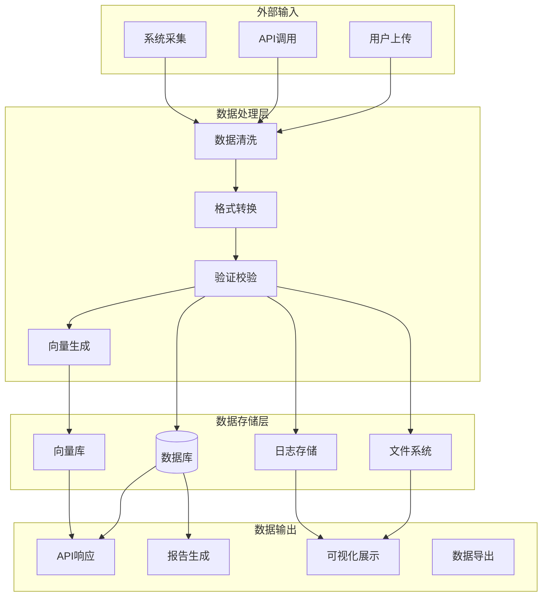
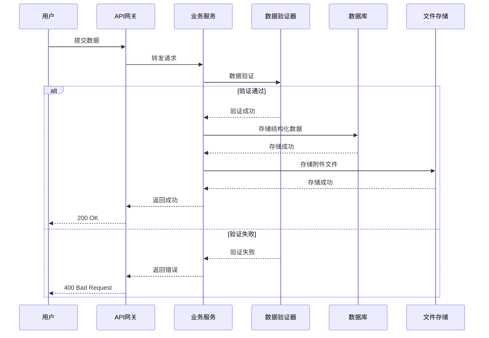
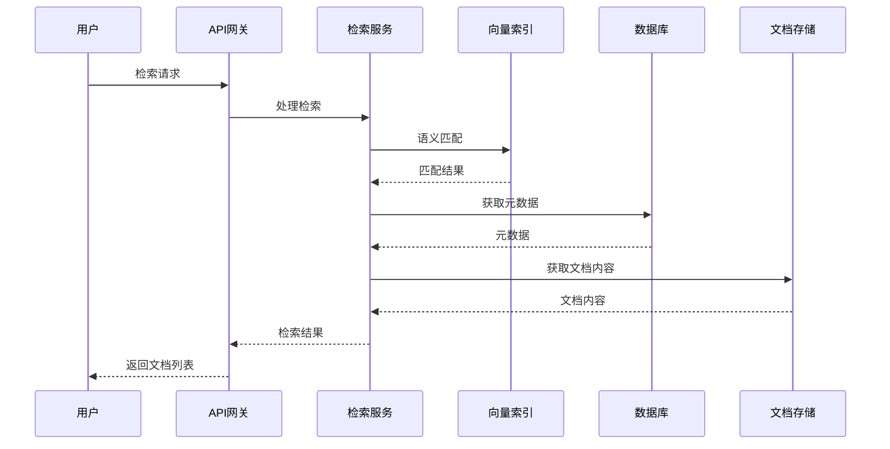
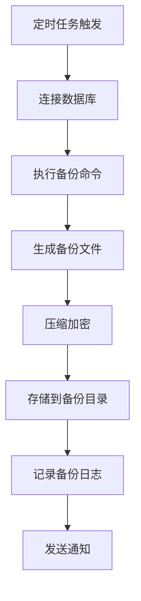

# 🔄 数据流程图

## 一、数据流动总览

## 二、核心数据流程

### 1. 用户数据录入流程

### 2. 知识检索流程

### 3. 数据备份流程

## 三、数据流向矩阵

| 数据类型 | 来源 | 处理 | 存储 | 输出 |
|----------|------|------|------|------|
| 用户数据 | 前端表单 | 验证清洗 | SQLite | API响应 |
| 知识文档 | 上传/导入 | 解析索引 | 文件系统+向量库 | 检索结果 |
| 系统日志 | 应用运行 | 格式化 | 文件日志 | 监控面板 |
| 配置数据 | 管理员配置 | 校验 | 配置文件 | 应用读取 |

---

*数据流程图 v1.0* | *2026年5月*
