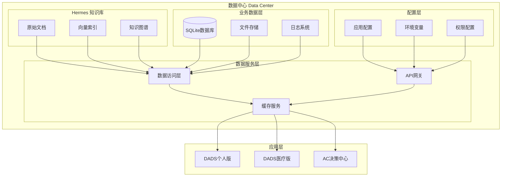

# 📐 数据中心架构总览

## 一、整体架构图

## 二、分层架构说明

### 1. 知识库层

| 组件 | 职责 | 存储内容 |
|------|------|----------|
| **原始文档** | 存储各种格式的知识文档 | Markdown、PDF、Word |
| **向量索引** | 用于AI语义检索 | 向量数据库文件 |
| **知识图谱** | 知识关系建模 | 实体和关系数据 |

### 2. 业务数据层

| 组件 | 职责 | 技术选型 |
|------|------|----------|
| **SQLite数据库** | 结构化数据存储 | SQLite（轻量、嵌入式） |
| **文件存储** | 用户上传文件和附件 | 文件系统 |
| **日志系统** | 应用运行日志 | 文件日志 |

### 3. 配置层

| 组件 | 职责 | 安全性 |
|------|------|--------|
| **应用配置** | 非敏感配置项 | 公开 |
| **环境变量** | 敏感配置项 | 加密存储 |
| **权限配置** | 用户权限定义 | 受控访问 |

### 4. 服务层

| 组件 | 职责 | 作用 |
|------|------|------|
| **数据访问层** | 统一数据访问接口 | 数据CRUD |
| **API网关** | 统一接口入口 | 请求路由 |
| **缓存服务** | 数据缓存 | 性能优化 |

## 三、架构优势

---

*架构总览 v1.0* | *2026年5月*
