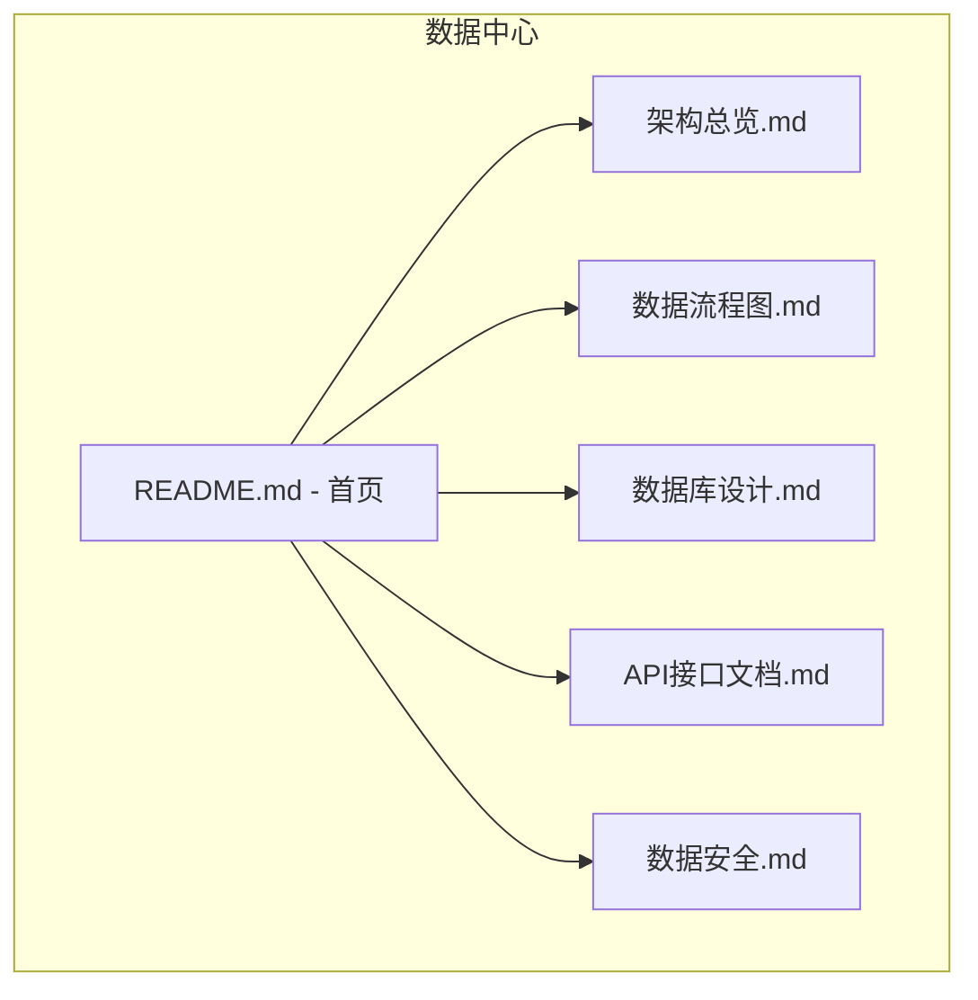
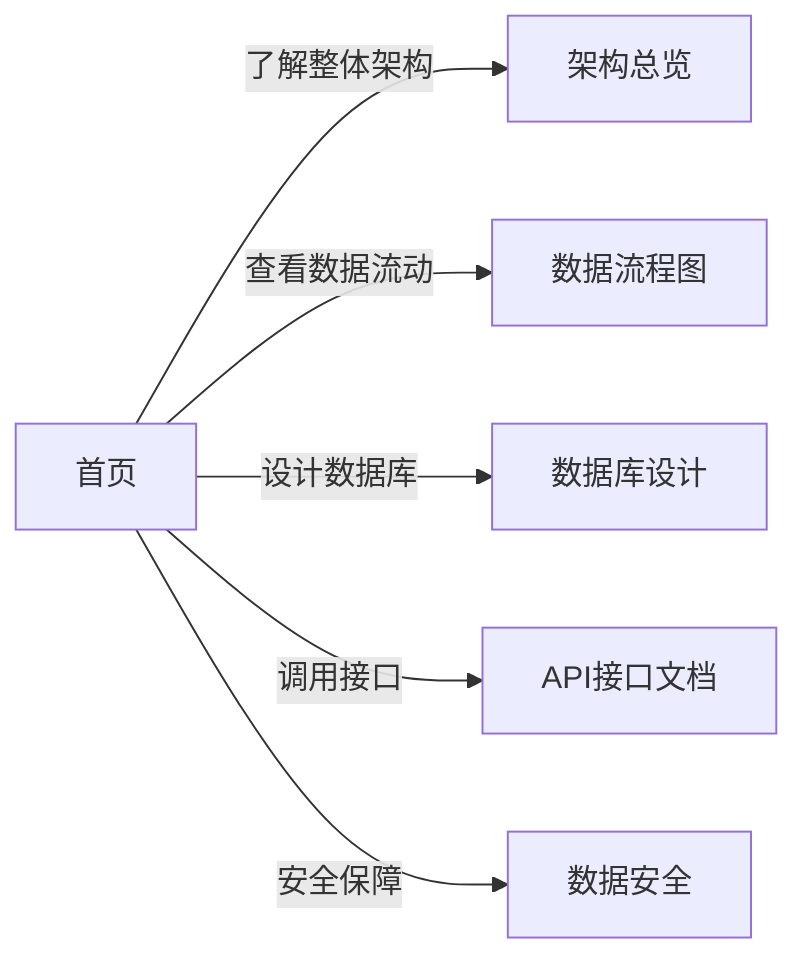
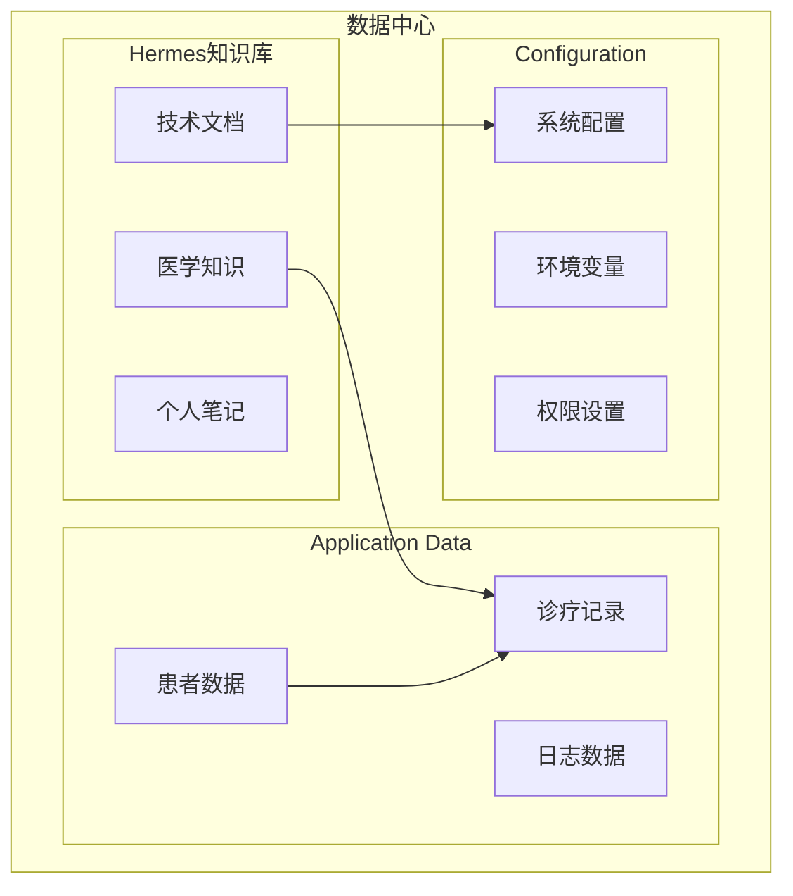

# 📊 数据中心 - Data Center

欢迎来到 TRAE 项目的数据中心！这里展示了项目的完整数据架构和流程。

---

## 🗂️ 目录结构

---

## 📋 文档清单

| 文档 | 说明 | 状态 |
|------|------|------|
| 📐 **架构总览.md** | 数据中心整体架构图 | ✅ 完成 |
| 🔄 **数据流程图.md** | 数据流动和处理流程 | ✅ 完成 |
| 🗄️ **数据库设计.md** | 数据库表结构设计 | ✅ 完成 |
| 🔌 **API接口文档.md** | 数据接口说明 | ✅ 完成 |
| 🔒 **数据安全.md** | 数据安全和权限控制 | ✅ 完成 |

---

## 🎯 快速导航

---

## 🏗️ 架构关系图

---

*数据中心 v1.0* | *2026年5月* | *TRAE Project*
